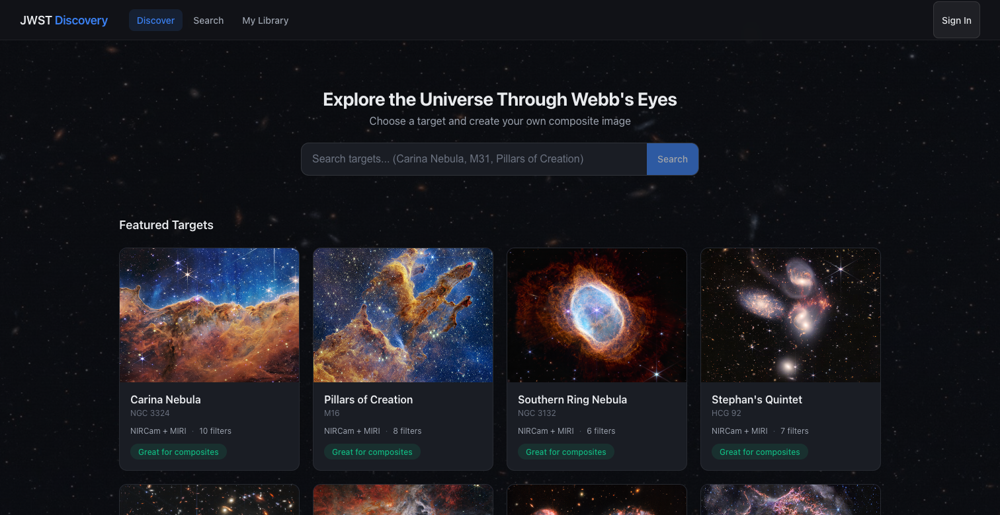

# JWST Data Analysis Application

[](https://opensource.org/licenses/MIT)
[](https://github.com/Snoww3d/jwst-data-analysis/actions)

A modern web application for analyzing James Webb Space Telescope (JWST) data, featuring direct integration with the MAST (Mikulski Archive for Space Telescopes) portal.



## Features

- **MAST Portal Integration** - Search and import JWST observations by target name, coordinates, or program ID
- **FITS Image Viewer** - Visualize FITS images with multiple color maps, stretch algorithms, zoom, and pan
- **RGB Composite Creator** - Combine 3 FITS files into false-color composites via guided wizard
- **WCS Mosaic Generator** - Spatially combine multiple observations using WCS reprojection
- **Image Comparison** - Blink, side-by-side, and opacity overlay comparison modes
- **Region Statistics** - Draw rectangle/ellipse regions and compute pixel statistics (mean, median, std, etc.)
- **Annotation Tools** - Add text, arrows, and circles to FITS images
- **WCS Grid Overlay** - RA/Dec coordinate grid with angular scale bar
- **Curves & Histogram** - Cubic spline tone curves and log-scale histogram with adjustable black/white points
- **3D Cube Navigator** - Navigate wavelength/time slices in 3D FITS data cubes
- **Export** - Save processed images as PNG/JPEG with resolution presets
- **Processing Level Tracking** - Automatic tracking of JWST pipeline levels (L1/L2a/L2b/L3)
- **Chunked Downloads** - Resume-capable downloads with real-time progress tracking
- **User Authentication** - JWT-based login/register with protected routes

## Quick Start

### Using Docker (Recommended)

```bash
git clone https://github.com/Snoww3d/jwst-data-analysis.git
cd jwst-data-analysis/docker
cp .env.example .env
docker compose up -d
```

Then open http://localhost:3000 in your browser.

### Service URLs

| Service | URL |
|---------|-----|
| Frontend | http://localhost:3000 |
| Backend API | http://localhost:5001 |
| API Documentation | http://localhost:5001/swagger |
| Processing Engine | http://localhost:8000 |

## Technology Stack

| Layer | Technology |
|-------|------------|
| Frontend | React 19, TypeScript |
| Backend | .NET 10 Web API |
| Database | MongoDB |
| Processing | Python 3.10+, FastAPI, Astropy |
| Infrastructure | Docker, Docker Compose |

## Project Structure

```
jwst-data-analysis/
├── backend/                 # .NET 10 Web API
├── frontend/                # React TypeScript application
├── processing-engine/       # Python scientific computing service
├── docker/                  # Docker Compose configuration
└── docs/                    # Documentation
```

## Documentation

- [Development Plan](./docs/development-plan.md) - Project roadmap and phases
- [Development Standards](./docs/standards/README.md) - Coding guidelines
- [Quick Reference](./docs/quick-reference.md) - API endpoints, common patterns, troubleshooting
- [Key Files Reference](./docs/key-files.md) - Important files in the codebase
- [MAST Usage Guide](./docs/mast-usage.md) - Detailed MAST search examples
- [Setup Guide](./docs/setup-guide.md) - Full development setup instructions
- [API Reference](http://localhost:5001/swagger) - OpenAPI/Swagger docs (when running)

## Contributing

We welcome contributions! Please see [CONTRIBUTING.md](./CONTRIBUTING.md) for guidelines.

## Security

For security concerns, please see [SECURITY.md](./SECURITY.md).

## License

This project is licensed under the MIT License - see the [LICENSE](./LICENSE) file for details.

## Acknowledgments

- [STScI](https://www.stsci.edu/) for the MAST portal and JWST data
- [Astropy](https://www.astropy.org/) for astronomical computing tools
