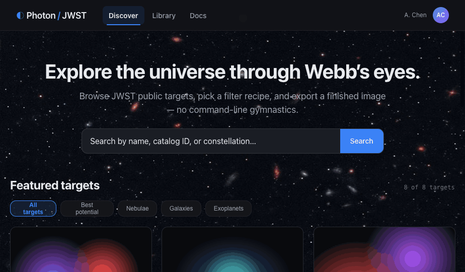
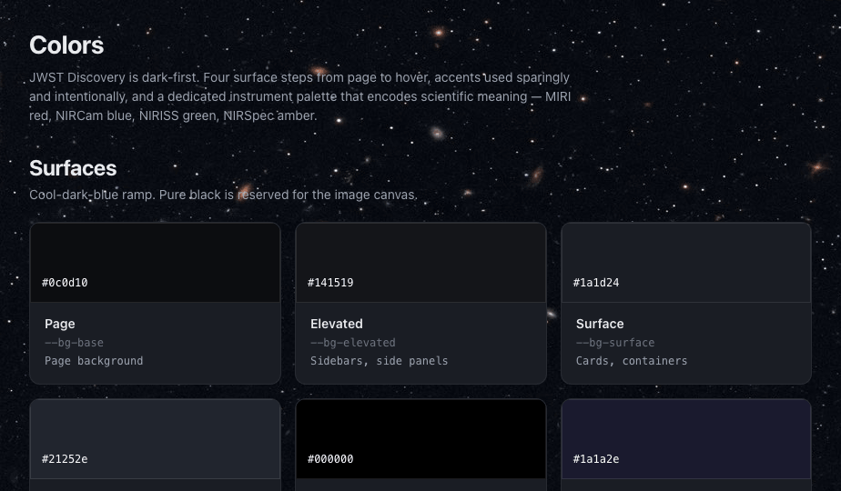
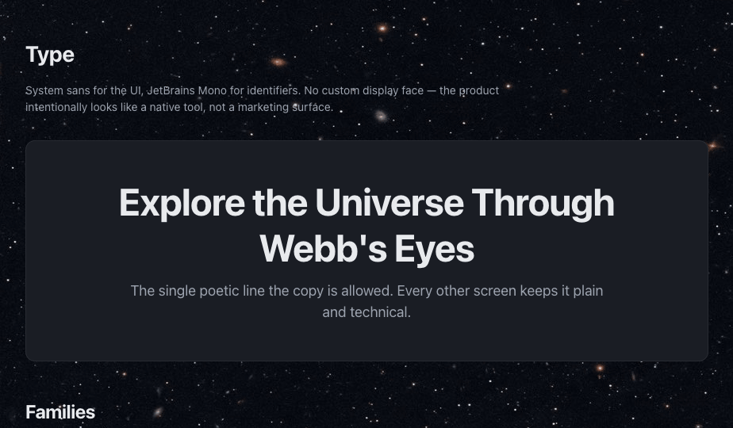
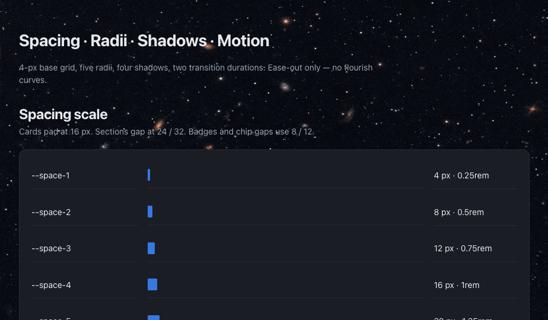
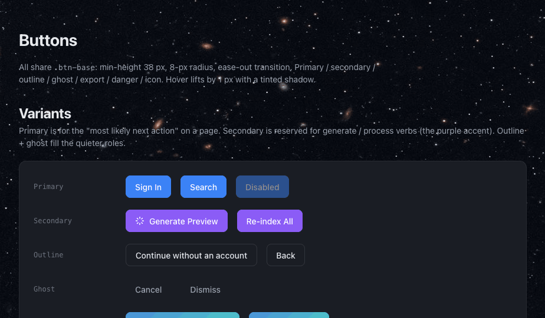
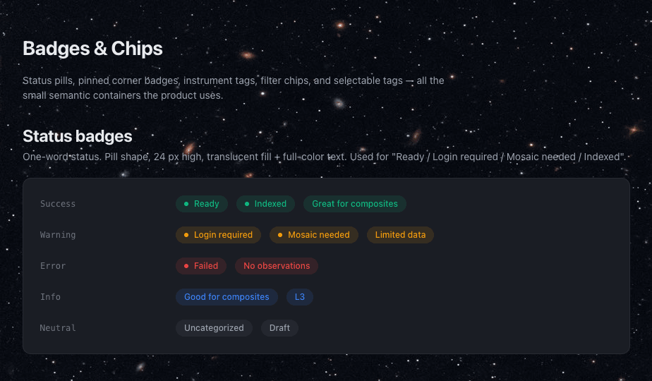
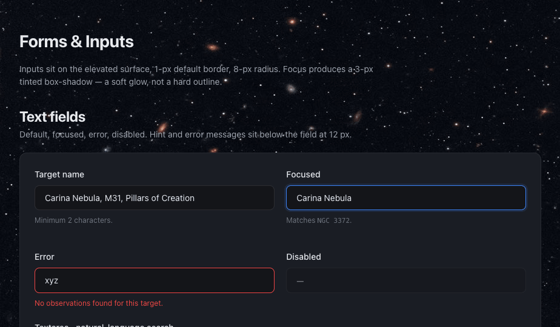
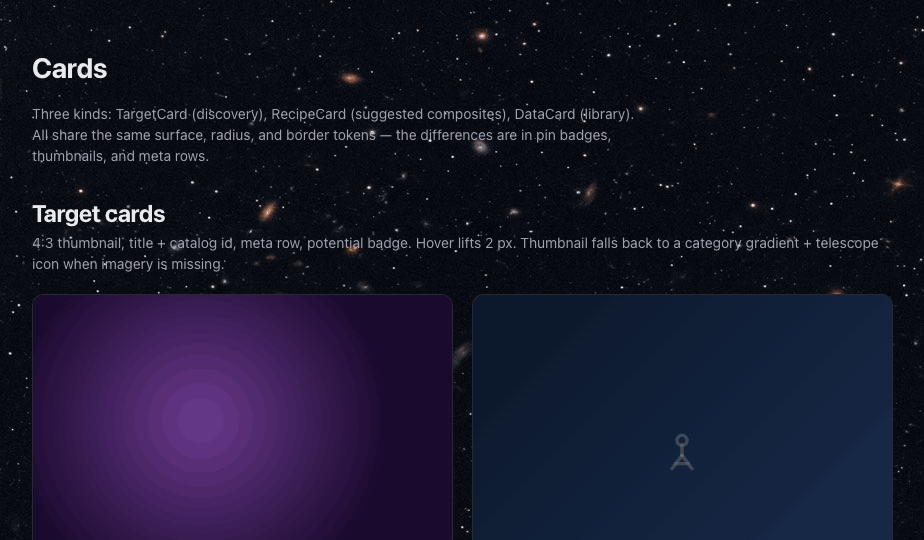
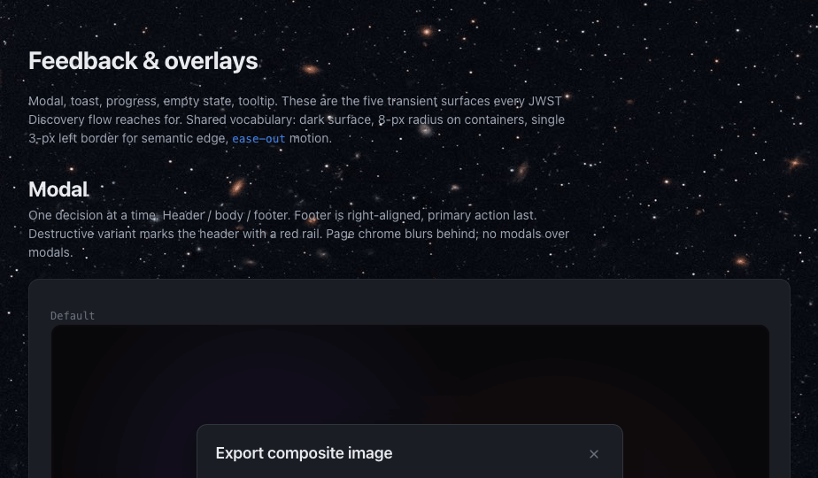
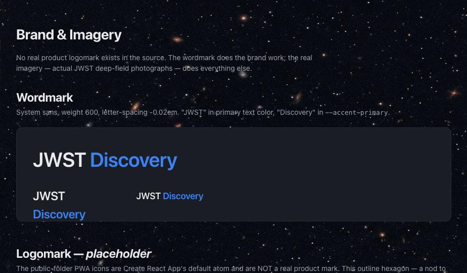

# JWST Discovery — Design System

A complete design system for the JWST Data Analysis web app. Tokens, atomic components, voice, invariants, and a live walkthrough — extracted from the production codebase and documented for reuse.

---

## What's in the box

| | Artifact | What it is |
|---|---|---|
| 🎨 | [`tokens.css`](./tokens.css) | Colors, type, spacing, radii, shadows, motion, z-index. Every value in the product is a token. |
| 📖 | [`README-context.md`](./README-context.md) | Full design-system doc: voice, visual foundations, invariants, caveats. |
| 🤖 | [`SKILL.md`](./SKILL.md) | Agent Skills entry — lets AI tools generate on-brand JWST designs without re-learning the system. |
| 🧩 | [`preview/`](./preview) | 9 atomic review cards. Open any HTML file in a browser. |
| 🛰 | [`ui-kit/`](./ui-kit) | Full product walkthrough — Discover → Target → Recipe → Library. |
| 🖼 | [`assets/`](./assets) | Real JWST bitmaps used as backgrounds and imagery placeholders. |

---

## Gallery

### The Discover screen · full product walkthrough
Signed-in header, editorial hero, targets grid with color-coded category cards and instrument badges.

### Colors — dark-first, instrument-coded
Four surface steps from page to hover. Accents used sparingly. A dedicated instrument palette (MIRI red, NIRCam blue, NIRISS green, NIRSpec amber) encodes scientific meaning.

### Typography — system sans + JetBrains Mono
Seven steps from `--text-xs` to `--text-3xl`. Filters, IDs, and numbers go mono; everything else goes sans. No Google Fonts.

### Spacing, radii, shadows
9-step spacing scale (0.25rem → 4rem). Five radii — 2, 4, 8, 12, circles — nothing in between. Four-tier shadow ramp.

### Buttons
Primary / secondary / outline / ghost / export / wizard / danger / icon. Three sizes. Hover lifts 1 px with a tinted shadow — never a scale.

### Badges, chips, status pills
Filter chips are always monospace + uppercase + colored swatch dot. Instrument badges carry the instrument palette. Status uses one word, always.

### Forms
Dark inputs with a 2-px interactive outline on focus. Validation states, help text, select, textarea, checkbox, radio — every control tokenized.

### Cards
Target cards, recipe cards, data cards, image frames. Hover lifts 2 px. Category gradients (nebula, galaxy, cluster, planetary) are pre-canned so imagery-less cards still feel intentional.

### Feedback & overlays
Modal, toast, progress, empty state, tooltip. Five surfaces every real app needs. Added in the second design sprint after the first port revealed the gaps.

### Brand & imagery
Wordmark, backgrounds, category gradients, placeholder logomark. Caveats section flags what's intentionally missing — a real logomark still owes us a trip to the illustrator.

---

## How it connects to the code

- `tokens.css` is a **reference copy** — the canonical tokens live in [`frontend/jwst-frontend/src/index.css`](../frontend/jwst-frontend/src/index.css). The app was built token-first; nothing in the codebase uses raw hex values.
- The `preview/` cards are **executable documentation** — each card renders the exact CSS the app ships, loaded from the token file.
- The `ui-kit/` walkthrough is a React prototype that mirrors the real Discover/Target/Recipe/Library flow using nothing but the token system.

---

## Invariants — do not break these

- **Dark-first.** Never a light theme. Only the auth surface is light.
- **No emoji.** Never. Anywhere in-product.
- **No invented / synthesized space art.** Use the real bitmaps in `assets/` or a category gradient + a telescope line-icon placeholder.
- **System sans + JetBrains Mono.** Do not swap in Inter, Roboto Mono, Geist, or any Google Font.
- **Filter chips are always monospace + uppercase + colored swatch dot.**
- **Instrument badges are color-coded** (MIRI red, NIRCam blue, NIRISS green, NIRSpec amber) — encoded, not decorative.
- **Motion:** `ease-out` only, 0.15s or 0.2s. Card hover = `translateY(-2px)` + shadow. No scale.
- **Content:** sentence case body, Title Case CTAs, one-word statuses, `·` middle-dot separators.

---

## What's intentionally missing

- **A real logomark.** The wordmark is committed; the mark is a placeholder hexagon + star. Worth a trip to an illustrator.
- **Data-viz primitives.** The product is about images and spectra — chart colors, axis conventions, and overlay styles deserve their own tokens. Next sprint.
- **Light / print surface.** Exports to PDF currently use the dark palette. A `[data-theme="print"]` pass would clean that up.
- **Component API docs.** The preview cards show appearance; they don't enumerate props and edge cases. To be written as each component lands in `src/components/ui/`.

---

## Credits

Tokens and patterns extracted from [`Snoww3d/jwst-data-analysis`](https://github.com/Snoww3d/jwst-data-analysis). Imagery by NASA / JWST / STScI — public domain. Design system authored with [Claude](https://claude.com/code).
