# Architecture Documentation

This document provides visual diagrams of the JWST Data Analysis Application architecture using Mermaid. GitHub renders these diagrams natively.

## Table of Contents

- [System Overview](#system-overview)
- [Data Flows](#data-flows)
  - [Local Upload Flow](#local-upload-flow)
  - [MAST Import Flow](#mast-import-flow)
- [Data Lineage](#data-lineage)
- [Frontend Component Hierarchy](#frontend-component-hierarchy)
- [MongoDB Document Structure](#mongodb-document-structure)
- [Backend Service Layer](#backend-service-layer)

---

## System Overview

High-level view of the microservices architecture and their communication patterns.

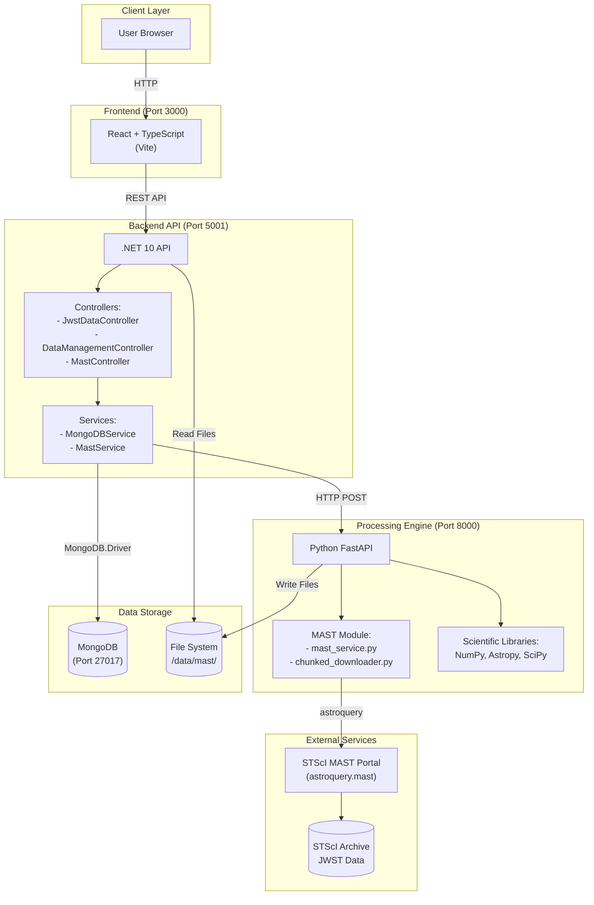

---

## Data Flows

### Local Upload Flow

The flow for uploading JWST data files directly to the application.

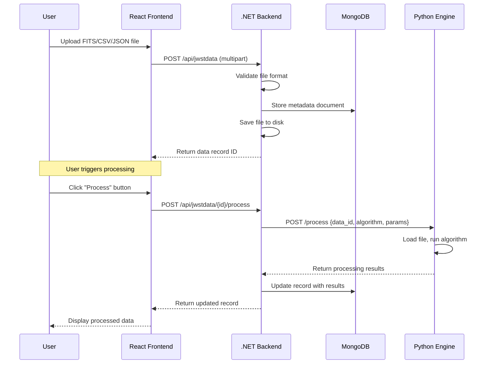

### MAST Import Flow

The complete flow for searching and importing data from the MAST portal, including chunked downloads with resume capability.

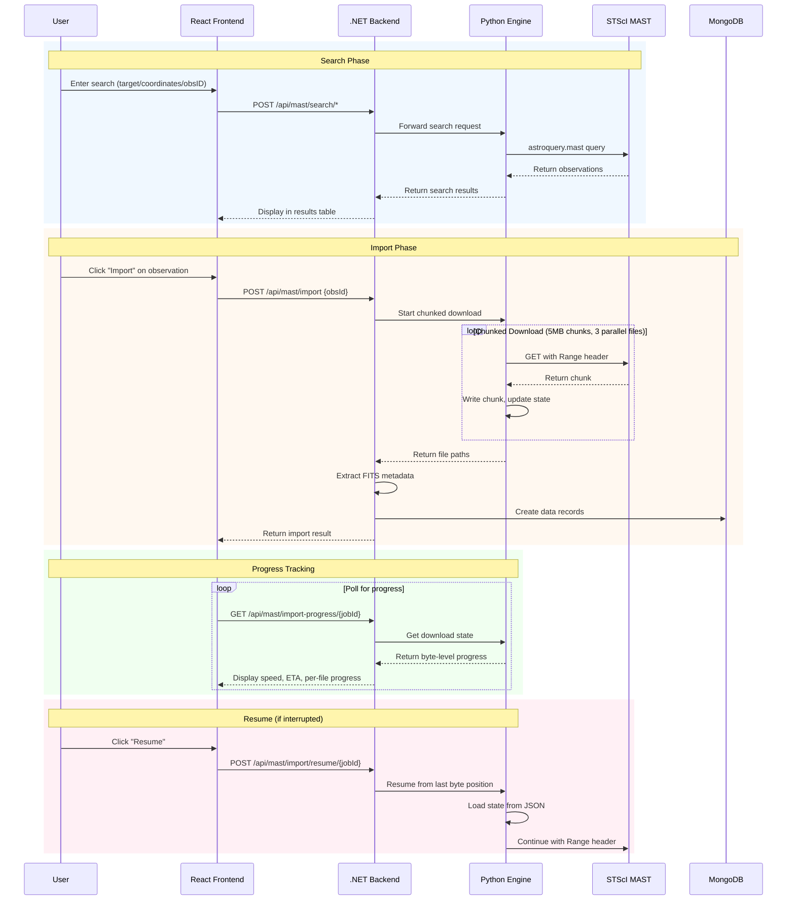

---

## Data Lineage

JWST data products progress through processing levels. Files are grouped by `ObservationBaseId` for lineage tracking.

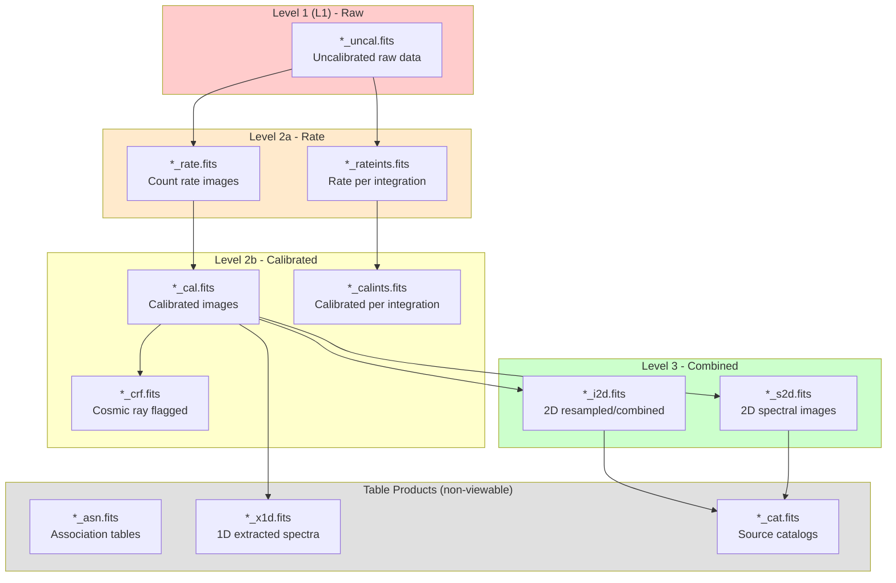

### Lineage Grouping

Files are grouped by observation for lineage visualization:

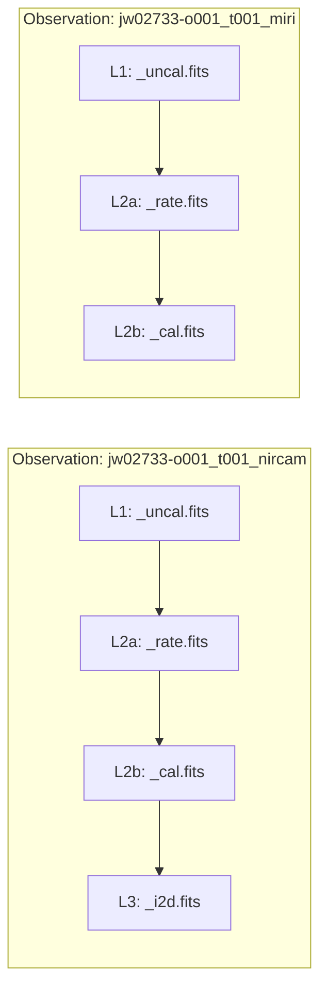

---

## Frontend Component Hierarchy

React component structure of the application.

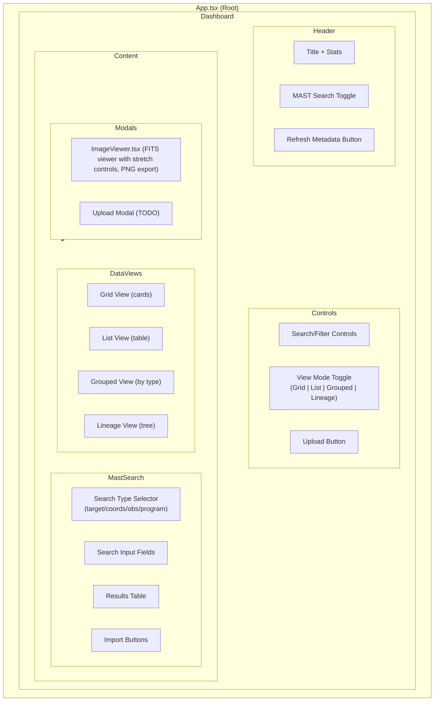

---

## MongoDB Document Structure

The flexible document schema for JWST data records.

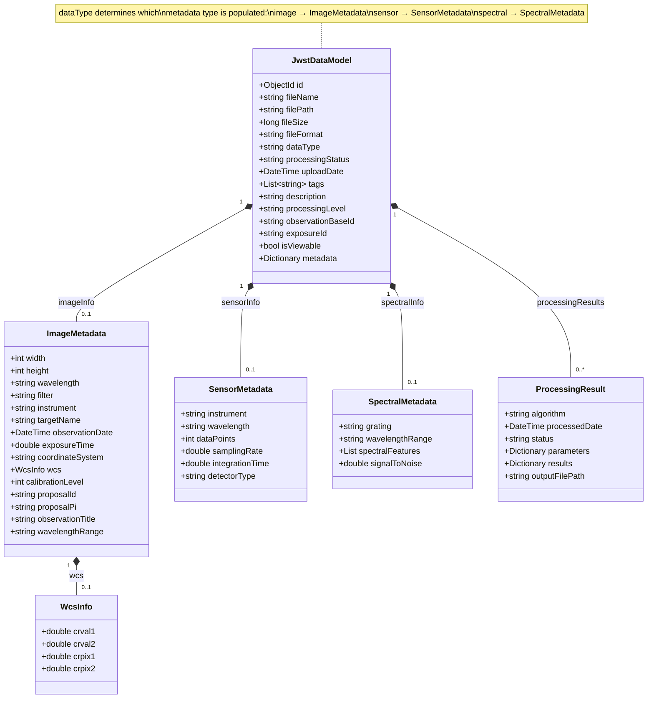

---

## Backend Service Layer

The .NET backend follows the repository pattern with clear separation of concerns.

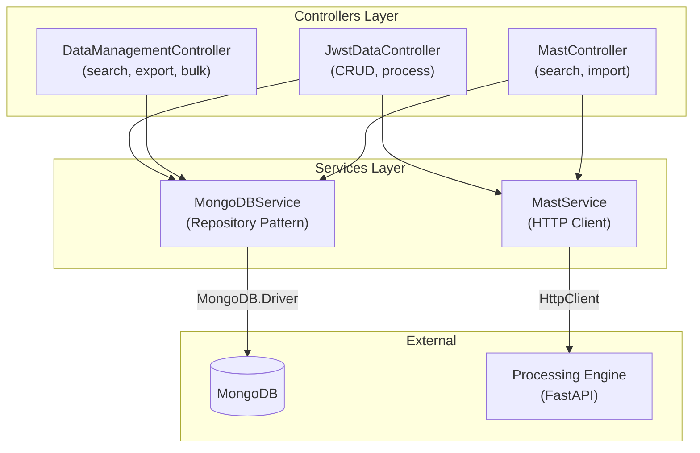

### MongoDBService Operations

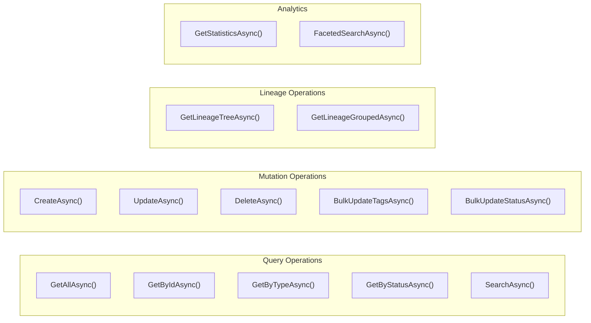

---

## Processing Engine Architecture

The Python FastAPI processing engine handles scientific computing and MAST integration.

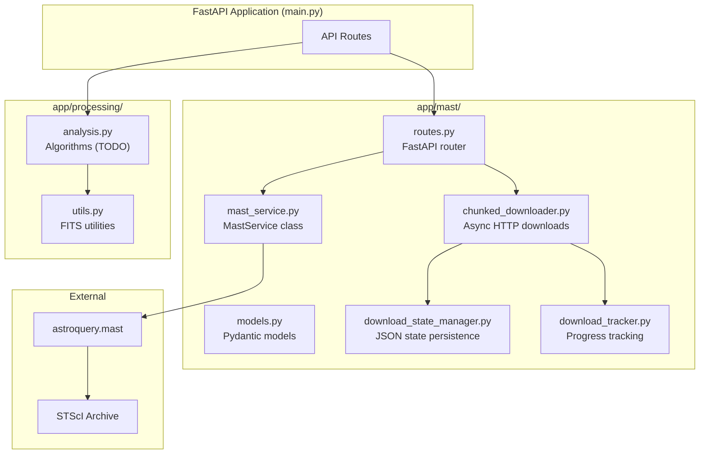

---

## Docker Compose Services

The complete application stack orchestrated via Docker Compose.

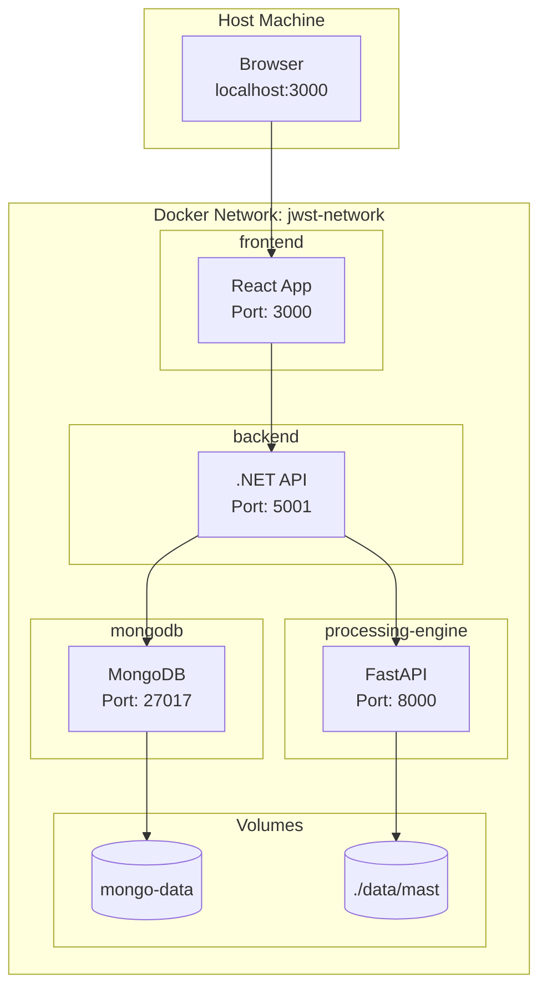

---

## See Also

- [CLAUDE.md](https://github.com/Snoww3d/jwst-data-analysis/blob/main/CLAUDE.md) - Main project documentation
- [Development Plan](development-plan.md) - Project roadmap
- [Backend Development Standards](standards/backend-development.md)
- [Frontend Development Standards](standards/frontend-development.md)
- [Database Models](standards/database-models.md)
