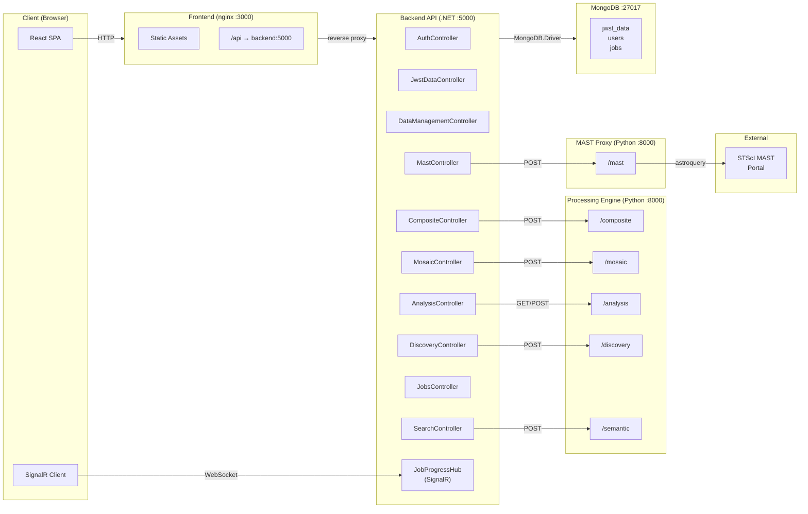

# API Contracts

Service-to-service API boundary map showing which services expose what to whom. All inter-service communication uses HTTP/JSON with snake_case payloads.

> **4+1 View**: Logical View

## Service Boundary Diagram

## Frontend → Backend API

All calls go through the `apiClient` singleton which handles JWT injection and 401 refresh.

### Authentication (`/api/auth`)

| Method | Endpoint | Auth | Purpose |
|--------|----------|------|---------|
| POST | `/login` | Public | Authenticate, returns access + refresh tokens |
| POST | `/register` | Public | Create account |
| POST | `/refresh` | Public | Refresh access token |
| POST | `/logout` | Required | Revoke refresh token |
| GET | `/me` | Required | Current user profile |

### Discovery (`/api/discovery`)

| Method | Endpoint | Auth | Purpose |
|--------|----------|------|---------|
| GET | `/featured` | Public | Curated featured targets list |
| POST | `/suggest-recipes` | Public | Recipe suggestions for a target → proxied to Processing Engine |

### MAST (`/api/mast`)

| Method | Endpoint | Auth | Purpose |
|--------|----------|------|---------|
| POST | `/search/target` | Required | Search MAST by target name |
| POST | `/search/coordinates` | Required | Search MAST by RA/Dec |
| POST | `/search/observation` | Required | Search by observation ID |
| POST | `/search/program` | Required | Search by program ID |
| POST | `/import` | Required | Import observation (async job) |

### Composite (`/api/composite`)

| Method | Endpoint | Auth | Purpose |
|--------|----------|------|---------|
| POST | `/generate-nchannel` | Public | Synchronous N-channel composite → returns image blob |
| POST | `/export-nchannel` | Required | Async export job → returns `jobId` (202 Accepted) |

### Mosaic (`/api/mosaic`)

| Method | Endpoint | Auth | Purpose |
|--------|----------|------|---------|
| POST | `/generate` | Public | Synchronous mosaic generation → returns image blob |
| POST | `/generate-and-save` | Required | Generate mosaic FITS + save as data record (201) |
| POST | `/footprint` | Public | WCS footprint polygons for preview |
| POST | `/export` | Required | Async mosaic export job → returns `jobId` (202) |
| POST | `/save` | Required | Async save-to-library job → returns `jobId` (202) |
| GET | `/limits` | Required | Processing limits for current user |

### Analysis (`/api/analysis`)

| Method | Endpoint | Auth | Purpose |
|--------|----------|------|---------|
| POST | `/region-statistics` | Public | Statistics for image region (mean, median, std, ...) |
| POST | `/detect-sources` | Public | Astronomical source detection |
| GET | `/table-info` | Public | FITS table HDU metadata |
| GET | `/table-data` | Public | Paginated table rows |
| GET | `/spectral-data` | Public | Spectral data for plotting |

### Jobs (`/api/jobs`)

| Method | Endpoint | Auth | Purpose |
|--------|----------|------|---------|
| GET | `/` | Required | List user's jobs (filter by status, type) |
| GET | `/{jobId}` | Required | Single job status |
| POST | `/{jobId}/cancel` | Required | Cancel a running job |
| GET | `/{jobId}/result` | Required | Stream job result (blob or data reference) |

### Data Library (`/api/jwstdata`, `/api/data-management`)

| Method | Endpoint | Auth | Purpose |
|--------|----------|------|---------|
| GET | `/api/jwstdata` | Required | List user's data records |
| GET | `/api/jwstdata/{id}` | Required | Single record |
| POST | `/api/jwstdata/upload` | Required | Upload FITS file |
| DELETE | `/api/jwstdata/{id}` | Required | Delete record |
| Various | `/api/data-management/*` | Required | Bulk ops, tagging, sharing, archive |

### Semantic Search (`/api/search`)

| Method | Endpoint | Auth | Purpose |
|--------|----------|------|---------|
| GET | `/semantic` | Public | Natural language search (`?q=...&topK=...&minScore=...`) |
| POST | `/reindex` | Admin | Trigger full re-index |
| GET | `/index-status` | Public | Semantic index statistics |

### SignalR Hub (`/hubs/job-progress`)

| Direction | Event | Payload |
|-----------|-------|---------|
| Client → Server | `SubscribeToJob(jobId)` | Job ID (ownership verified) |
| Client → Server | `UnsubscribeFromJob(jobId)` | Job ID |
| Server → Client | `JobSnapshot` | Full job state on subscription |
| Server → Client | `JobProgress` | `{ jobId, percent, stage, message }` |
| Server → Client | `JobCompleted` | `{ jobId, resultKind, resultDataId }` |
| Server → Client | `JobFailed` | `{ jobId, error }` |

Auth: JWT via `?access_token=` query parameter (WebSocket limitation).

---

## Backend → Processing Engine

The .NET backend calls the Python Processing Engine via typed `HttpClient` instances with Polly resilience policies.

### Composite Service

| Method | Endpoint | Timeout | Resilience |
|--------|----------|---------|------------|
| POST | `/composite/generate-nchannel` | 30 min attempt / 60 min total | 3 retries, circuit breaker |

### Mosaic Service

| Method | Endpoint | Timeout | Resilience |
|--------|----------|---------|------------|
| POST | `/mosaic/generate` | 30 min attempt / 60 min total | 3 retries, circuit breaker |
| POST | `/mosaic/footprint` | 30 min attempt / 60 min total | 3 retries, circuit breaker |

### Analysis Service

| Method | Endpoint | Timeout | Resilience |
|--------|----------|---------|------------|
| POST | `/analysis/region-statistics` | 2 min | Standard |
| POST | `/analysis/detect-sources` | 2 min | Standard |
| GET | `/analysis/table-info` | 2 min | Standard |
| GET | `/analysis/table-data` | 2 min | Standard |
| GET | `/analysis/spectral-data` | 2 min | Standard |

### Discovery Service

| Method | Endpoint | Timeout | Resilience |
|--------|----------|---------|------------|
| POST | `/discovery/suggest-recipes` | 2 min | Standard |

### Semantic Search Service

| Method | Endpoint | Timeout | Resilience |
|--------|----------|---------|------------|
| POST | `/semantic/search` | 5 min | Standard |
| POST | `/semantic/embed` | 5 min | Standard |
| POST | `/semantic/embed-batch` | 5 min | Standard |
| GET | `/semantic/index-status` | 5 min | Standard |

### Thumbnail Service

| Method | Endpoint | Timeout | Resilience |
|--------|----------|---------|------------|
| POST | `/composite/generate-nchannel` | 60 sec | None (fire-and-forget) |

---

## Backend → MAST Proxy

| Method | Endpoint | Timeout | Purpose |
|--------|----------|---------|---------|
| POST | `/mast/search/target` | 5 min | MAST target search |
| POST | `/mast/download` | 5 min | Chunked FITS download |
| POST | `/mast/s3-download` | 5 min | Direct S3 download |
| POST | `/mast/chunked-download` | 5 min | Streaming download with progress |

The MAST Proxy is separated from the main Processing Engine to isolate I/O-heavy downloads (2 uvicorn workers) from CPU-heavy processing (1 worker).

---

## Error Translation

Backend translates Processing Engine errors to user-friendly messages:

| Processing Engine Error | Backend Response | User Message |
|------------------------|-----------------|--------------|
| Connection refused | 503 | "Processing engine not reachable" |
| HTTP 503 | 503 | "Processing engine temporarily unavailable" |
| Timeout | 504 | "Processing timed out" |
| HTTP 500 | 500 | "An unexpected error occurred" |
| HTTP 413 | 413 | "File too large" |
| KeyNotFoundException | 404 | Original message preserved |

---

## JSON Casing Convention

| Boundary | Convention | Example |
|----------|-----------|---------|
| Frontend ↔ Backend | camelCase | `{ "jobId": "abc", "progressPercent": 50 }` |
| Backend ↔ Processing Engine | snake_case | `{ "job_id": "abc", "progress_percent": 50 }` |
| Backend ↔ MongoDB | PascalCase (C# default) | `{ "JobId": "abc", "ProgressPercent": 50 }` |

The .NET backend handles conversion automatically via `JsonSerializerOptions` configured per boundary.

---

[Back to Architecture Overview](index.md)
