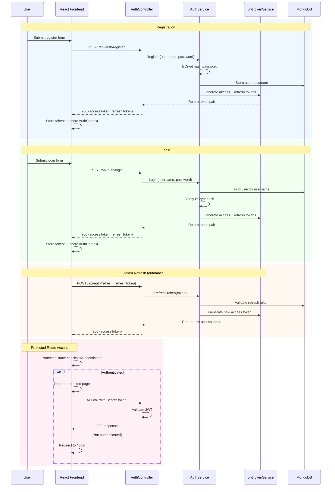

# Authentication Flow

JWT-based authentication with access and refresh tokens.

```mermaid
sequenceDiagram
    participant User
    participant Frontend as React Frontend
    participant AuthCtrl as AuthController
    participant AuthSvc as AuthService
    participant JwtSvc as JwtTokenService
    participant MongoDB

    rect rgb(240, 248, 255)
        Note over User,MongoDB: Registration
        User->>Frontend: Submit register form
        Frontend->>AuthCtrl: POST /api/auth/register
        AuthCtrl->>AuthSvc: Register(username, password)
        AuthSvc->>AuthSvc: BCrypt hash password
        AuthSvc->>MongoDB: Store user document
        AuthSvc->>JwtSvc: Generate access + refresh tokens
        JwtSvc-->>AuthCtrl: Return token pair
        AuthCtrl-->>Frontend: 200 {accessToken, refreshToken}
        Frontend->>Frontend: Store tokens, update AuthContext
    end

    rect rgb(240, 255, 240)
        Note over User,MongoDB: Login
        User->>Frontend: Submit login form
        Frontend->>AuthCtrl: POST /api/auth/login
        AuthCtrl->>AuthSvc: Login(username, password)
        AuthSvc->>MongoDB: Find user by username
        AuthSvc->>AuthSvc: Verify BCrypt hash
        AuthSvc->>JwtSvc: Generate access + refresh tokens
        JwtSvc-->>AuthCtrl: Return token pair
        AuthCtrl-->>Frontend: 200 {accessToken, refreshToken}
        Frontend->>Frontend: Store tokens, update AuthContext
    end

    rect rgb(255, 248, 240)
        Note over User,JwtSvc: Token Refresh (automatic)
        Frontend->>AuthCtrl: POST /api/auth/refresh {refreshToken}
        AuthCtrl->>AuthSvc: RefreshToken(token)
        AuthSvc->>MongoDB: Validate refresh token
        AuthSvc->>JwtSvc: Generate new access token
        JwtSvc-->>AuthCtrl: Return new access token
        AuthCtrl-->>Frontend: 200 {accessToken}
    end

    rect rgb(255, 240, 245)
        Note over User,Frontend: Protected Route Access
        Frontend->>Frontend: ProtectedRoute checks isAuthenticated
        alt Authenticated
            Frontend->>Frontend: Render protected page
            Frontend->>AuthCtrl: API call with Bearer token
            AuthCtrl->>AuthCtrl: Validate JWT
            AuthCtrl-->>Frontend: 200 response
        else Not authenticated
            Frontend->>Frontend: Redirect to /login
        end
    end
```

---

[Back to Architecture Overview](index.md)
