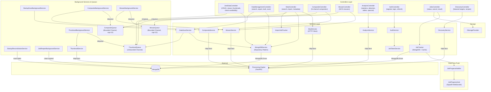

# Backend Service Layer

The .NET backend follows the repository pattern with clear separation of concerns.

```mermaid
flowchart TB
    subgraph Controllers["Controllers Layer"]
        JwstCtrl["JwstDataController\n(CRUD, viewer, thumbnails,\ncheck-availability)"]
        DataMgmtCtrl["DataManagementController\n(search, export, bulk, scan)"]
        MastCtrl["MastController\n(search, import, metadata)"]
        CompositeCtrl["CompositeController\n(N-channel composites)"]
        MosaicCtrl["MosaicController\n(WCS mosaics)"]
        AnalysisCtrl["AnalysisController\n(statistics, detection,\ntables, spectral)"]
        AuthCtrl["AuthController\n(register, login, refresh)"]
        JobsCtrl["JobsController\n(status, cancel, result)"]
        DiscoveryCtrl["DiscoveryController\n(featured targets, recipes)"]
    end

    subgraph Services["Services Layer"]
        MongoSvc["MongoDBService\n(Repository Pattern)"]
        MastSvc["MastService\n(HTTP Client)"]
        CompositeSvc["CompositeService"]
        MosaicSvc["MosaicService"]
        AnalysisSvc["AnalysisService"]
        DiscoverySvc["DiscoveryService"]
        AuthSvc["AuthService"]
        JwtSvc["JwtTokenService"]
        ImportTracker["ImportJobTracker"]
        UnifiedTracker["JobTracker\n(MongoDB + Cache)"]
        DataScanSvc["DataScanService"]
    end

    subgraph Background["Background Services & Queues"]
        StartupScanBg["StartupScanBackgroundService"]
        ReconcileBg["StartupReconciliationService"]
        ReaperBg["JobReaperBackgroundService"]

        ThumbnailQ["ThumbnailQueue\n(Unbounded Channel)"]
        ThumbnailBg["ThumbnailBackgroundService"]
        ThumbnailSvc["ThumbnailService"]

        CompositeQ["CompositeQueue\n(Bounded Channel, cap=10)"]
        CompositeBg["CompositeBackgroundService"]

        MosaicQ["MosaicQueue\n(Bounded Channel, cap=10)"]
        MosaicBg["MosaicBackgroundService"]
    end

    subgraph RealTime["Real-Time Push"]
        SignalRHub["JobProgressHub\n(SignalR WebSocket)"]
        Notifier["JobProgressNotifier"]
    end

    subgraph StorageLayer["Storage"]
        StorageProvider["IStorageProvider"]
    end

    subgraph External["External"]
        MongoDB[("MongoDB")]
        ProcessingAPI["Processing Engine\n(FastAPI)"]
    end

    JwstCtrl --> MongoSvc
    JwstCtrl --> ThumbnailQ
    DataMgmtCtrl --> MongoSvc
    DataMgmtCtrl --> DataScanSvc
    MastCtrl --> MastSvc
    MastCtrl --> MongoSvc
    MastCtrl --> ThumbnailQ
    MastCtrl --> ImportTracker
    CompositeCtrl --> CompositeSvc
    CompositeCtrl -->|enqueue| CompositeQ
    MosaicCtrl --> MosaicSvc
    MosaicCtrl -->|enqueue| MosaicQ
    AnalysisCtrl --> AnalysisSvc
    AuthCtrl --> AuthSvc
    AuthSvc --> JwtSvc
    DiscoveryCtrl --> DiscoverySvc
    JobsCtrl --> UnifiedTracker
    JobsCtrl --> StorageProvider

    CompositeBg -->|dequeue| CompositeQ
    CompositeBg --> CompositeSvc
    MosaicBg -->|dequeue| MosaicQ
    MosaicBg --> MosaicSvc
    ThumbnailBg -->|dequeue| ThumbnailQ
    ThumbnailBg --> ThumbnailSvc

    UnifiedTracker --> Notifier
    Notifier --> SignalRHub
    UnifiedTracker -->|MongoDB.Driver| MongoDB
    ReaperBg -->|clean expired| MongoDB
    ReconcileBg -->|mark failed| MongoDB

    StartupScanBg --> DataScanSvc
    DataScanSvc --> MongoSvc
    DataScanSvc --> ThumbnailQ

    MongoSvc -->|MongoDB.Driver| MongoDB
    MastSvc -->|HttpClient| ProcessingAPI
    CompositeSvc -->|HttpClient| ProcessingAPI
    MosaicSvc -->|HttpClient| ProcessingAPI
    AnalysisSvc -->|HttpClient| ProcessingAPI
    DiscoverySvc -->|HttpClient| ProcessingAPI
    ThumbnailSvc -->|HttpClient| ProcessingAPI
```

---

[Back to Architecture Overview](index.md)
