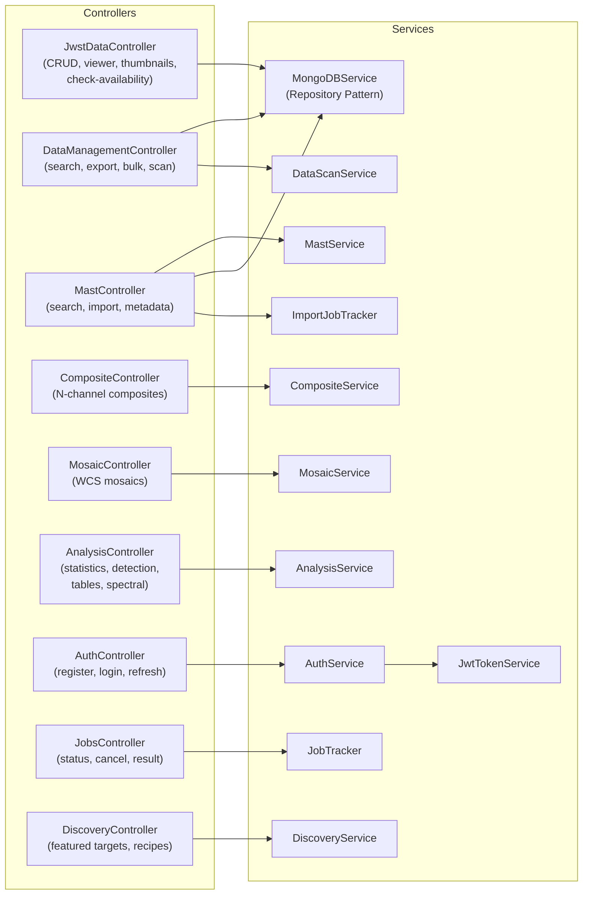
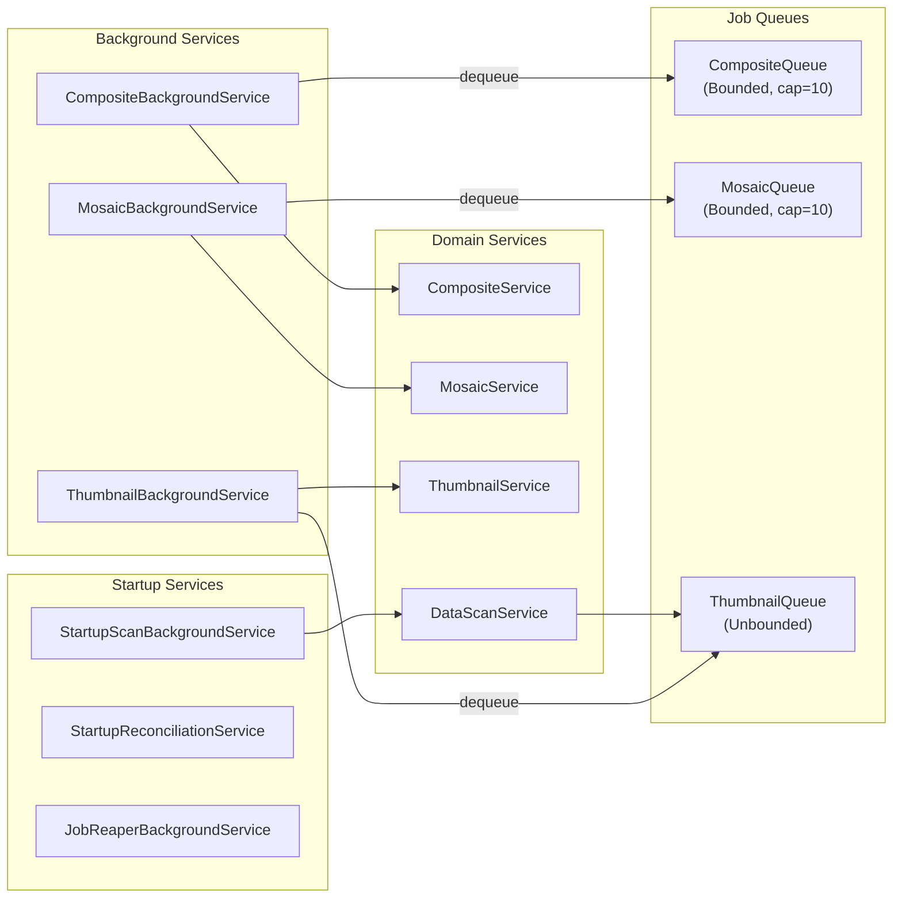
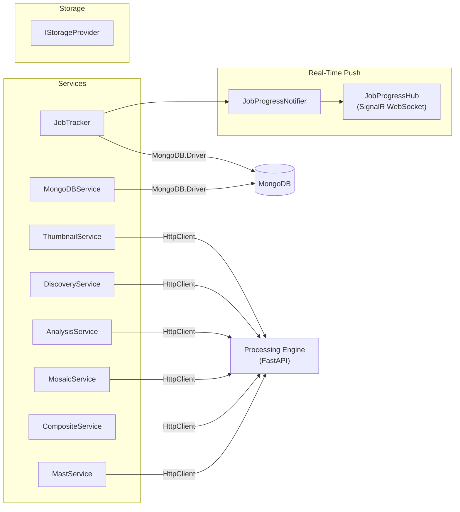

# Backend Service Layer

The .NET backend follows the repository pattern with clear separation of concerns.

## Request Flow

Controllers receive HTTP requests and delegate to domain services.

## Background Processing

Async job queues process composites, mosaics, and thumbnails via bounded channels.

## External Dependencies

Services communicate with MongoDB and the Python processing engine.

---

[Back to Architecture Overview](index.md)
