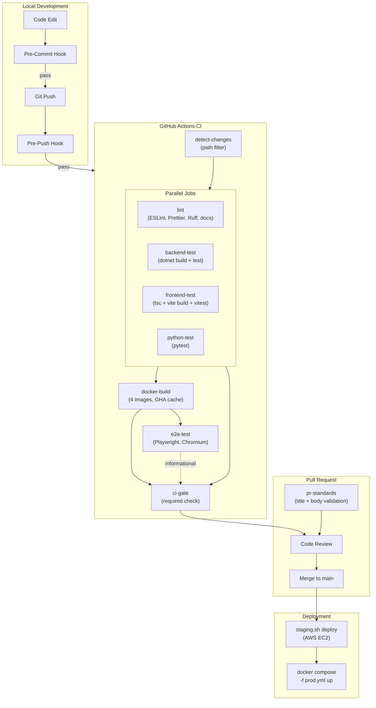
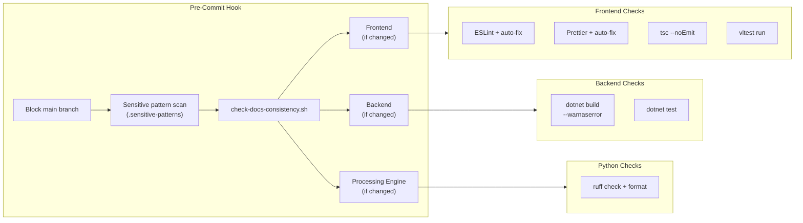

# Build Pipeline

CI/CD flow from local development through commit hooks, CI, and deployment.

> **4+1 View**: Development View

## Pipeline Overview



## Stage 1: Local — Pre-Commit Hook

Runs on `git commit`. Blocks commit on failure.



**What gets checked**:
- Commits to `main` are **blocked** (must use feature branches)
- Staged diffs scanned against `.sensitive-patterns` (AWS IDs, IPs, emails, absolute paths)
- Doc consistency (cross-references between architecture docs)
- Service-specific checks run only if that service's files are staged

## Stage 2: Local — Pre-Push Hook

Runs on `git push`. Blocks pushes to `main`.

- Prevents direct pushes to the `main` branch
- Allows branch deletions (`git push --delete`)
- All changes must go through feature branches + PRs

## Stage 3: CI — GitHub Actions

### Triggers

| Workflow | Trigger |
|----------|---------|
| `ci.yml` | PR to main, push to main, manual dispatch |
| `pr-standards.yml` | PR opened, edited, synchronized, ready for review |
| `security.yml` | PR to main, push to main, weekly (Sunday), manual |
| `docs.yml` | Push to main with `docs/**` or `mkdocs.yml` changes |

### CI Pipeline (`ci.yml`)

#### 1. detect-changes

Uses `dorny/paths-filter` to determine which services changed:
- `backend/**` → run backend tests
- `frontend/**` → run frontend tests
- `processing-engine/**` → run Python tests
- `docker/**`, `scripts/**` → run Docker build

**Docs fast path**: If only `docs/**` changed, all code jobs are skipped.

#### 2. Parallel Test Jobs

| Job | Setup | Steps | Threshold |
|-----|-------|-------|-----------|
| **lint** | Node 22 | ESLint, Prettier check, Ruff, docs consistency | Zero warnings |
| **backend-test** | .NET 10 SDK | `dotnet restore` → `build` → `test` with Coverlet | 40% line coverage |
| **frontend-test** | Node 22 | `npm ci` → `tsc -b && vite build` → `vitest` | Build must pass |
| **python-test** | Python 3.12 | `pip install -r requirements-dev.txt` → `pytest` | 60% coverage |

#### 3. Docker Build

Builds 4 images in parallel with GitHub Actions cache:

| Image | Dockerfile | Cache Scope |
|-------|-----------|-------------|
| Backend | `backend/JwstDataAnalysis.API/Dockerfile` | `backend` |
| Frontend | `frontend/jwst-frontend/Dockerfile.dev` | `frontend` |
| Processing Engine | `processing-engine/Dockerfile` | `processing` |
| MAST Proxy | `processing-engine/Dockerfile.mast` | `mast-proxy` |

#### 4. E2E Tests

- Depends on: docker-build (loads cached images)
- Seeds MongoDB with fixture data
- Runs Playwright (Chromium only)
- **Informational only** — not a required check

#### 5. CI Gate

**Required checks** for merge: `lint` + `backend-test` + `frontend-test` + `python-test` + `docker-build` (must pass or be skipped via path filter).

E2E is explicitly non-blocking.

### PR Standards (`pr-standards.yml`)

Validates PR metadata via `.github/scripts/validate-pr.js`:
- Title format and length
- Required body sections (Summary, Changes Made, Test Plan, etc.)
- `Closes #N` or `No linked issue` present
- Tech Debt Impact checkbox
- Risk & Rollback section

### Security Scanning (`security.yml`)

Weekly + on-demand CodeQL scans:

| Job | Language | Source |
|-----|----------|--------|
| `codeql-csharp` | C# | `backend/**` |
| `codeql-javascript` | TypeScript/JS | `frontend/**` |
| `codeql-python` | Python | `processing-engine/**` |

## Stage 4: Deployment

### Staging (AWS EC2)

```
git checkout staging
git merge main (fast-forward)
./scripts/staging.sh deploy
  ↓
SSH to EC2 → git pull → docker compose up -d --build
  (uses docker-compose.yml + docker-compose.staging.yml)
```

### Production

```
docker compose -f docker-compose.yml -f docker-compose.prod.yml up -d --build
```

Manual process — no automated production deployment pipeline. SSL certificates must be provisioned separately.

## Claude Code Hooks (Development-Time)

In addition to git hooks, Claude Code hooks run during development:

| Hook | Trigger | Purpose |
|------|---------|---------|
| `post-edit-typecheck` | After Edit/Write on .ts/.tsx | Per-file `tsc` check |
| `post-edit-lint` | After Edit/Write | Anti-pattern scan (inline styles, `any`, debug logging) |
| `post-edit-ruff` | After Edit/Write on `.py` | Per-file `ruff check` on processing-engine files |
| `post-edit-doc-drift` | After Edit/Write | Warns when docs may need updating |
| `validate-before-pr-create` | Before `gh pr create` | Validates PR body and branch prefix |
| `require-plan-file` | Before Edit/Write | Warns if no plan file in `docs/plans/features/` matches the current implementation branch |
| `warn-pr-merge` | Before `gh pr merge` | Warns for merge approval |
| `block-push-merged-branch` | Before `git push` | Blocks pushes to already-merged branches |

## Build Matrix

| Check | Pre-Commit | CI | Required for Merge |
|-------|-----------|----|--------------------|
| Block main commits | Yes | — | — |
| Sensitive pattern scan | Yes | — | — |
| ESLint + Prettier | Yes (auto-fix) | Yes (check only) | Yes |
| TypeScript type check | Yes | Yes (via build) | Yes |
| Vitest unit tests | Yes | Yes | Yes |
| dotnet build (warnings as errors) | Yes | Yes | Yes |
| dotnet test | Yes | Yes | Yes |
| Ruff lint + format | Yes | Yes | Yes |
| Python pytest | No (requires Docker) | Yes | Yes |
| Docker image builds | No | Yes | Yes |
| E2E (Playwright) | No | Yes | **No** (informational) |
| CodeQL security scan | No | Weekly + PR | No |
| PR standards validation | No | Yes | Yes |
| Docs consistency | Yes | Yes | Yes |
| Code coverage (backend) | No | Yes (40% threshold) | Yes |
| Code coverage (Python) | No | Yes (60% threshold) | Yes |

---

[Back to Architecture Overview](index.md)
