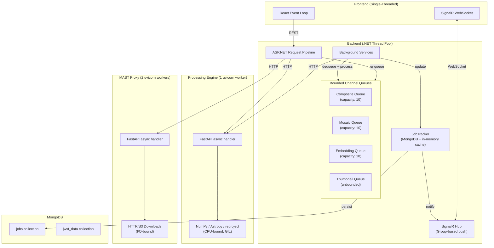
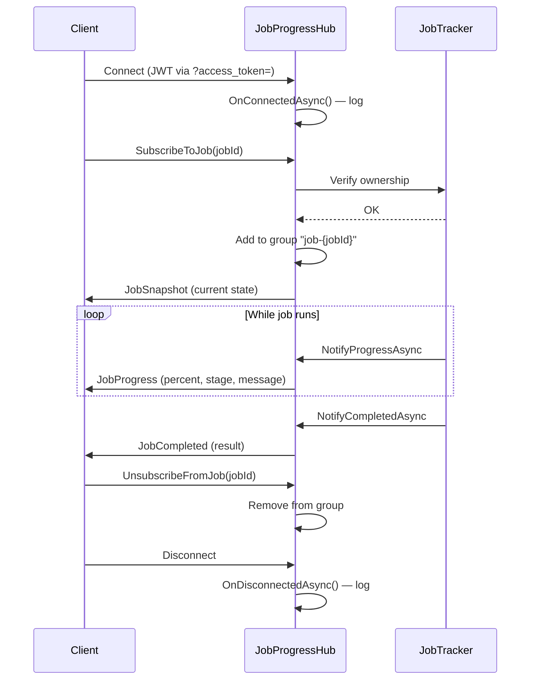
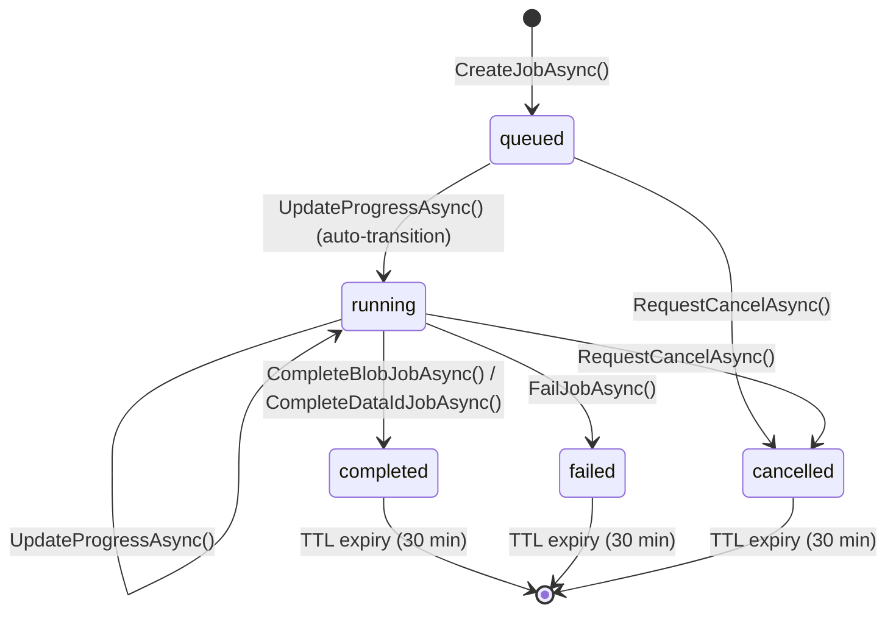

# Concurrency Model

Runtime concurrency, threading, job queue behavior, and real-time communication patterns.

> **4+1 View**: Process View

## System Concurrency Overview



## Job Queue Architecture

The backend uses .NET `BoundedChannel<T>` for async job queues with dedicated `BackgroundService` consumers.

### Queue Configuration

| Queue | Capacity | Consumer | Concurrency | Purpose |
|-------|----------|----------|-------------|---------|
| Composite | 10 | `CompositeBackgroundService` | Sequential (1 reader) | N-channel composite exports |
| Mosaic | 10 | `MosaicBackgroundService` | Sequential (1 reader) | Mosaic exports and saves |
| Embedding | 10 | `EmbeddingBackgroundService` | Sequential (1 reader) | Semantic search indexing |
| Thumbnail | Unbounded | `ThumbnailBackgroundService` | Sequential (1 reader) | Thumbnail generation |

### Queue Behavior

```
API Request (POST /api/composite/export-nchannel)
  ↓
JobTracker.CreateJobAsync() → state: "queued"
  ↓
Channel.TryWrite(item)
  ├─ Success → return jobId (202 Accepted)
  └─ Full (10 items) → return 503 Service Unavailable
  ↓
BackgroundService reads from channel (blocking await)
  ↓
JobTracker.UpdateProgressAsync() → state: "running"
  ↓
HTTP call to Processing Engine
  ↓
  ├─ Success → store result → JobTracker.CompleteBlobJobAsync()
  └─ Failure → JobTracker.FailJobAsync()
  ↓
SignalR push to subscribed clients
```

### Cancellation Flow

```
User clicks Cancel → POST /api/jobs/{jobId}/cancel
  ↓
JobTracker.RequestCancelAsync() → sets CancelRequested = true
  ↓
BackgroundService checks flag:
  - Before processing: skip job
  - After generation, before storage: discard result
  - During Processing Engine call: not interrupted (completes, then discarded)
```

**Limitation**: Cancellation is cooperative — the Processing Engine itself does not receive cancel signals. Long-running composites/mosaics will complete on the Python side even if cancelled.

## Processing Engine Concurrency

### Worker Model

| Service | Workers | Model | Why |
|---------|---------|-------|-----|
| Processing Engine | 1 | Single-process async | CPU-bound NumPy/Astropy work under GIL — additional workers don't help |
| MAST Proxy | 2 | Multi-process async | I/O-bound downloads — 2 workers allow concurrent downloads |

### Processing Engine (1 Worker)

- **One request at a time** for CPU-bound work (composite, mosaic, analysis)
- FastAPI async handlers allow I/O concurrency (file reads, storage writes)
- NumPy/SciPy release the GIL for array operations, but reproject does not fully
- Practical throughput: ~1 composite or mosaic at a time

### MAST Proxy (2 Workers)

- Each uvicorn worker is a separate Python process
- Can handle 2 concurrent MAST downloads
- Downloads are I/O-bound (network + disk), minimal CPU
- aiohttp used for async HTTP requests

## SignalR Real-Time Communication

### Connection Lifecycle



### Group-Based Delivery

- Each job gets a SignalR group: `job-{jobId}`
- Multiple clients can subscribe to the same job
- Messages sent to group (not individual connections)
- Ownership verified on subscribe (prevents cross-user snooping)

### Snapshot Pattern (Race Condition Fix)

When a client subscribes, the hub immediately sends a `JobSnapshot` with the current state. This prevents the race where:
1. Client subscribes
2. Job completes between subscribe and first push
3. Client never receives completion event

## Job State Machine



### Job Storage

- **Primary**: MongoDB `jobs` collection (survives restarts)
- **Cache**: `ConcurrentDictionary` in-memory (fast reads)
- **Dual-write**: Cache updated first, then async MongoDB persist
- **TTL**: 30 minutes after completion, cleaned by background reaper (every 5 min, 100 jobs/batch)

### Import Jobs (Special Case)

Import jobs use a separate `ImportJobTracker` with:
- In-memory primary state (byte-level download progress)
- Fire-and-forget writes to unified JobTracker for SignalR
- Resumable: tracks `DownloadedBytes`, `TotalBytes`, `FileProgress`
- MongoDB write failure doesn't block imports

## Backend Thread Model

### ASP.NET Core

- **Thread pool**: Default .NET thread pool (min 12 threads on 2-core)
- **Request handling**: Async throughout — no blocking calls
- **Background services**: 4 hosted services, each on its own long-running thread
- **SignalR**: Managed by ASP.NET, shares thread pool

### Concurrent Access Patterns

| Resource | Protection | Pattern |
|----------|-----------|---------|
| Job state (memory) | `ConcurrentDictionary` | Lock-free reads, atomic updates |
| Job state (MongoDB) | Single writer per job | Background service is sole mutator |
| Bounded channels | Thread-safe by design | Producer/consumer pattern |
| SignalR groups | Framework-managed | No custom locking needed |
| Storage writes | Atomic (write-then-record) | No partial state visible |

## Rate Limiting

Per-IP rate limiting via AspNetCoreRateLimit:

| Endpoint Pattern | Limit | Period | Reason |
|-----------------|-------|--------|--------|
| `POST /api/mast/*` | 30 | 1 min | Prevent MAST API abuse |
| `POST /api/jwstdata/*/process` | 10 | 1 min | Prevent job flooding |
| `GET /api/mast/import-progress/*` | 1000 | 1 min | High — polling endpoint |
| `*` (default) | 300 | 1 min | General protection |
| `*` (hourly) | 5000 | 1 hour | Burst cap |

## Capacity Planning

### Current Limits (Single Node)

| Metric | Limit | Bottleneck |
|--------|-------|-----------|
| Concurrent composite jobs | 10 queued, 1 processing | Processing Engine (1 worker) |
| Concurrent mosaic jobs | 10 queued, 1 processing | Processing Engine (1 worker) |
| Concurrent MAST downloads | 2 | MAST Proxy (2 workers) |
| Max FITS file size | 2 GB | `MAX_FITS_FILE_SIZE_MB` |
| Max array elements | 100M–200M | `MAX_FITS_ARRAY_ELEMENTS` |
| Max mosaic output | 64M pixels | `MAX_MOSAIC_OUTPUT_PIXELS` |
| Processing Engine memory | 4 GB | Docker `mem_limit` |
| SignalR connections | ~1000 | ASP.NET default |

### Scaling Constraints

- **Vertical**: Increase Processing Engine memory for larger mosaics
- **Horizontal**: Not currently supported — single backend instance assumed for job queues and SignalR
- **Future**: Would require distributed job queue (Redis/RabbitMQ) and SignalR backplane (Redis) for multi-instance

---

[Back to Architecture Overview](index.md)
