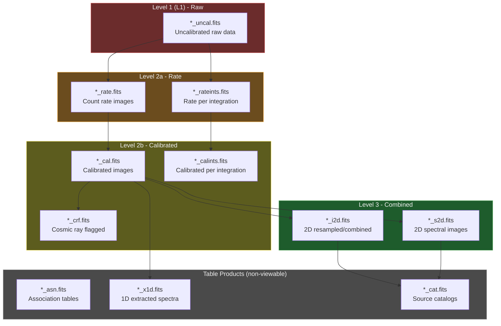
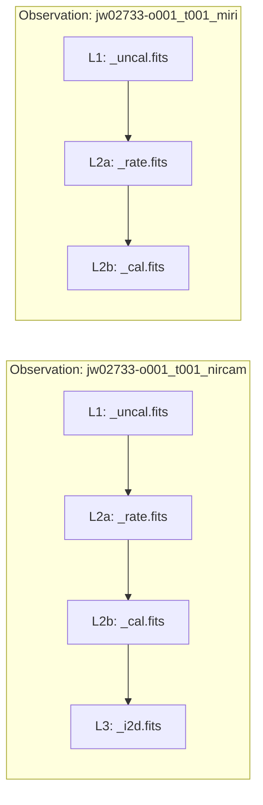

# Data Lineage

JWST data products progress through processing levels. Files are grouped by `ObservationBaseId` for lineage tracking.

## Lineage Grouping

Files are grouped by observation for lineage visualization:

---

[Back to Architecture Overview](index.md)
