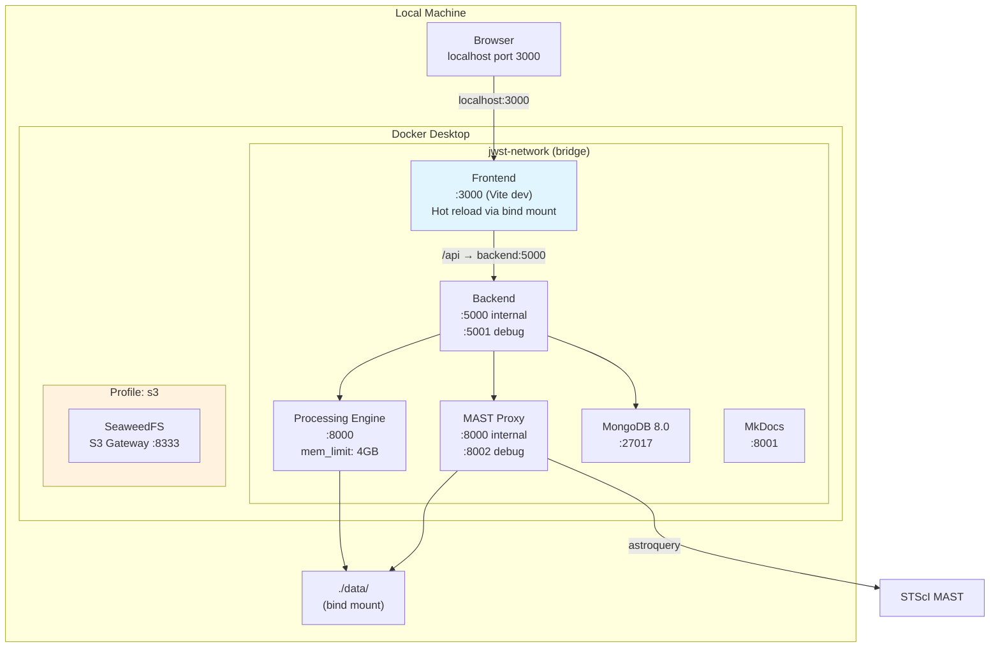
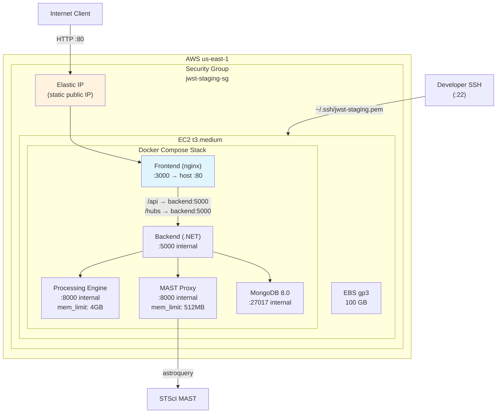
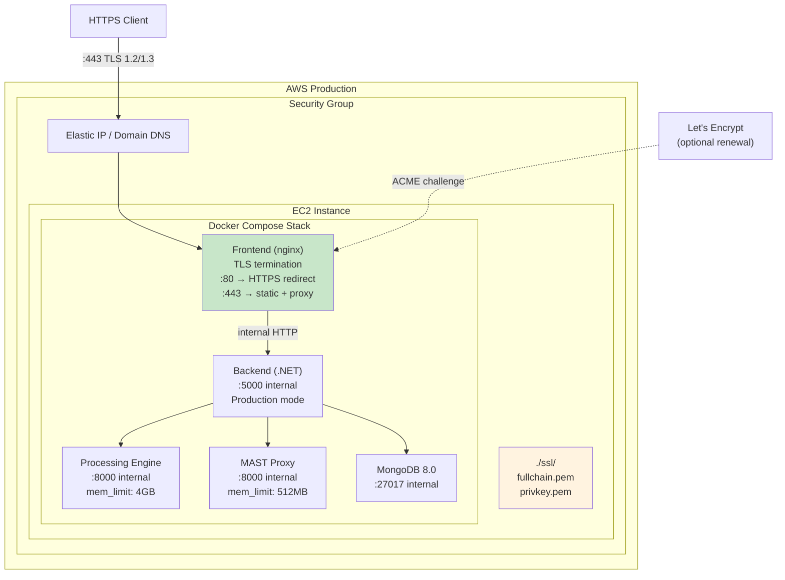
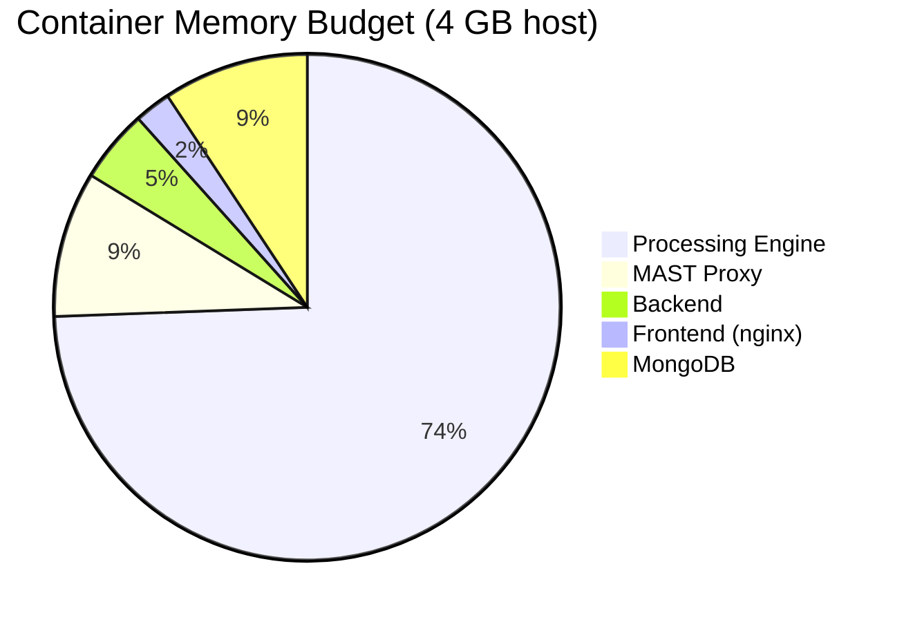
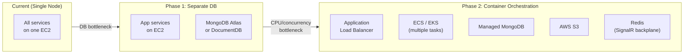

# Deployment Architecture

Infrastructure topology for all deployment environments — local development, staging, and production.

> **4+1 View**: Physical View
>
> For the operator runbook (provisioning steps, cert acquisition, backup/restore
> procedures, common operations), see [`../deployment.md`](../deployment.md).
> This document covers topology and design rationale; that one covers how to
> actually run things.

## Environment Comparison

| Aspect | Development | Staging | Production |
|--------|-------------|---------|------------|
| **Host** | Local machine | AWS EC2 t3.medium | AWS EC2 (t3.medium+) |
| **OS** | macOS / Linux | Amazon Linux 2023 | Amazon Linux 2023 |
| **Compose files** | base + override | base + staging | base + prod |
| **Frontend** | Vite dev server (HMR) | nginx + static build | nginx + static build + TLS |
| **External access** | localhost only | HTTP (Elastic IP) | HTTPS (domain + cert) |
| **Storage** | Local filesystem | Local filesystem | S3-compatible (optional) |
| **Debug ports** | Exposed (8000, 8002) | Not exposed | Not exposed |
| **Cost** | $0 | ~$43/mo (24/7) | ~$43/mo+ |

## Development Environment



**Key characteristics**:
- All ports bound to localhost loopback (not accessible from network)
- Frontend uses Vite dev server with bind mount for instant HMR
- Debug ports exposed for Processing Engine (8000) and MAST Proxy (8002)
- MkDocs documentation site at :8001
- SeaweedFS S3 available via `--profile s3` flag

### Docker Compose Commands

```bash
# Standard development
docker compose up -d

# With S3 storage
docker compose --profile s3 up -d

# Rebuild after code changes
docker compose up -d --build

# Run E2E tests (mock processing engine)
docker compose -f docker-compose.yml -f docker-compose.e2e.yml up -d
```

## Staging Environment (AWS EC2)



**Infrastructure**:
- **Instance**: t3.medium (2 vCPU, 4 GB RAM, burstable)
- **Storage**: 100 GB gp3 EBS volume
- **Networking**: Elastic IP for stable public address; Security Group allows SSH (22), HTTP (80), HTTPS (443)
- **No TLS** — staging is HTTP-only

### Provisioning

```bash
# Provision EC2 + security group + EIP
./scripts/deploy-aws.sh

# SSH and bootstrap application
scp scripts/server-setup.sh ec2-user@<IP>:~/
ssh -i ~/.ssh/jwst-staging.pem ec2-user@<IP>
./server-setup.sh
```

### Management

```bash
./scripts/staging.sh status    # Instance state + service health
./scripts/staging.sh deploy    # Pull latest + rebuild
./scripts/staging.sh ssh       # SSH into instance
./scripts/staging.sh stop      # Stop EC2 (saves compute cost)
./scripts/staging.sh start     # Resume EC2
./scripts/staging.sh promote   # Fast-forward staging branch to main
```

### Cost

| Resource | Monthly (24/7) | Monthly (stopped) |
|----------|---------------|-------------------|
| EC2 t3.medium | ~$30 | $0 |
| EBS 100 GB gp3 | ~$8 | ~$8 |
| Elastic IP | $3.65 | $3.65 |
| **Total** | **~$43** | **~$12** |

## Production Environment



**Additional production features**:
- **TLS termination** at nginx (TLS 1.2 + 1.3, modern ciphers)
- **HSTS** header (max-age 31536000)
- **CSP** header (restrictive content security policy)
- **OCSP stapling** enabled
- **HTTP → HTTPS redirect** on port 80
- **Forwarded headers** enabled for correct client IP logging
- **No debug ports** exposed
- **CORS** restricted to production domain only

### SSL Certificate Options

1. **Let's Encrypt** (recommended): `certbot` with webroot challenge, auto-renewal
2. **Manual**: Copy certificate files to `docker/ssl/`

## Resource Allocation



Note: Processing Engine is allocated 4 GB (the full host RAM on t3.medium). In practice, it uses this only during large composite/mosaic operations. Other services share remaining system memory.

| Service | Memory Limit | CPU | Workers |
|---------|-------------|-----|---------|
| Processing Engine | 4 GB | Shared | 1 uvicorn |
| MAST Proxy | 512 MB | Shared | 2 uvicorn |
| Backend | Unlimited (ASP.NET default) | Shared | Thread pool |
| MongoDB | Unlimited (self-managed) | Shared | WiredTiger cache |
| Frontend (nginx) | Minimal (~50 MB) | Shared | Worker processes |

## Storage Architecture

### Local Storage (Default)

```
/app/data/                     (Docker volume mount → ../data/)
├── mast/                      (Downloaded FITS files from MAST)
├── composites/                (Rendered composite images)
├── mosaics/                   (Mosaic outputs)
├── semantic/                  (FAISS index files)
└── model-cache/               (sentence-transformers model weights)
```

Shared between Processing Engine and MAST Proxy via Docker volume mount.

### S3 Storage (Optional)

```
SeaweedFS (local S3-compatible)     or     AWS S3
├── jwst-data bucket                       ├── jwst-data bucket
│   ├── mast/                              │   ├── mast/
│   ├── composites/                        │   ├── composites/
│   └── mosaics/                           │   └── mosaics/
```

Configured via `STORAGE_PROVIDER=s3` + S3 credentials in `.env`.

## Scaling Path

The current architecture is single-node. Here's the path to horizontal scaling if needed:



| Phase | Trigger | Changes |
|-------|---------|---------|
| **Current** | < 10 concurrent users | Single EC2, all services |
| **Phase 1** | DB performance or durability needs | Managed MongoDB (Atlas/DocumentDB); app stays on EC2 |
| **Phase 2** | Compute bottleneck or HA requirements | ECS/EKS orchestration, ALB, Redis for SignalR backplane, AWS S3 for storage |

---

[Back to Architecture Overview](index.md)
