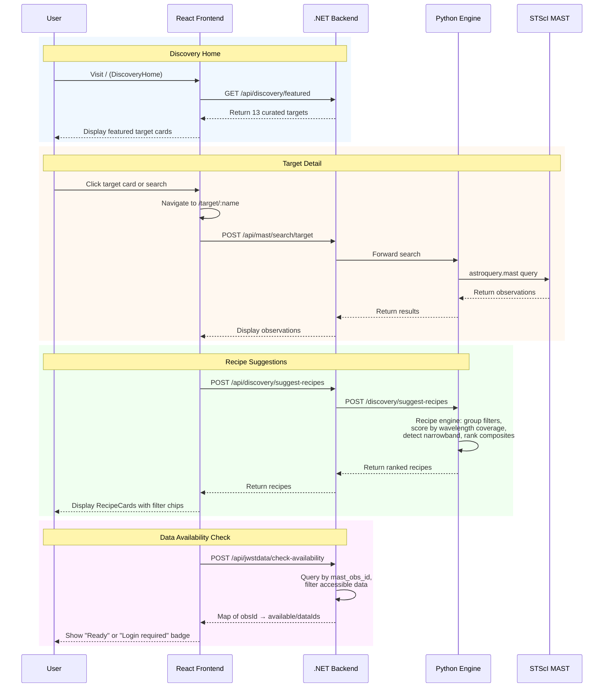

# Discovery & Recipe Flow

The user's primary entry point — browsing featured targets, searching MAST, and getting composite recipe suggestions.

```mermaid
sequenceDiagram
    participant User
    participant Frontend as React Frontend
    participant Backend as .NET Backend
    participant Processing as Python Engine
    participant MAST as STScI MAST

    rect rgb(240, 248, 255)
        Note over User,Backend: Discovery Home
        User->>Frontend: Visit / (DiscoveryHome)
        Frontend->>Backend: GET /api/discovery/featured
        Backend-->>Frontend: Return 13 curated targets
        Frontend-->>User: Display featured target cards
    end

    rect rgb(255, 248, 240)
        Note over User,MAST: Target Detail
        User->>Frontend: Click target card or search
        Frontend->>Frontend: Navigate to /target/:name
        Frontend->>Backend: POST /api/mast/search/target
        Backend->>Processing: Forward search
        Processing->>MAST: astroquery.mast query
        MAST-->>Processing: Return observations
        Processing-->>Backend: Return results
        Backend-->>Frontend: Display observations
    end

    rect rgb(240, 255, 240)
        Note over User,Processing: Recipe Suggestions
        Frontend->>Backend: POST /api/discovery/suggest-recipes
        Backend->>Processing: POST /discovery/suggest-recipes
        Processing->>Processing: Recipe engine: group filters,<br/>score by wavelength coverage,<br/>detect narrowband, rank composites
        Processing-->>Backend: Return ranked recipes
        Backend-->>Frontend: Return recipes
        Frontend-->>User: Display RecipeCards with filter chips
    end

    rect rgb(255, 240, 255)
        Note over User,Backend: Data Availability Check
        Frontend->>Backend: POST /api/jwstdata/check-availability
        Backend->>Backend: Query by mast_obs_id,<br/>filter accessible data
        Backend-->>Frontend: Map of obsId → available/dataIds
        Frontend-->>User: Show "Ready" or "Login required" badge
    end
```

---

[Back to Architecture Overview](index.md)
