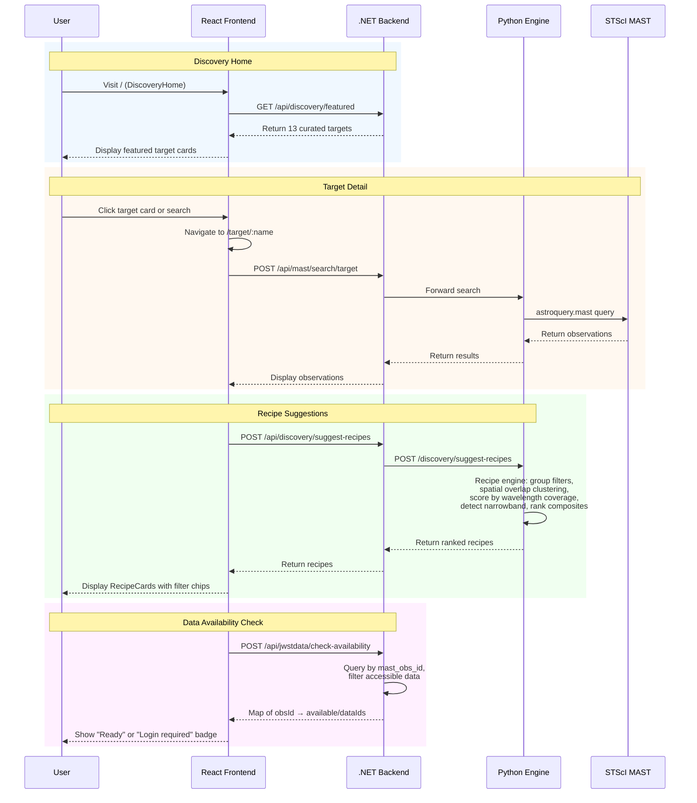

# Discovery & Recipe Flow

The user's primary entry point — browsing featured targets, searching MAST, and getting composite recipe suggestions.

## Spatial Overlap Detection

The recipe engine uses observation center coordinates (`s_ra`, `s_dec`) to detect whether observations from different instruments actually overlap on the sky. This prevents broken composites where, e.g., MIRI data from one pointing gets combined with NIRCam data from a completely different pointing.

**Algorithm**: Single-linkage clustering using known JWST instrument FOV radii:
- NIRCAM: 1.1' radius (~2.2' square field)
- MIRI: 0.75' radius (~1.23'×1.88', conservative)
- NIRISS: 1.1', NIRSPEC: 1.6' (MSA)

Two observations overlap if their center separation < sum of FOV radii. Cross-instrument recipes are only generated for groups containing 2+ instruments.

**Fallback**: When no coordinate data is present, the engine assumes all observations overlap (backward compatible with pre-spatial-awareness behavior).

**Mosaic detection**: `requires_mosaic` is set when the same filter appears at 2+ distinct pointings (>10" apart).

## Recipe Ranking

The recipe engine generates ranked composites based on instrument coverage:

### Multi-instrument targets (e.g. NIRCam + MIRI)

| Rank | Recipe | Description |
|------|--------|-------------|
| 1 | Cross-instrument (overlapping filters only) | Stars and dust — full wavelength coverage. Only includes spatially overlapping observations. Uses instrument-aware color mapping: NIRCam → cool hues (blue-green), MIRI → warm hues (yellow-red) |
| 2 | All filters (per instrument) | Maximum detail from a single instrument |
| 3 | Classic 3-color | Three well-separated wavelengths |
| 4 | Narrowband highlight | Emission-line filters for gas structures |
| 5 | Broadband clean | Broadband filters for continuum view |

If no instruments overlap spatially, no cross-instrument recipe is generated and single-instrument recipes start at rank 1.

### Single-instrument targets

| Rank | Recipe |
|------|--------|
| 1 | All available filters |
| 2 | Classic 3-color |
| 3 | Narrowband highlight |
| 4 | Broadband clean |

The frontend marks array index 0 as "Recommended".

---

[Back to Architecture Overview](index.md)
