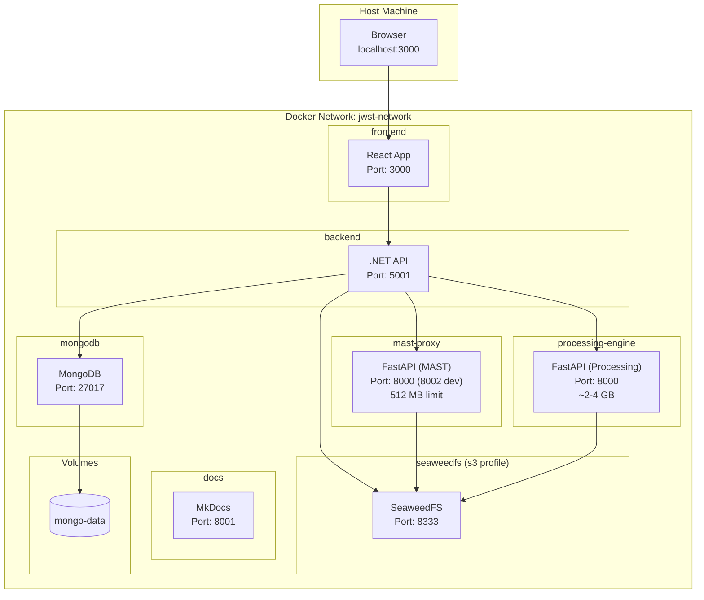

# Docker Compose Services

The complete application stack orchestrated via Docker Compose.



## Community Edition (CE) Topology

The CE deployment (`docker/docker-compose.ce.yml`, CE plan Phase 4) is a
three-container slice with no .NET tier, no mast-proxy, no SeaweedFS:

```text
                     Internet
                        │  :80 (the ONLY published port; TLS in front — Phase 6)
                        ▼
              ┌───────────────────┐
              │ frontend (nginx)  │  VITE_CE_MODE build · SPA + /api proxy
              │  mem 256m         │  limit_req: api 10r/s · mast 2r/s · render 1r/s
              └─────────┬─────────┘  timeouts: 600s render (relaxed-threshold posture)
              ce-edge   │
              ┌─────────▼─────────┐
              │ processing-engine │  CE_MODE deny-by-default /api facade
              │  mem 4g           │  render semaphore 2 slots + queue 4
              └─────────┬─────────┘  data mount READ-ONLY
              ce-internal (internal: true — no host ports, no egress)
              ┌─────────▼─────────┐
              │ mongodb           │  ceReader (read role only)
              │  mem 1g · WT 0.5g │  seeded catalog, IsPublic data
              └───────────────────┘
```

Defense layers, outermost first: nginx rate limits → engine deny-by-default
route mounting + default-deny middleware → render semaphore + input caps +
per-request memory budget → read-only Mongo credentials → read-only FITS
mount → internal-only DB network. Covers #651 (network isolation) and #745
(resource limits) for the CE topology.

Known residual: the single-image data views (`preview`/`histogram`/
`pixeldata`/`cubeinfo`) are capped per-IP at nginx (3r/s, 4 conns) but have
no engine-side concurrency gate — aggregate cross-IP load is unbounded
below the container memory limit. Tracked in #1664.

---

[Back to Architecture Overview](index.md)

