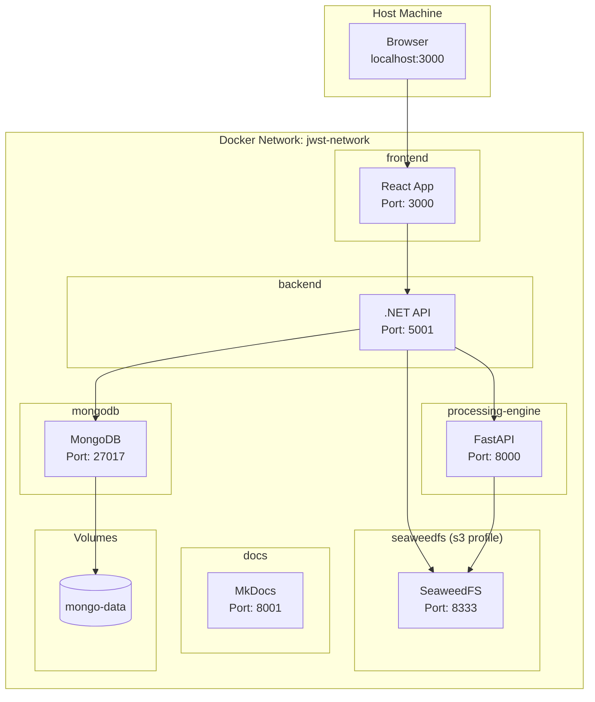

# Docker Compose Services

The complete application stack orchestrated via Docker Compose.

```mermaid
flowchart TB
    subgraph DockerNetwork["Docker Network: jwst-network"]
        subgraph Frontend["frontend"]
            ReactContainer["React App\nPort: 3000"]
        end

        subgraph Backend["backend"]
            DotNetContainer[".NET API\nPort: 5001"]
        end

        subgraph Processing["processing-engine"]
            PythonContainer["FastAPI\nPort: 8000"]
        end

        subgraph Database["mongodb"]
            MongoContainer["MongoDB\nPort: 27017"]
        end

        subgraph Docs["docs"]
            DocsContainer["MkDocs\nPort: 8001"]
        end

        subgraph S3Dev["seaweedfs (s3 profile)"]
            SeaweedFS["SeaweedFS\nPort: 8333"]
        end

        subgraph Volumes["Volumes"]
            MongoData[("mongo-data")]
        end
    end

    subgraph Host["Host Machine"]
        Browser["Browser\nlocalhost:3000"]
    end

    Browser --> ReactContainer
    ReactContainer --> DotNetContainer
    DotNetContainer --> PythonContainer
    DotNetContainer --> MongoContainer
    DotNetContainer --> SeaweedFS
    PythonContainer --> SeaweedFS
    MongoContainer --> MongoData
```

---

[Back to Architecture Overview](index.md)
