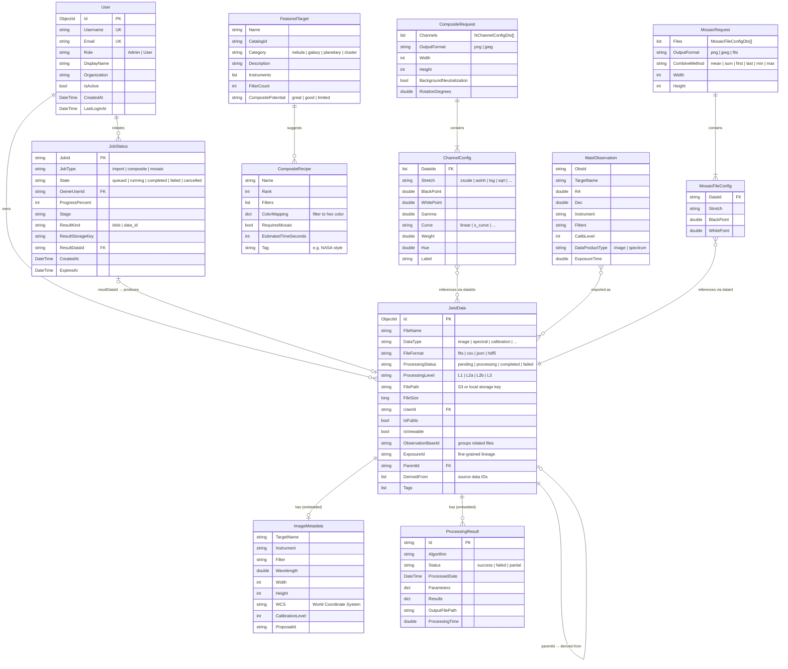

# Domain Model

Conceptual entity-relationship model for the JWST Data Analysis Application. This diagram shows the core domain objects, their key attributes, and how they relate to each other.

> **4+1 View**: Logical View

## Entity Relationship Diagram



## Domain Concepts

### Data Lifecycle

JWST data flows through a well-defined pipeline, modeled by the `ProcessingLevel` field:

| Level | Description | FITS Suffix | Example |
|-------|-------------|-------------|---------|
| **L1** | Raw detector readout | `_uncal` | Uncalibrated frames |
| **L2a** | Count rate images | `_rate`, `_rateints` | Detector-level calibration |
| **L2b** | Calibrated exposures | `_cal`, `_crf` | Fully calibrated single exposures |
| **L3** | Combined/mosaicked products | `_i2d`, `_s2d`, `_x1d` | Science-ready composites |

Files are grouped by `ObservationBaseId` (e.g., `jw02733-o001_t001_nircam`) and linked via `ParentId` / `DerivedFrom` for full lineage tracking.

### Observation Grouping

```
Observation (ObservationBaseId)
├── L1: jw02733001001_02101_00001_nrca1_uncal.fits
├── L2a: jw02733001001_02101_00001_nrca1_rate.fits
├── L2b: jw02733001001_02101_00001_nrca1_cal.fits
└── L3: jw02733-o001_t001_nircam_clear-f200w_i2d.fits
```

### Access Control Model

- **MAST imports** are always `IsPublic = true` (public archive data)
- **User uploads** default to private (`IsPublic = false`)
- `SharedWith` list enables selective sharing by user ID
- Admin role has full access to all records

### Job Lifecycle

Jobs progress through a state machine tracked by `JobStatus`:

```
queued → running → completed
                 → failed
         ↓
       cancelled (via CancelRequested flag)
```

Results are stored as either:
- **blob**: Binary file in S3/local storage (`ResultStorageKey` + `ResultContentType`)
- **data_id**: Reference to a new `JwstData` document (`ResultDataId`)

### Discovery & Recipes

The discovery flow connects external MAST data to the compositing workflow:

1. **FeaturedTarget** — curated list of photogenic JWST targets
2. **CompositeRecipe** — filter combinations ranked by visual quality
3. User selects a recipe → system resolves MAST observations → imports data → creates composite

---

## MongoDB Collections

| Collection | Document Type | Indexes |
|------------|--------------|---------|
| `jwst_data` | JwstData + embedded metadata | userId, observationBaseId, processingLevel, tags, uploadDate |
| `users` | User | username (unique), email (unique) |
| `jobs` | JobStatus | ownerUserId, state, createdAt |

---

[Back to Architecture Overview](index.md)
