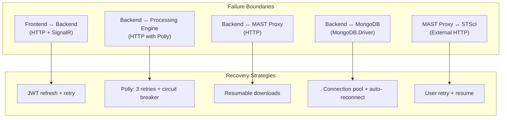
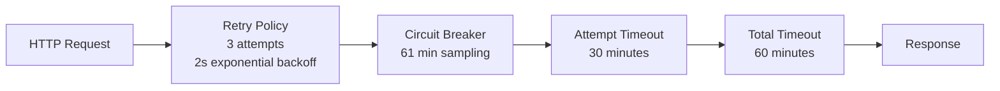
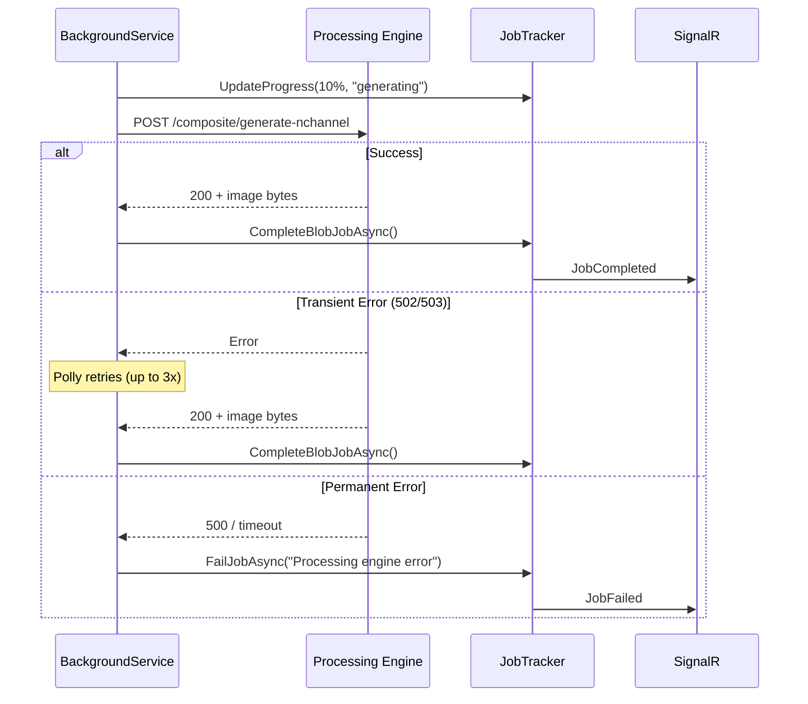
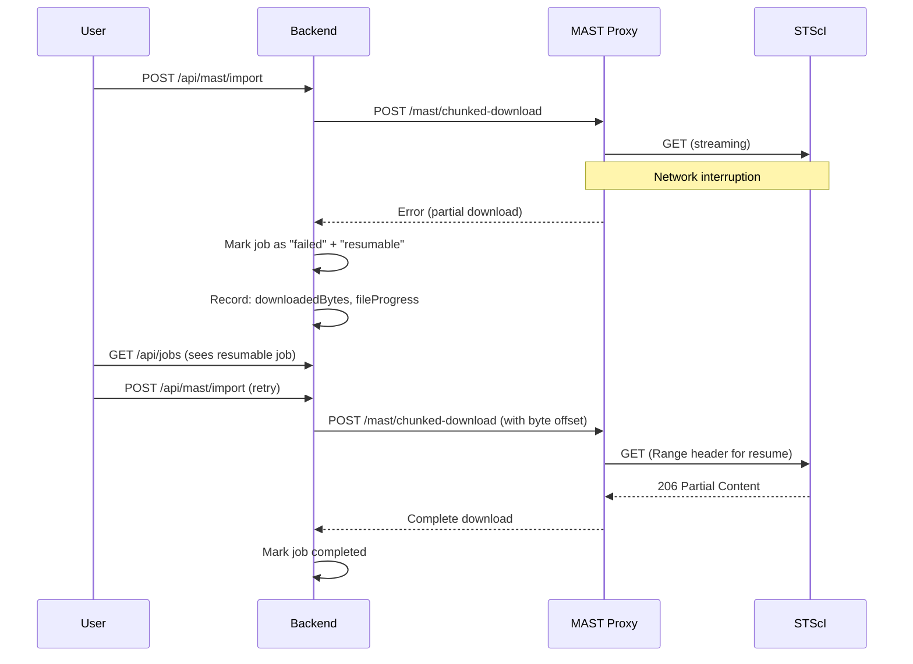
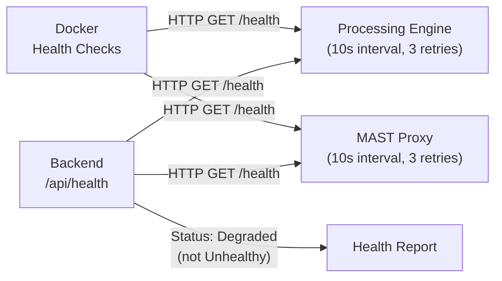

# Error Recovery

Failure modes, retry strategies, and recovery paths for each service boundary and operation type.

> **4+1 View**: Process View

## Error Recovery Overview



## Boundary 1: Frontend ↔ Backend

### Authentication Failures

| Trigger | Response | Recovery |
|---------|----------|----------|
| Access token expired | 401 Unauthorized | `apiClient` auto-refreshes token via `/api/auth/refresh`, retries original request |
| Refresh token expired | 401 on refresh | Redirect to login page, clear local auth state |
| Invalid credentials | 401 on login | Show error, user retries |

### SignalR Disconnection

| Trigger | Response | Recovery |
|---------|----------|----------|
| Network interruption | WebSocket close | SignalR auto-reconnect (built-in, exponential backoff) |
| Token expired during connection | Auth failure | Reconnect with fresh token |
| Server restart | Connection drop | Auto-reconnect + re-subscribe to active jobs |
| Missed updates during disconnect | Stale UI | `JobSnapshot` sent on re-subscribe catches up state |

### HTTP Request Failures

| Trigger | Response | Recovery |
|---------|----------|----------|
| Network timeout | Fetch error | UI shows error toast, user retries |
| 429 Rate Limited | `Retry-After` header | UI backs off, can retry after delay |
| 503 Service Unavailable | Error response | UI shows "service busy" message |

## Boundary 2: Backend ↔ Processing Engine

### Polly Resilience Pipeline (Composite & Mosaic)



**Retry Conditions**:

| Error | Retried? | Reason |
|-------|----------|--------|
| `HttpRequestException` | Yes | Transient network error |
| `TimeoutRejectedException` | Yes | Temporary overload |
| HTTP 502 Bad Gateway | Yes | Proxy/container restart |
| HTTP 503 Service Unavailable | Yes | Temporary unavailability |
| HTTP 504 Gateway Timeout | Yes | Slow response |
| HTTP 500 Internal Server Error | **No** | Application bug — retrying won't help |
| HTTP 400 Bad Request | **No** | Client error — fix the request |
| HTTP 413 Payload Too Large | **No** | Input too big — won't shrink on retry |

### Error Translation

The backend translates Processing Engine errors into user-friendly messages via `ProcessingErrorMessages`:

```
HttpRequestException + ServiceUnavailable → "Processing engine is temporarily unavailable"
HttpRequestException + SocketException    → "Processing engine not reachable"
TaskCanceledException                     → "Processing timed out"
KeyNotFoundException                      → Original message preserved (e.g., "File not found")
Default                                   → "An unexpected error occurred"
```

### Job Failure Pattern



## Boundary 3: Backend ↔ MAST Proxy (Imports)

### Download Failure Recovery

| Failure | Detection | Recovery |
|---------|-----------|----------|
| Network interruption mid-download | `HttpRequestException` | Job marked as resumable; user can restart |
| STScI server 5xx | HTTP status code | Job fails; user retries (no automatic retry for downloads) |
| Disk full | `IOException` | Job fails with storage error; no partial records saved |
| Download timeout (5 min) | `TaskCanceledException` | Job fails; user can retry |
| User cancellation | `CancelRequested` flag | `CancellationTokenSource` cancels HTTP request; job marked cancelled |

### Resumable Import Pattern



### Import Data Integrity

- **Atomic record creation**: FITS metadata extracted and validated before MongoDB insert
- **No partial records**: If import fails mid-file, no `JwstData` document is created for that file
- **Checksum verification**: File checksums computed on download for integrity validation
- **Cleanup on failure**: Partially downloaded files cleaned up; storage and DB stay consistent

## Boundary 4: Backend ↔ MongoDB

### Connection Resilience

- **Connection pool**: MongoDB.Driver manages connection pool automatically
- **Auto-reconnect**: Driver handles transient disconnections transparently
- **No custom retry**: Relies on driver-level retry (retryable writes enabled by default in MongoDB 4.2+)

### Failure Scenarios

| Failure | Impact | Recovery |
|---------|--------|----------|
| MongoDB unreachable at startup | Backend won't start | Docker `depends_on` ensures MongoDB starts first; health check would catch |
| MongoDB crash during operation | Write failure | Operation fails; user retries; MongoDB restarts via Docker |
| Disk full (MongoDB) | Write failure | Docker container may crash-loop (exit 133); fix: `docker image prune -f && docker builder prune -f` |

### Dual-Write Consistency (JobTracker)

The JobTracker uses a write-through cache:

```
1. Update ConcurrentDictionary (in-memory) ← immediate
2. Persist to MongoDB (async)              ← may fail
3. Push via SignalR (async)                ← may fail
```

- **Memory is authoritative** for active jobs (fast reads)
- **MongoDB is authoritative** for job recovery after restart
- **If MongoDB write fails**: Job progress still visible in-memory; logged as warning; job can still complete
- **On restart**: In-memory cache lost; running jobs appear as stale in MongoDB (need manual cleanup or TTL expiry)

## Boundary 5: MAST Proxy ↔ STScI External

### MAST API Resilience

| Failure | Frequency | Handling |
|---------|-----------|---------|
| MAST API timeout | Occasional | 5-minute timeout; fail and surface to user |
| MAST API 5xx | Rare | Fail with "MAST service unavailable" |
| MAST API rate limit | Possible | Backend rate limits MAST calls to 30/min to stay well under MAST limits |
| MAST API schema change | Very rare | Would cause parsing errors; manual code update needed |
| STScI maintenance window | Periodic | Discovery/import unavailable; local features unaffected |

### Isolation Principle

MAST failures are isolated to MAST-dependent features:

| Feature | MAST Dependency | Impact of MAST Outage |
|---------|----------------|----------------------|
| Discovery (featured targets) | None (curated list) | No impact |
| MAST search | Direct | Unavailable |
| Data import | Direct | Unavailable |
| Recipe suggestions | Indirect (needs MAST data) | Limited (works with already-imported data) |
| Compositing | None | No impact |
| Mosaic | None | No impact |
| Analysis | None | No impact |
| Data library | None | No impact |

## Container Restart Recovery

### Processing Engine Restart

| State | Detection | Recovery |
|-------|-----------|---------|
| No active job | Health check passes after restart | No impact |
| Active HTTP request from backend | `HttpRequestException` on backend | Polly retries (up to 3x); may succeed after container restarts |
| Active job in queue | Backend detects HTTP failure | Job marked failed; user can re-submit |

### Backend Restart

| State | Detection | Recovery |
|-------|-----------|---------|
| In-memory job cache | Lost on restart | Stale jobs in MongoDB; TTL cleans up in 30 min |
| Bounded channel queues | Lost on restart | Queued jobs lost; users must re-submit |
| SignalR connections | Dropped | Clients auto-reconnect; re-subscribe |
| Active HTTP calls | Interrupted | Processing Engine may complete work that no one collects |

### MongoDB Restart

| State | Detection | Recovery |
|-------|-----------|---------|
| Clean restart | Brief unavailability | Backend operations fail during restart; auto-recover after |
| Crash (exit 133 = OOM) | Container restart loop | Likely disk space issue; prune Docker images |
| Data corruption | Startup failure | Restore from Docker volume backup |

## Health Check Architecture



- Processing Engine or MAST Proxy down → backend reports **Degraded** (not Unhealthy)
- Backend continues serving local operations (data library, auth)
- Docker restarts containers after 3 consecutive health check failures (30 seconds)

---

[Back to Architecture Overview](index.md)
