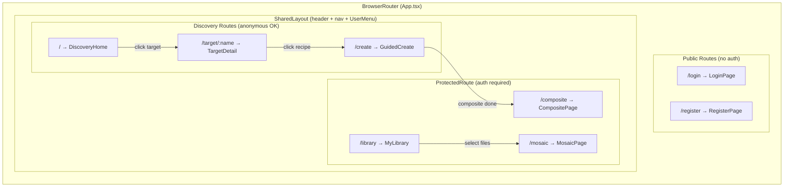
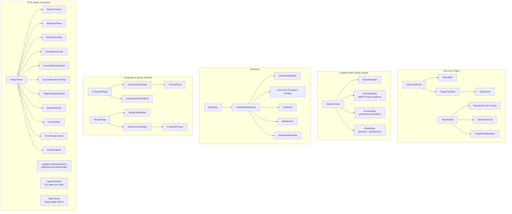

# Frontend Architecture

## Route Structure

React Router-based SPA with public and protected routes.

## Component Hierarchy

Key component trees for major features.

---

[Back to Architecture Overview](index.md)
