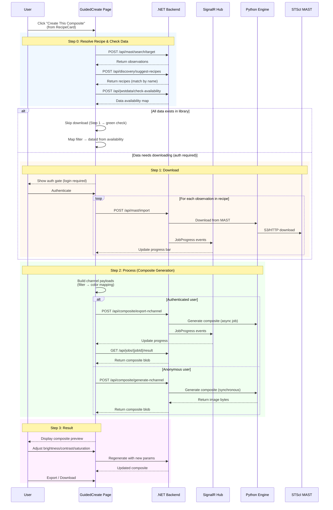

# GuidedCreate End-to-End Flow

The main user journey: recipe selection → data check → download (if needed) → composite generation → result.

```mermaid
sequenceDiagram
    participant User
    participant GuidedCreate as GuidedCreate Page
    participant Backend as .NET Backend
    participant SignalR as SignalR Hub
    participant Processing as Python Engine
    participant MAST as STScI MAST

    User->>GuidedCreate: Click "Create This Composite"<br/>(from RecipeCard)

    rect rgb(240, 248, 255)
        Note over User,Backend: Step 0: Resolve Recipe & Check Data
        GuidedCreate->>Backend: POST /api/mast/search/target
        Backend-->>GuidedCreate: Return observations
        GuidedCreate->>Backend: POST /api/discovery/suggest-recipes
        Backend-->>GuidedCreate: Return recipes (match by name)
        GuidedCreate->>Backend: POST /api/jwstdata/check-availability
        Backend-->>GuidedCreate: Data availability map
    end

    alt All data exists in library
        GuidedCreate->>GuidedCreate: Skip download (Step 1 → green check)
        GuidedCreate->>GuidedCreate: Map filter → dataId from availability
    else Data needs downloading (auth required)
        rect rgb(255, 248, 240)
            Note over User,MAST: Step 1: Download
            GuidedCreate-->>User: Show auth gate (login required)
            User->>GuidedCreate: Authenticate
            loop For each observation in recipe
                GuidedCreate->>Backend: POST /api/mast/import
                Backend->>Processing: Download from MAST
                Processing->>MAST: S3/HTTP download
                Backend->>SignalR: JobProgress events
                SignalR-->>GuidedCreate: Update progress bar
            end
        end
    end

    rect rgb(240, 255, 240)
        Note over User,Processing: Step 2: Process (Composite Generation)
        GuidedCreate->>GuidedCreate: Build channel payloads<br/>(filter → color mapping)

        alt Authenticated user
            GuidedCreate->>Backend: POST /api/composite/export-nchannel
            Backend->>Processing: Generate composite (async job)
            Backend->>SignalR: JobProgress events
            SignalR-->>GuidedCreate: Update progress
            GuidedCreate->>Backend: GET /api/jobs/{jobId}/result
            Backend-->>GuidedCreate: Return composite blob
        else Anonymous user
            GuidedCreate->>Backend: POST /api/composite/generate-nchannel
            Backend->>Processing: Generate composite (synchronous)
            Processing-->>Backend: Return image bytes
            Backend-->>GuidedCreate: Return composite blob
        end
    end

    rect rgb(255, 240, 255)
        Note over User,GuidedCreate: Step 3: Result
        GuidedCreate-->>User: Display composite preview
        User->>GuidedCreate: Adjust brightness/contrast/saturation
        GuidedCreate->>Backend: Regenerate with new params
        Backend-->>GuidedCreate: Updated composite
        User->>GuidedCreate: Export / Download
    end
```

---

[Back to Architecture Overview](index.md)
