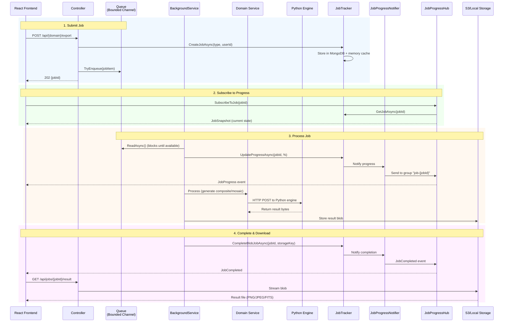

# Job Queue & SignalR Progress

The async job pattern used by composite export, mosaic export, mosaic save, and thumbnail generation.

```mermaid
sequenceDiagram
    participant Frontend as React Frontend
    participant Controller as Controller
    participant Queue as Queue<br/>(Bounded Channel)
    participant BgService as BackgroundService
    participant Service as Domain Service
    participant Processing as Python Engine
    participant JobTracker as JobTracker
    participant Notifier as JobProgressNotifier
    participant SignalR as JobProgressHub
    participant Storage as S3/Local Storage

    rect rgb(240, 248, 255)
        Note over Frontend,Queue: 1. Submit Job
        Frontend->>Controller: POST /api/{domain}/export
        Controller->>JobTracker: CreateJobAsync(type, userId)
        JobTracker->>JobTracker: Store in MongoDB + memory cache
        Controller->>Queue: TryEnqueue(jobItem)
        Controller-->>Frontend: 202 {jobId}
    end

    rect rgb(240, 255, 240)
        Note over Frontend,SignalR: 2. Subscribe to Progress
        Frontend->>SignalR: SubscribeToJob(jobId)
        SignalR->>JobTracker: GetJobAsync(jobId)
        SignalR-->>Frontend: JobSnapshot (current state)
    end

    rect rgb(255, 248, 240)
        Note over Queue,Storage: 3. Process Job
        BgService->>Queue: ReadAsync() (blocks until available)
        BgService->>JobTracker: UpdateProgressAsync(jobId, %)
        JobTracker->>Notifier: Notify progress
        Notifier->>SignalR: Send to group "job-{jobId}"
        SignalR-->>Frontend: JobProgress event
        BgService->>Service: Process (generate composite/mosaic)
        Service->>Processing: HTTP POST to Python engine
        Processing-->>Service: Return result bytes
        BgService->>Storage: Store result blob
    end

    rect rgb(255, 240, 255)
        Note over Frontend,Storage: 4. Complete & Download
        BgService->>JobTracker: CompleteBlobJobAsync(jobId, storageKey)
        JobTracker->>Notifier: Notify completion
        Notifier->>SignalR: JobCompleted event
        SignalR-->>Frontend: JobCompleted
        Frontend->>Controller: GET /api/jobs/{jobId}/result
        Controller->>Storage: Stream blob
        Storage-->>Frontend: Result file (PNG/JPEG/FITS)
    end
```

---

[Back to Architecture Overview](index.md)
