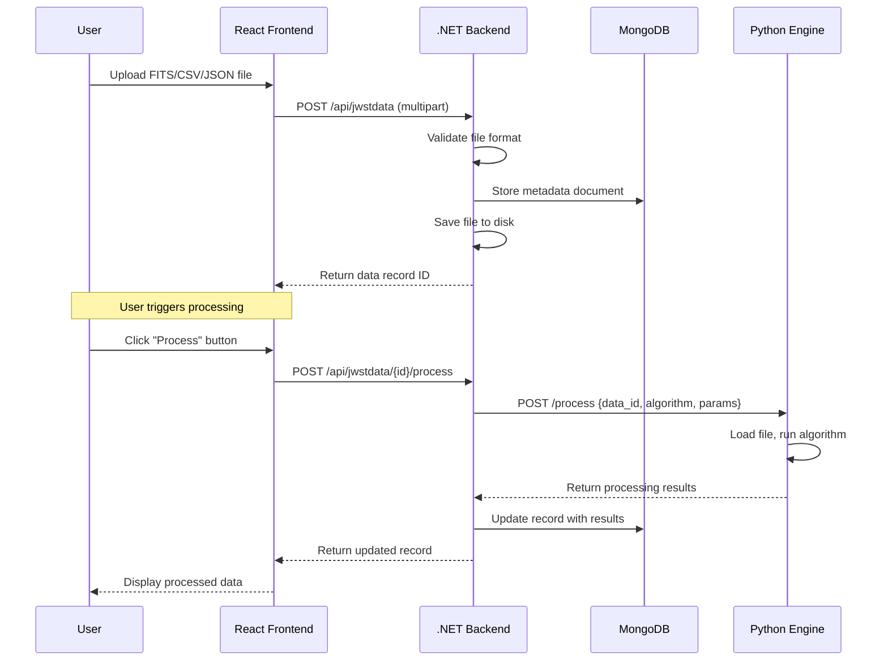

# Local Upload Flow

The flow for uploading JWST data files directly to the application.

```mermaid
sequenceDiagram
    participant User
    participant Frontend as React Frontend
    participant Backend as .NET Backend
    participant MongoDB
    participant Processing as Python Engine

    User->>Frontend: Upload FITS/CSV/JSON file
    Frontend->>Backend: POST /api/jwstdata (multipart)
    Backend->>Backend: Validate file format
    Backend->>MongoDB: Store metadata document
    Backend->>Backend: Save file to disk
    Backend-->>Frontend: Return data record ID

    Note over User,Frontend: User triggers processing

    User->>Frontend: Click "Process" button
    Frontend->>Backend: POST /api/jwstdata/{id}/process
    Backend->>Processing: POST /process {data_id, algorithm, params}
    Processing->>Processing: Load file, run algorithm
    Processing-->>Backend: Return processing results
    Backend->>MongoDB: Update record with results
    Backend-->>Frontend: Return updated record
    Frontend-->>User: Display processed data
```

---

[Back to Architecture Overview](index.md)
