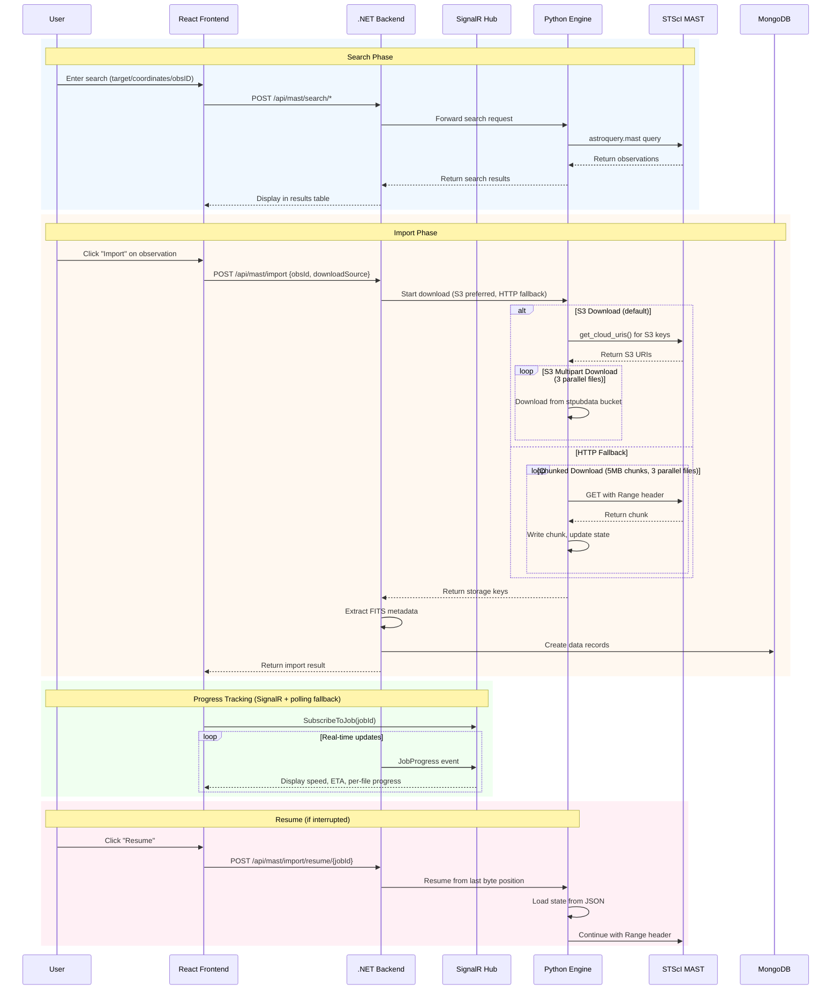

# MAST Import Flow

The complete flow for searching and importing data from the MAST portal, including chunked downloads with resume capability.

```mermaid
sequenceDiagram
    participant User
    participant Frontend as React Frontend
    participant Backend as .NET Backend
    participant SignalR as SignalR Hub
    participant Processing as Python Engine
    participant MAST as STScI MAST
    participant MongoDB

    rect rgb(240, 248, 255)
        Note over User,MAST: Search Phase
        User->>Frontend: Enter search (target/coordinates/obsID)
        Frontend->>Backend: POST /api/mast/search/*
        Backend->>Processing: Forward search request
        Processing->>MAST: astroquery.mast query
        MAST-->>Processing: Return observations
        Processing-->>Backend: Return search results
        Backend-->>Frontend: Display in results table
    end

    rect rgb(255, 248, 240)
        Note over User,MongoDB: Import Phase
        User->>Frontend: Click "Import" on observation
        Frontend->>Backend: POST /api/mast/import {obsId, downloadSource}
        Backend->>Processing: Start download (S3 preferred, HTTP fallback)

        alt S3 Download (default)
            Processing->>MAST: get_cloud_uris() for S3 keys
            MAST-->>Processing: Return S3 URIs
            loop S3 Multipart Download (3 parallel files)
                Processing->>Processing: Download from stpubdata bucket
            end
        else HTTP Fallback
            loop Chunked Download (5MB chunks, 3 parallel files)
                Processing->>MAST: GET with Range header
                MAST-->>Processing: Return chunk
                Processing->>Processing: Write chunk, update state
            end
        end

        Processing-->>Backend: Return storage keys
        Backend->>Backend: Extract FITS metadata
        Backend->>MongoDB: Create data records
        Backend-->>Frontend: Return import result
    end

    rect rgb(240, 255, 240)
        Note over User,SignalR: Progress Tracking (SignalR + polling fallback)
        Frontend->>SignalR: SubscribeToJob(jobId)
        loop Real-time updates
            Backend->>SignalR: JobProgress event
            SignalR-->>Frontend: Display speed, ETA, per-file progress
        end
    end

    rect rgb(255, 240, 245)
        Note over User,Processing: Resume (if interrupted)
        User->>Frontend: Click "Resume"
        Frontend->>Backend: POST /api/mast/import/resume/{jobId}
        Backend->>Processing: Resume from last byte position
        Processing->>Processing: Load state from JSON
        Processing->>MAST: Continue with Range header
    end
```

---

[Back to Architecture Overview](index.md)
