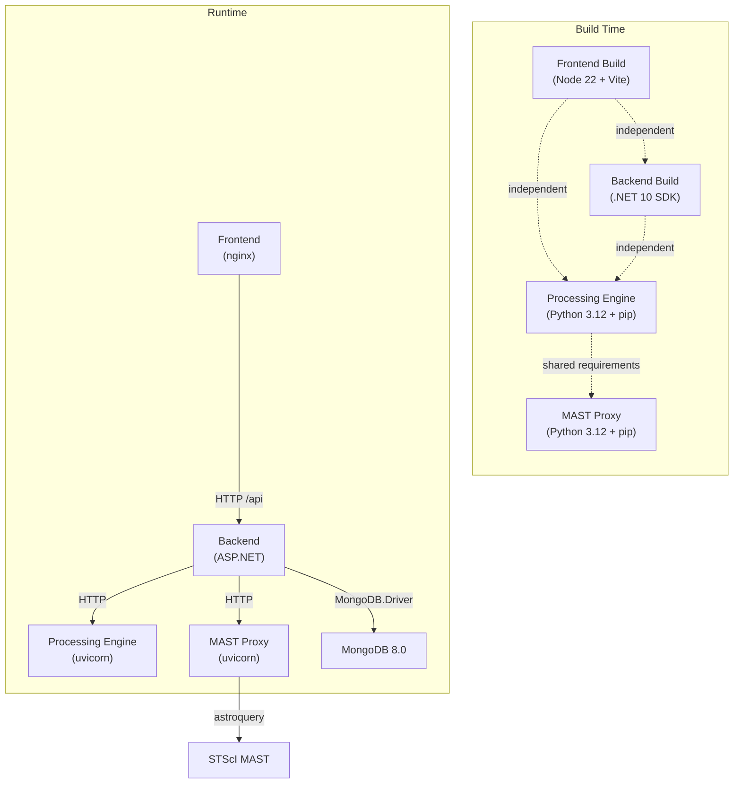
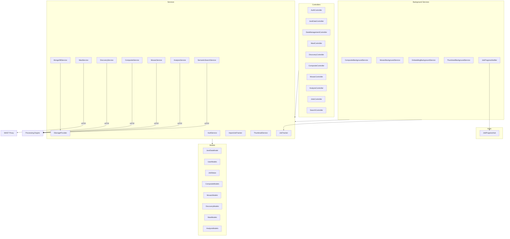
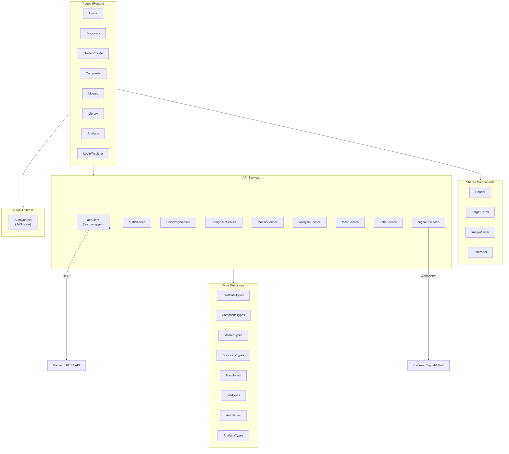
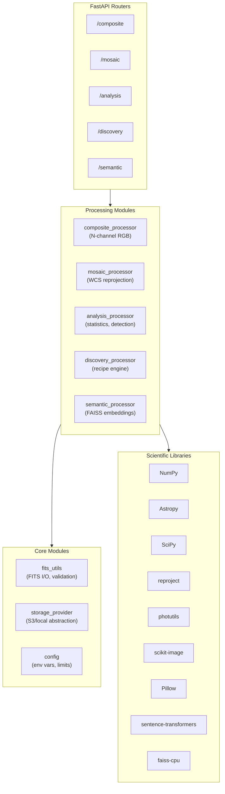

# Module Dependencies

Package and module dependency structure for each service, showing how internal modules relate and which external libraries each service depends on.

> **4+1 View**: Development View

## Cross-Service Dependencies

**Key point**: All services build independently. No shared code or compiled artifacts between services. The only coupling is runtime HTTP API contracts.

## Backend (.NET 10)

### Internal Module Structure

### NuGet Dependencies

| Package | Version | Purpose | Category |
|---------|---------|---------|----------|
| `MongoDB.Driver` | 3.7.1 | Database access | Data |
| `AWSSDK.S3` | 4.x | S3-compatible storage | Data |
| `Microsoft.AspNetCore.Authentication.JwtBearer` | 10.0.5 | JWT authentication | Security |
| `BCrypt.Net-Next` | 4.1.0 | Password hashing | Security |
| `Microsoft.Extensions.Http.Resilience` | 10.4.0 | Polly retry/circuit-breaker | Resilience |
| `AspNetCoreRateLimit` | 5.0.0 | Per-IP rate limiting | Security |
| `Swashbuckle.AspNetCore` | 10.1.5 | Swagger/OpenAPI docs | Dev tooling |
| `Microsoft.AspNetCore.OpenApi` | 10.0.5 | OpenAPI metadata | Dev tooling |

### Test Dependencies

| Package | Version | Purpose |
|---------|---------|---------|
| `xunit` | 2.9.3 | Test framework |
| `Moq` | 4.20.72 | Mocking |
| `FluentAssertions` | 8.8.0 | Assertion library |
| `coverlet.msbuild` | 6.0.4 | Code coverage (40% threshold) |
| `Microsoft.NET.Test.Sdk` | 17.14.1 | Test runner |

## Frontend (React + TypeScript)

### Internal Module Structure

### npm Dependencies

| Package | Version | Purpose | Category |
|---------|---------|---------|----------|
| `react` | ^19.1.0 | UI framework | Core |
| `react-dom` | ^19.1.0 | DOM rendering | Core |
| `react-router-dom` | ^7.13.1 | Client routing | Core |
| `@microsoft/signalr` | ^10.0.0 | Real-time updates | Communication |
| `react-plotly.js` | ^2.6.0 | Scientific charts | Visualization |
| `plotly.js-basic-dist-min` | ^3.4.0 | Chart engine | Visualization |
| `fitsjs` | ^0.6.6 | FITS file parsing | Astronomy |
| `sonner` | ^2.0.7 | Toast notifications | UI |

### Dev/Build Dependencies

| Package | Version | Purpose |
|---------|---------|---------|
| `vite` | ^8.0.0 | Build tool |
| `@vitejs/plugin-react` | ^6.0.1 | React HMR |
| `typescript` | ^5.9.3 | Type checking |
| `vitest` | ^4.0.18 | Unit testing |
| `@testing-library/react` | latest | Component testing |
| `@playwright/test` | ^1.58.2 | E2E testing |
| `eslint` | ^10.1.0 | Linting |
| `prettier` | ^3.4.2 | Formatting |

## Processing Engine (Python 3.12)

### Internal Module Structure

### pip Dependencies

| Package | Version | Purpose | Category |
|---------|---------|---------|----------|
| `fastapi` | 0.135.1 | Web framework | Core |
| `uvicorn` | 0.42.0 | ASGI server | Core |
| `pydantic` | 2.12.5 | Data validation | Core |
| `numpy` | 2.2.6 | Array operations | Scientific |
| `scipy` | 1.15.3 | Scientific computing | Scientific |
| `astropy` | 6.1.7 | Astronomy toolkit (FITS, WCS) | Astronomy |
| `astroquery` | 0.4.11 | MAST API client | Astronomy |
| `photutils` | >=1.10.0 | Source detection | Astronomy |
| `reproject` | >=0.13.0 | WCS reprojection | Astronomy |
| `scikit-image` | >=0.22.0 | Image processing | Image |
| `pillow` | 12.1.1 | Image I/O | Image |
| `matplotlib` | 3.10.8 | Colormaps, plotting | Visualization |
| `pandas` | 2.3.3 | Table data handling | Data |
| `sentence-transformers` | >=3.0.0,<6.0.0 | Text embeddings | ML |
| `onnxruntime` | >=1.18.0,<2.0.0 | Model inference | ML |
| `faiss-cpu` | >=1.9.0,<2.0.0 | Vector similarity search | ML |
| `boto3` | >=1.34.0 | AWS S3 client | Storage |
| `aiohttp` | 3.13.3 | Async HTTP | I/O |
| `aiofiles` | 25.1.0 | Async file I/O | I/O |

### MAST Proxy (Subset)

The MAST Proxy uses `requirements-mast.txt` — a subset of the main requirements focused on I/O:
- `fastapi`, `uvicorn`, `pydantic` (web framework)
- `astroquery`, `astropy` (MAST queries)
- `aiohttp`, `aiofiles`, `boto3` (downloads)
- No scientific computing libraries (numpy, scipy, etc. not needed)

## Dependency Weight Analysis

| Service | Runtime Deps | Docker Image Size (approx) | Heaviest Dependencies |
|---------|-------------|---------------------------|----------------------|
| Frontend | 8 runtime | ~50 MB (nginx + static) | plotly.js (~3 MB), react |
| Backend | 8 NuGet | ~200 MB (ASP.NET runtime) | MongoDB.Driver, AWSSDK.S3 |
| Processing Engine | 20+ pip | ~2 GB (scientific stack) | sentence-transformers, PyTorch/ONNX, astropy |
| MAST Proxy | 8 pip | ~500 MB (astroquery) | astroquery, astropy |

The Processing Engine is by far the heaviest due to ML model dependencies (sentence-transformers + ONNX runtime).

---

[Back to Architecture Overview](index.md)
