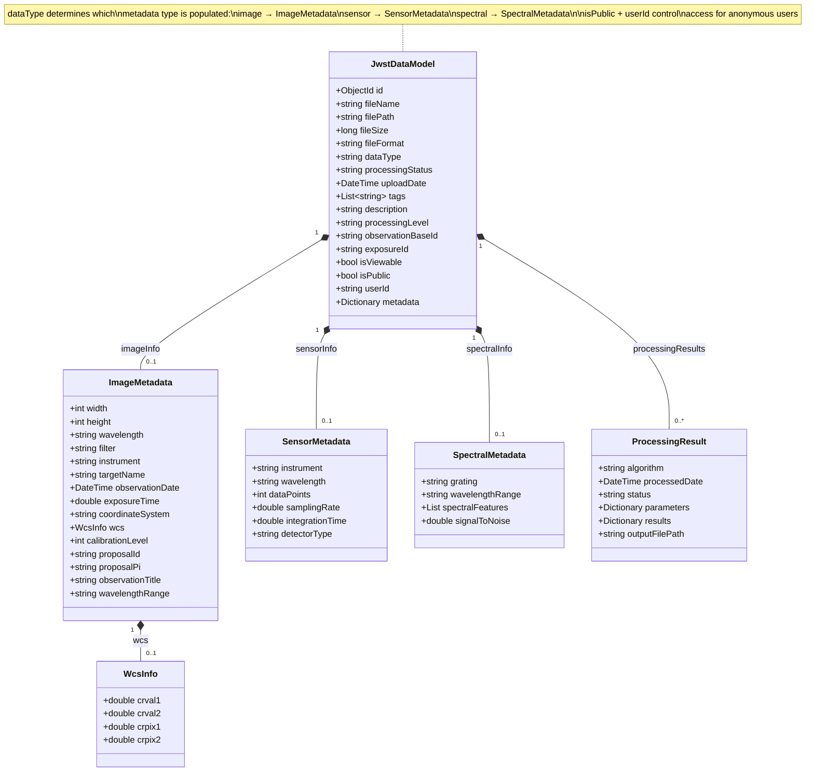

# MongoDB Document Structure

The flexible document schema for JWST data records.

```mermaid
classDiagram
    class JwstDataModel {
        +ObjectId id
        +string fileName
        +string filePath
        +long fileSize
        +string fileFormat
        +string dataType
        +string processingStatus
        +DateTime uploadDate
        +List~string~ tags
        +string description
        +string processingLevel
        +string observationBaseId
        +string exposureId
        +bool isViewable
        +bool isPublic
        +string userId
        +Dictionary metadata
    }

    class ImageMetadata {
        +int width
        +int height
        +string wavelength
        +string filter
        +string instrument
        +string targetName
        +DateTime observationDate
        +double exposureTime
        +string coordinateSystem
        +WcsInfo wcs
        +int calibrationLevel
        +string proposalId
        +string proposalPi
        +string observationTitle
        +string wavelengthRange
    }

    class SensorMetadata {
        +string instrument
        +string wavelength
        +int dataPoints
        +double samplingRate
        +double integrationTime
        +string detectorType
    }

    class SpectralMetadata {
        +string grating
        +string wavelengthRange
        +List spectralFeatures
        +double signalToNoise
    }

    class ProcessingResult {
        +string algorithm
        +DateTime processedDate
        +string status
        +Dictionary parameters
        +Dictionary results
        +string outputFilePath
    }

    class WcsInfo {
        +double crval1
        +double crval2
        +double crpix1
        +double crpix2
    }

    JwstDataModel "1" *-- "0..1" ImageMetadata : imageInfo
    JwstDataModel "1" *-- "0..1" SensorMetadata : sensorInfo
    JwstDataModel "1" *-- "0..1" SpectralMetadata : spectralInfo
    JwstDataModel "1" *-- "0..*" ProcessingResult : processingResults
    ImageMetadata "1" *-- "0..1" WcsInfo : wcs

    note for JwstDataModel "dataType determines which\nmetadata type is populated:\nimage → ImageMetadata\nsensor → SensorMetadata\nspectral → SpectralMetadata\n\nisPublic + userId control\naccess for anonymous users"
```

---

[Back to Architecture Overview](index.md)
