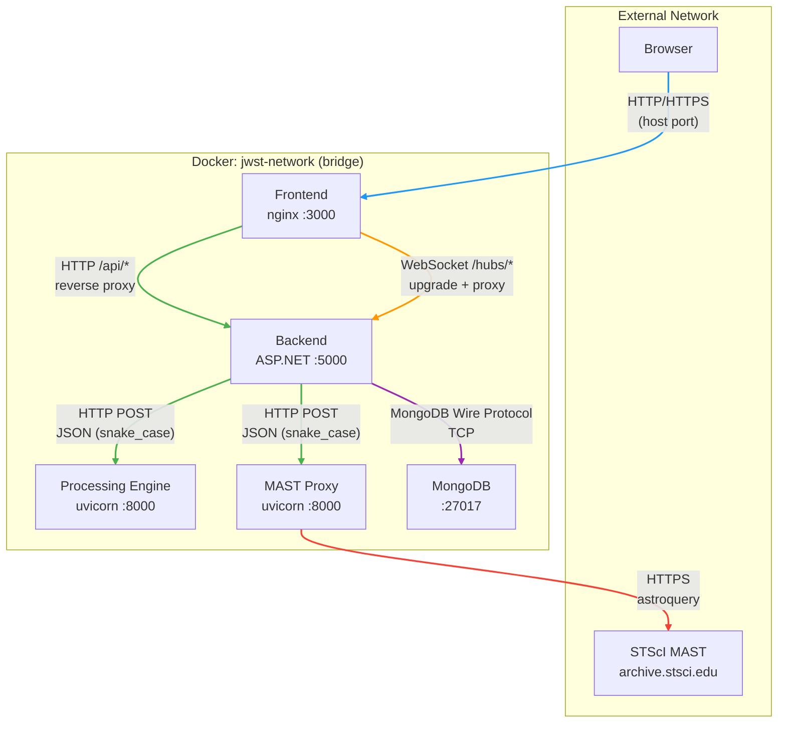
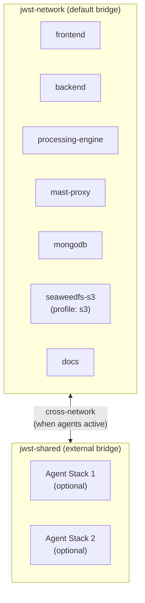

# Network Topology

All ports, protocols, and service-to-service communication paths across deployment environments.

> **4+1 View**: Physical View

## Port Map

### Development (localhost)

```
┌─────────────────────────────────────────────────────────────────┐
│  Host (localhost loopback)                                        │
│                                                                   │
│  :3000 ──→ Frontend (Vite dev server)                           │
│  :5001 ──→ Backend (.NET API, debug access)                     │
│  :8000 ──→ Processing Engine (debug access)                     │
│  :8001 ──→ MkDocs (documentation site)                          │
│  :8002 ──→ MAST Proxy (debug access)                           │
│  :8333 ──→ SeaweedFS S3 Gateway (optional, profile=s3)         │
│  :27017 ─→ MongoDB (direct access for tools)                   │
│                                                                   │
│  All bound to localhost loopback — not accessible from network   │
└─────────────────────────────────────────────────────────────────┘
```

### Staging (AWS EC2)

```
┌─────────────────────────────────────────────────────────────────┐
│  Internet                                                        │
│                                                                   │
│  :22  ──→ SSH (key-based auth)                                  │
│  :80  ──→ Frontend (nginx, public)                              │
│  :443 ──→ (allowed by SG, unused — no TLS in staging)          │
│                                                                   │
│  All other ports internal only (Docker network)                 │
└─────────────────────────────────────────────────────────────────┘
```

### Production

```
┌─────────────────────────────────────────────────────────────────┐
│  Internet                                                        │
│                                                                   │
│  :22  ──→ SSH (key-based auth)                                  │
│  :80  ──→ HTTP → HTTPS redirect + ACME challenge                │
│  :443 ──→ Frontend (nginx, TLS termination)                     │
│                                                                   │
│  All other ports internal only (Docker network)                 │
└─────────────────────────────────────────────────────────────────┘
```

## Internal Communication Map



## Protocol Details

### Client ↔ Frontend (nginx)

| Protocol | Port | Path | Purpose |
|----------|------|------|---------|
| HTTP/HTTPS | 80/443 | `/*` | Static assets (React SPA) |
| HTTP/HTTPS | 80/443 | `/api/*` | Reverse proxy to backend |
| WebSocket | 80/443 | `/hubs/*` | SignalR real-time updates |

**nginx routing rules**:
- `/` → serve static files; fallback to `index.html` (SPA routing)
- `/api/*` → `proxy_pass http://backend:5000`
- `/hubs/*` → `proxy_pass http://backend:5000` with WebSocket upgrade headers

**Timeouts**:
- `/api/*`: connect 60s, send/read 300s
- `/hubs/*`: read 3600s (long-lived WebSocket)

### Frontend ↔ Backend

| Protocol | Transport | Auth | Casing |
|----------|-----------|------|--------|
| REST | HTTP/1.1 via nginx proxy | JWT Bearer token | camelCase |
| SignalR | WebSocket via nginx proxy | JWT via `?access_token=` query param | camelCase |

### Backend ↔ Processing Engine

| Protocol | Transport | Auth | Casing | Timeout |
|----------|-----------|------|--------|---------|
| HTTP | Direct TCP (Docker network) | None (internal) | snake_case | 30 min attempt / 60 min total |

Resilience: Polly retry (3x, 2s backoff) + circuit breaker for composite/mosaic calls.

### Backend ↔ MAST Proxy

| Protocol | Transport | Auth | Casing | Timeout |
|----------|-----------|------|--------|---------|
| HTTP | Direct TCP (Docker network) | None (internal) | snake_case | 5 min |

No Polly resilience — MAST operations use application-level retry (user re-submits).

### Backend ↔ MongoDB

| Protocol | Transport | Auth | Port |
|----------|-----------|------|------|
| MongoDB Wire Protocol | TCP | Username/password (SCRAM) | 27017 |

Connection string: `mongodb://admin:<password>@mongodb:27017`

### MAST Proxy ↔ STScI

| Protocol | Transport | Auth | Rate Limit |
|----------|-----------|------|------------|
| HTTPS | Public internet | None (public API) | Backend enforces 30 req/min |

Uses `astroquery.mast` library — communicates with `archive.stsci.edu` and `mast.stsci.edu`.

## Security Headers

Applied by nginx in all environments:

| Header | Value | Purpose |
|--------|-------|---------|
| `X-Content-Type-Options` | `nosniff` | Prevent MIME sniffing |
| `X-Frame-Options` | `SAMEORIGIN` | Prevent clickjacking |
| `X-XSS-Protection` | `1; mode=block` | XSS filter |
| `Referrer-Policy` | `strict-origin-when-cross-origin` | Limit referrer leakage |

Production adds:
| Header | Value | Purpose |
|--------|-------|---------|
| `Strict-Transport-Security` | `max-age=31536000` | Force HTTPS for 1 year |
| `Content-Security-Policy` | Restrictive policy | XSS/injection prevention |

## CORS Configuration

| Environment | Allowed Origins |
|-------------|----------------|
| Development | `http://localhost:3000`, `http://localhost:5173` (+ loopback equivalents) |
| Staging | `http://<Elastic-IP>` |
| Production | `https://yourdomain.com` (must be explicitly set) |

Policy: `AllowAnyHeader()`, `AllowAnyMethod()`, `AllowCredentials()`.

## DNS and TLS (Production)

```
yourdomain.com → A record → Elastic IP
                             ↓
                    nginx :443
                    ├── TLS 1.2 / TLS 1.3
                    ├── Ciphers: ECDHE-ECDSA-AES128-GCM-SHA256, ...
                    ├── OCSP Stapling: on
                    ├── Session cache: shared (50 MB)
                    └── Cert: /etc/nginx/ssl/fullchain.pem
```

## Docker Network Architecture



- **jwst-network**: Default bridge network for all services — automatic DNS resolution by container name
- **jwst-shared**: External bridge for multi-agent stacks (experimental, not actively used)

All services within `jwst-network` can reach each other by container name (e.g., `http://backend:5000`, `http://processing-engine:8000`).

## Firewall Rules (AWS Security Group)

| Rule | Protocol | Port | Source | Purpose |
|------|----------|------|--------|---------|
| Inbound | TCP | 22 | any | SSH access |
| Inbound | TCP | 80 | any | HTTP traffic |
| Inbound | TCP | 443 | any | HTTPS traffic |
| Outbound | All | All | any | Internet access (MAST, package repos) |

**Recommendation for production**: Restrict SSH to specific IP ranges.

## Community Edition (CE) Topology

The CE deployment (`docker/docker-compose.ce.yml`, CE plan Phase 4) is a
three-container slice with no .NET tier, no mast-proxy, no SeaweedFS:

```text
                     Internet
                        │  :80 (the ONLY published port; TLS in front — Phase 6)
                        ▼
              ┌───────────────────┐
              │ frontend (nginx)  │  VITE_CE_MODE build · SPA + /api proxy
              │  mem 256m         │  limit_req: api 10r/s · mast 2r/s · render 1r/s
              └─────────┬─────────┘  timeouts: 120s render (Phase 1 spike)
              ce-edge   │
              ┌─────────▼─────────┐
              │ processing-engine │  CE_MODE deny-by-default /api facade
              │  mem 4g           │  render semaphore 2 slots + queue 4
              └─────────┬─────────┘  data mount READ-ONLY
              ce-internal (internal: true — no host ports, no egress)
              ┌─────────▼─────────┐
              │ mongodb           │  ceReader (read role only)
              │  mem 1g · WT 0.5g │  seeded catalog, IsPublic data
              └───────────────────┘
```

Defense layers, outermost first: nginx rate limits → engine deny-by-default
route mounting + default-deny middleware → render semaphore + input caps +
per-request memory budget → read-only Mongo credentials → read-only FITS
mount → internal-only DB network. Covers #651 (network isolation) and #745
(resource limits) for the CE topology.

Known residual: the single-image data views (`preview`/`histogram`/
`pixeldata`/`cubeinfo`) are capped per-IP at nginx (3r/s, 4 conns) but have
no engine-side concurrency gate — aggregate cross-IP load is unbounded
below the container memory limit. Tracked in #1664.

---

[Back to Architecture Overview](index.md)

