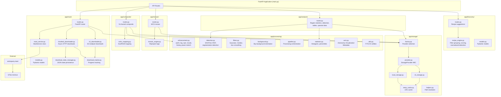

# Processing Engine Architecture

The Python FastAPI processing engine handles scientific computing and MAST integration.

```mermaid
flowchart TB
    subgraph FastAPI["FastAPI Application (main.py)"]
        Routes["API Routes"]
    end

    subgraph MastModule["app/mast/"]
        MastService["mast_service.py\nMastService class"]
        MastRoutes["routes.py\nFastAPI router"]
        MastModels["models.py\nPydantic models"]
        Downloader["chunked_downloader.py\nAsync HTTP downloads"]
        S3Down["s3_downloader.py\nS3 multipart downloads"]
        StateManager["download_state_manager.py\nJSON state persistence"]
        Tracker["download_tracker.py\nProgress tracking"]
    end

    subgraph CompositeModule["app/composite/"]
        CompositeRoutes["routes.py\nN-channel composite"]
        ColorMapping["color_mapping.py\nHue/RGB mapping"]
    end

    subgraph MosaicModule["app/mosaic/"]
        MosaicRoutes["routes.py\nWCS mosaic"]
        MosaicEngine["mosaic_engine.py\nReproject logic"]
    end

    subgraph AnalysisModule["app/analysis/"]
        AnalysisRoutes["routes.py\nRegion statistics, detection,\ntables, spectral data"]
    end

    subgraph DiscoveryModule["app/discovery/"]
        DiscoveryRoutes["routes.py\nRecipe suggestions"]
        RecipeEngine["recipe_engine.py\nFilter grouping, scoring,\nnarrowband detection"]
        DiscoveryModels["models.py\nPydantic models"]
    end

    subgraph Processing["app/processing/"]
        Enhancement["enhancement.py\nasinh, log, sqrt, zscale,\nhisteq, power stretch"]
        Detection["detection.py\nDAOFind, IRAF,\nsegmentation detection"]
        Filters["filters.py\nGaussian, median,\nbox smoothing"]
        Background["background.py\nSky background estimation"]
        Pipeline["pipeline.py\nProcessing orchestration"]
        Statistics["statistics.py\nHistogram, percentiles"]
        AVM["avm.py\nAstronomy Visualization\nMetadata"]
        Utils["utils.py\nFITS I/O utilities"]
    end

    subgraph StorageModule["app/storage/"]
        StorageFactory["factory.py\nProvider selection"]
        StorageABC["provider.py\nStorageProvider ABC"]
        LocalStore["local_storage.py"]
        S3Store["s3_storage.py"]
        TempCache["temp_cache.py\nLRU cache"]
        Helpers["helpers.py\nPath resolution"]
    end

    subgraph External["External"]
        Astroquery["astroquery.mast"]
        STScI["STScI Archive"]
    end

    Routes --> MastRoutes
    Routes --> CompositeRoutes
    Routes --> MosaicRoutes
    Routes --> AnalysisRoutes
    Routes --> DiscoveryRoutes

    MastRoutes --> MastService
    MastRoutes --> Downloader
    MastRoutes --> S3Down
    MastService --> Astroquery
    Downloader --> StateManager
    Downloader --> Tracker
    S3Down --> Tracker
    Astroquery --> STScI

    CompositeRoutes --> ColorMapping
    CompositeRoutes --> Enhancement
    MosaicRoutes --> MosaicEngine
    AnalysisRoutes --> Detection
    AnalysisRoutes --> Statistics
    DiscoveryRoutes --> RecipeEngine

    CompositeRoutes --> StorageFactory
    MosaicRoutes --> StorageFactory
    AnalysisRoutes --> StorageFactory
    MastRoutes --> StorageFactory
    StorageFactory --> StorageABC
    StorageABC --> LocalStore
    StorageABC --> S3Store
    LocalStore --> TempCache
    S3Store --> TempCache
```

---

[Back to Architecture Overview](index.md)
