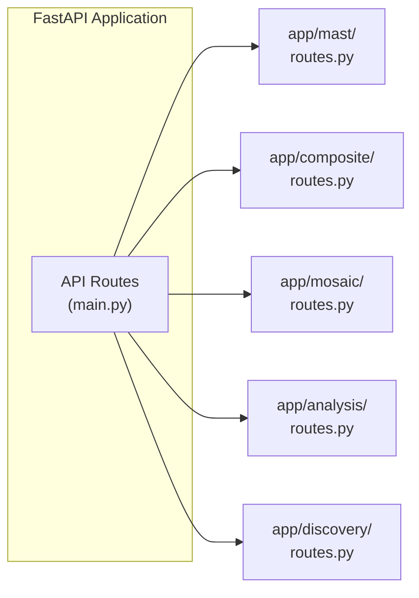
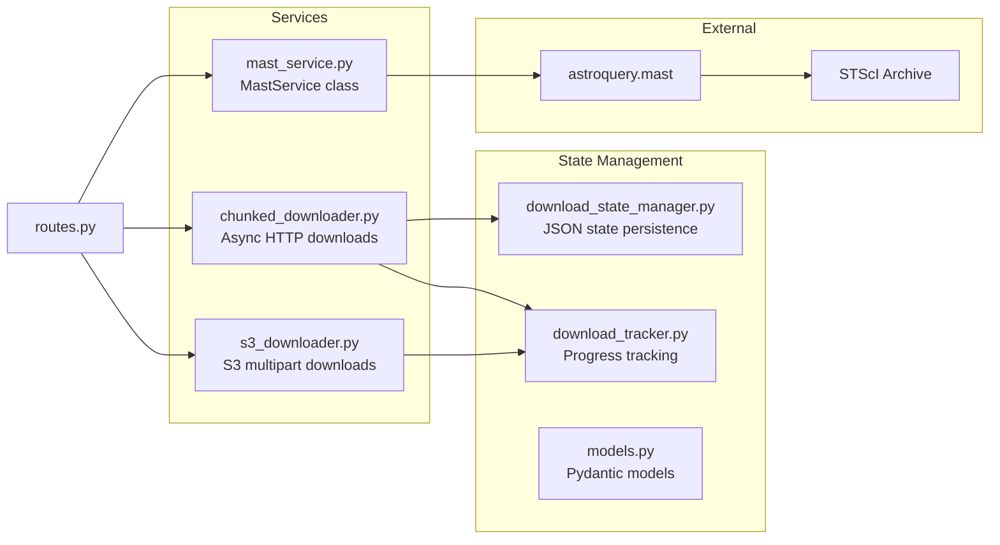
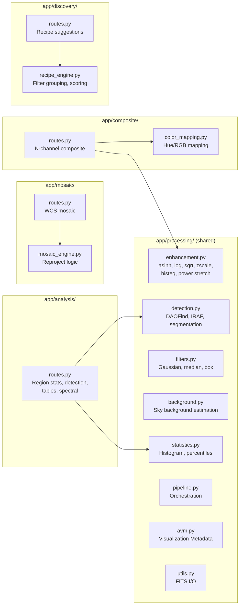
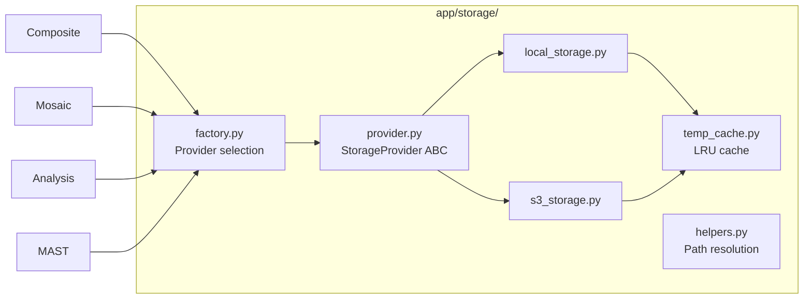

# Processing Engine Architecture

The Python FastAPI processing engine handles scientific computing and MAST integration.

## Module Routing

FastAPI routes dispatch to domain-specific modules.

## MAST Module

MAST search and data download with chunked/S3 download support.

## Scientific Modules

Composite, mosaic, analysis, and discovery modules with their dependencies.

## Storage Layer

All modules share a common storage abstraction with LRU caching.

---

[Back to Architecture Overview](index.md)
