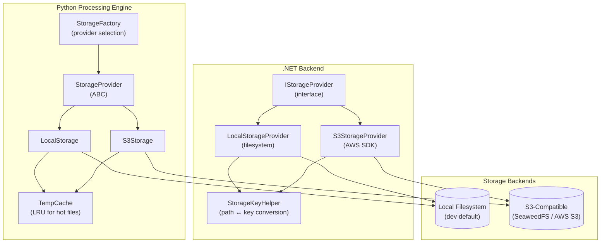

# Storage Layer

Both .NET and Python implement the same storage abstraction for portability between local filesystem and S3.

```mermaid
flowchart TB
    subgraph DotNet[".NET Backend"]
        IStorage["IStorageProvider\n(interface)"]
        LocalNet["LocalStorageProvider\n(filesystem)"]
        S3Net["S3StorageProvider\n(AWS SDK)"]
        KeyHelper["StorageKeyHelper\n(path ↔ key conversion)"]

        IStorage --> LocalNet
        IStorage --> S3Net
        LocalNet --> KeyHelper
        S3Net --> KeyHelper
    end

    subgraph Python["Python Processing Engine"]
        StorageABC["StorageProvider\n(ABC)"]
        LocalPy["LocalStorage"]
        S3Py["S3Storage"]
        TempCache["TempCache\n(LRU for hot files)"]
        Factory["StorageFactory\n(provider selection)"]

        Factory --> StorageABC
        StorageABC --> LocalPy
        StorageABC --> S3Py
        LocalPy --> TempCache
        S3Py --> TempCache
    end

    subgraph Backends["Storage Backends"]
        Local[("Local Filesystem\n(dev default)")]
        S3[("S3-Compatible\n(SeaweedFS / AWS S3)")]
    end

    LocalNet --> Local
    S3Net --> S3
    LocalPy --> Local
    S3Py --> S3
```

---

[Back to Architecture Overview](index.md)
