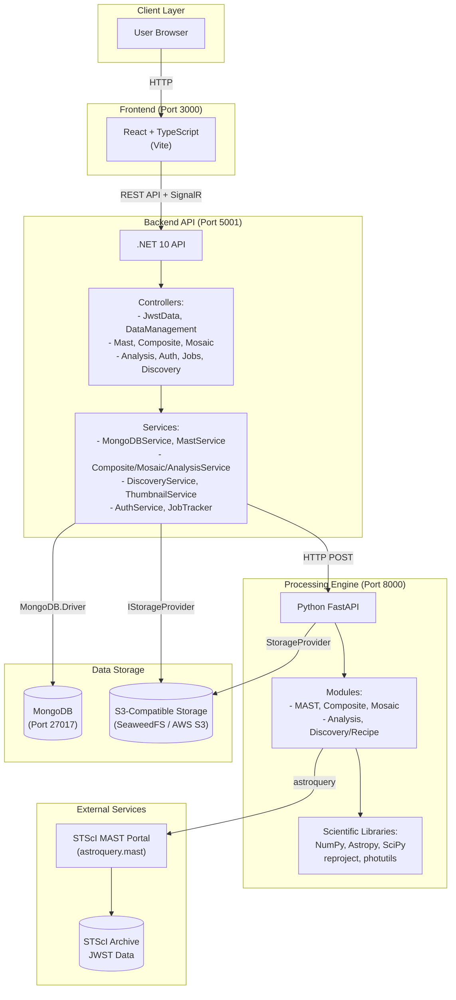

# System Overview

High-level view of the microservices architecture and their communication patterns.

```mermaid
flowchart TB
    subgraph Client["Client Layer"]
        Browser["User Browser"]
    end

    subgraph Frontend["Frontend (Port 3000)"]
        React["React + TypeScript\n(Vite)"]
    end

    subgraph Backend["Backend API (Port 5001)"]
        DotNet[".NET 10 API"]
        Controllers["Controllers:\n- JwstData, DataManagement\n- Mast, Composite, Mosaic\n- Analysis, Auth, Jobs, Discovery"]
        Services["Services:\n- MongoDBService, MastService\n- Composite/Mosaic/AnalysisService\n- DiscoveryService, ThumbnailService\n- AuthService, JobTracker"]
    end

    subgraph Processing["Processing Engine (Port 8000)"]
        FastAPI["Python FastAPI"]
        Modules["Modules:\n- MAST, Composite, Mosaic\n- Analysis, Discovery/Recipe"]
        SciLibs["Scientific Libraries:\nNumPy, Astropy, SciPy\nreproject, photutils"]
    end

    subgraph Storage["Data Storage"]
        MongoDB[("MongoDB\n(Port 27017)")]
        ObjectStore[("S3-Compatible Storage\n(SeaweedFS / AWS S3)")]
    end

    subgraph External["External Services"]
        MAST["STScI MAST Portal\n(astroquery.mast)"]
        STScI[("STScI Archive\nJWST Data")]
    end

    Browser -->|HTTP| React
    React -->|REST API + SignalR| DotNet
    DotNet --> Controllers
    Controllers --> Services
    Services -->|MongoDB.Driver| MongoDB
    Services -->|HTTP POST| FastAPI
    Services -->|IStorageProvider| ObjectStore
    FastAPI --> Modules
    Modules --> SciLibs
    Modules -->|astroquery| MAST
    MAST --> STScI
    FastAPI -->|StorageProvider| ObjectStore
```

---

[Back to Architecture Overview](index.md)
