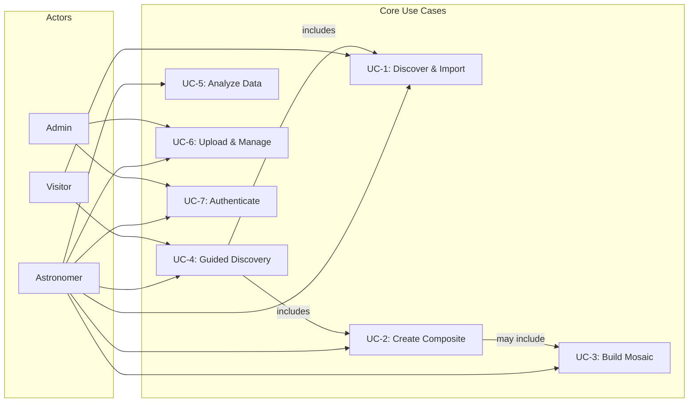

# Use Case Catalog

Primary use cases that exercise the JWST Data Analysis Application across all architectural views. Each use case references which views it touches and which architectural components are involved.

> **4+1 View**: +1 Scenarios — these use cases tie the Logical, Process, Development, and Physical views together.

## Actors

| Actor | Description |
|-------|-------------|
| **Astronomer** | Authenticated user who imports, analyzes, and visualizes JWST data |
| **Visitor** | Unauthenticated user browsing public data and featured targets |
| **Admin** | User with elevated privileges for data management |
| **MAST Portal** | External STScI archive providing JWST observations |
| **Processing Engine** | Internal Python service performing scientific computation |

---

## Primary Use Cases

### UC-1: Discover and Import JWST Data

**Goal**: Astronomer finds interesting JWST observations and imports them for analysis.

**Trigger**: User navigates to Discovery page.

**Flow**:
1. Frontend loads featured targets from backend (`GET /api/discovery/featured`)
2. User selects a target (e.g., "Carina Nebula") or searches by name/coordinates
3. Backend queries Processing Engine, which queries MAST via `astroquery`
4. Results displayed with instrument/filter metadata and preview thumbnails
5. User selects observations to import
6. Backend creates an import job (`POST /api/mast/import`) → JobTracker assigns job ID
7. Processing Engine downloads FITS files from STScI archive (chunked, resumable)
8. Files stored via IStorageProvider (S3 or local), metadata saved to MongoDB
9. SignalR pushes progress updates (bytes downloaded, files completed)
10. Job completes → data appears in user's library with full lineage (L1→L3)

**Views Exercised**:
- **Logical**: JwstData, JobStatus, FeaturedTarget, MastObservation entities
- **Process**: Async job queue, SignalR push, chunked download with resume
- **Physical**: Frontend → Backend → Processing Engine → MAST (external)
- **Development**: All three services coordinate

**Error Scenarios**:
- MAST timeout → retry with exponential backoff
- Download interrupted → job marked resumable, user can restart
- Disk full → job fails with storage error, no partial records saved

---

### UC-2: Create Multi-Band Color Composite

**Goal**: Astronomer combines multiple JWST filter images into a single RGB color image.

**Trigger**: User clicks "Create Composite" or follows a recipe suggestion.

**Flow**:
1. User selects 2+ FITS images from their library, assigns each to a color channel
2. Per-channel controls: stretch algorithm, black/white points, gamma, tone curve, weight
3. Color assignment via hue angle, explicit RGB, or luminance (LRGB mode)
4. User can apply a preset (auto, natural, NASA, high-contrast, faint-emission, scientific)
5. Frontend submits composite request (`POST /api/composite/n-channel`)
6. Backend validates inputs, creates job, forwards to Processing Engine
7. Processing Engine: loads FITS → WCS alignment → per-channel stretch → color mapping → stack → post-processing
8. Result stored as PNG/JPEG blob, job marked complete
9. SignalR notifies frontend → composite displayed in viewer
10. User can adjust parameters and re-render, or save to library

**Views Exercised**:
- **Logical**: JwstData (inputs), CompositeRequest, ChannelConfig, JobStatus
- **Process**: Compute-intensive job, progress stages, result as blob
- **Physical**: CPU-bound work on Processing Engine container

**Quality Attributes**: See QA-1 (performance) — composite of 4 channels at 4096x4096 should complete in < 30s.

---

### UC-3: Build WCS-Aligned Mosaic

**Goal**: Astronomer combines multiple overlapping JWST pointings into a single seamless mosaic.

**Trigger**: User selects multi-pointing observations, or recipe indicates `requiresMosaic = true`.

**Flow**:
1. User selects 2+ FITS files with WCS headers
2. Backend requests footprint analysis from Processing Engine (`POST /api/mosaic/footprints`)
3. Footprints displayed on a sky coordinate overlay (RA/Dec corners, bounding box)
4. User configures: combine method (mean/sum/first/last/min/max), stretch, colormap, output size
5. Frontend submits mosaic request (`POST /api/mosaic/create`)
6. Processing Engine uses `reproject` library for WCS-aware reprojection and combination
7. Result can be PNG/JPEG (for viewing) or FITS (for further analysis, saved as L3 data)
8. Saved mosaics link back to source files via `DerivedFrom`

**Views Exercised**:
- **Logical**: JwstData (inputs + output), MosaicRequest, MosaicFileConfig, footprints
- **Process**: Memory-intensive reprojection, DoS limits enforced (MAX_MOSAIC_OUTPUT_PIXELS)
- **Physical**: RAM-constrained on Processing Engine container

---

### UC-4: Guided Discovery Experience

**Goal**: New user follows a step-by-step wizard from target selection to finished composite.

**Trigger**: User clicks a featured target card on the Discovery home page.

**Flow**:
1. Featured target cards load with thumbnails, categories, and composite potential ratings
2. User selects a target → system queries MAST for available observations
3. Processing Engine analyzes available filters and suggests ranked recipes
4. User picks a recipe (e.g., "Pillars of Creation — NASA-style RGB")
5. System checks which data is already imported; imports missing observations
6. GuidedCreate wizard pre-fills channel assignments from the recipe's color mapping
7. User can accept defaults or customize before rendering
8. Composite created (UC-2 flow) → result displayed → user can save or share

**Views Exercised**: All views — this is the end-to-end "golden path" through the application.

---

### UC-5: Analyze Astronomical Data

**Goal**: Astronomer performs quantitative analysis on imported FITS data.

**Trigger**: User opens a data file and selects an analysis tool.

**Subflows**:

**5a. Region Statistics**:
- User draws a rectangle or ellipse on the image
- Backend forwards region to Processing Engine
- Returns: mean, median, std, min, max, sum, pixel count

**5b. Source Detection**:
- User configures threshold (sigma), FWHM, minimum pixels
- Processing Engine runs photutils-based detection
- Returns: detected sources with centroids, flux, sharpness, roundness

**5c. Table/Spectral Viewer**:
- FITS tables displayed with pagination and column metadata
- Spectral data plotted as interactive charts (wavelength vs. flux)

**Views Exercised**:
- **Logical**: JwstData, AnalysisModels (region stats, source detection, table/spectral)
- **Process**: Synchronous request-response (no job queue for simple analysis)
- **Physical**: Processing Engine CPU for source detection

---

### UC-6: Upload and Manage Local Data

**Goal**: Astronomer uploads their own FITS files and organizes their data library.

**Trigger**: User clicks "Upload" or drags files into the application.

**Flow**:
1. Frontend validates file type and size client-side
2. File uploaded via multipart POST to backend (`POST /api/jwstdata/upload`)
3. Backend validates FITS headers, extracts metadata (instrument, filter, WCS)
4. File stored via IStorageProvider, metadata document created in MongoDB
5. Thumbnail generated asynchronously
6. User can tag, describe, archive, and share uploaded data
7. Data appears in library with `IsPublic = false` (private by default)

**Supporting Operations**:
- Search by filename, tags, target, instrument, filter
- Semantic search across metadata fields
- Archive/unarchive, version tracking
- Bulk operations (tag, delete, share)

---

### UC-7: Authenticate and Manage Account

**Goal**: User creates an account and manages their session.

**Flow**:
1. Register with username, email, password (+ optional display name, organization)
2. Login → backend issues JWT access token + refresh token
3. Access token used for API calls (short-lived)
4. Refresh token extends session without re-login
5. Admin can manage user accounts and access public data
6. All user data scoped by `UserId` — users see only their own data + public data

**Architectural Note**: Auth flow is currently fragile — documented as a known limitation. Extra care required for changes.

---

## Use Case Map

---

## Traceability to Architecture Views

| Use Case | Logical View | Process View | Development View | Physical View |
|----------|-------------|-------------|-----------------|--------------|
| UC-1: Discover & Import | JwstData, JobStatus, FeaturedTarget | Async jobs, SignalR, chunked download | All 3 services | Frontend → Backend → Engine → MAST |
| UC-2: Create Composite | CompositeRequest, ChannelConfig | Compute job, progress push | Backend + Engine | CPU on Engine container |
| UC-3: Build Mosaic | MosaicRequest, JwstData lineage | Memory-intensive job, DoS limits | Backend + Engine | RAM on Engine container |
| UC-4: Guided Discovery | All entities | Full async pipeline | All 3 services | Full stack + MAST |
| UC-5: Analyze Data | Analysis models | Synchronous request-response | Backend + Engine | CPU on Engine container |
| UC-6: Upload & Manage | JwstData, User | File upload, thumbnail gen | Frontend + Backend | Storage provider |
| UC-7: Authenticate | User, tokens | JWT lifecycle, refresh | Frontend + Backend | Stateless (no session store) |

---

[Back to Architecture Overview](index.md)
