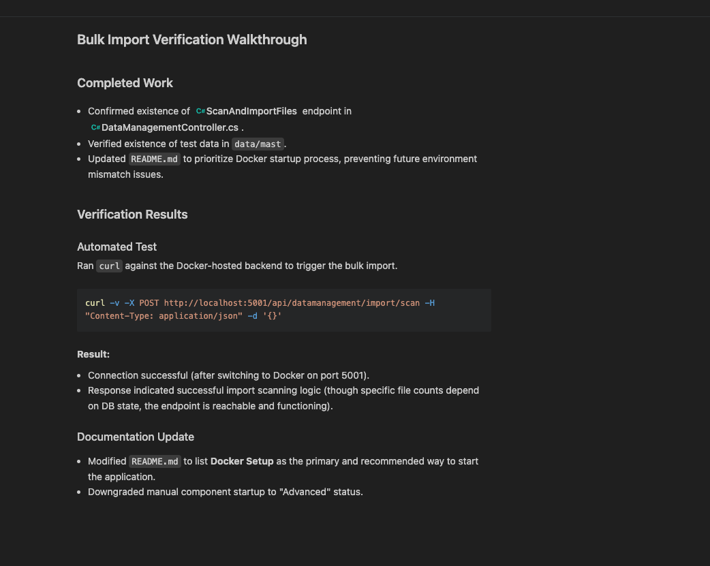
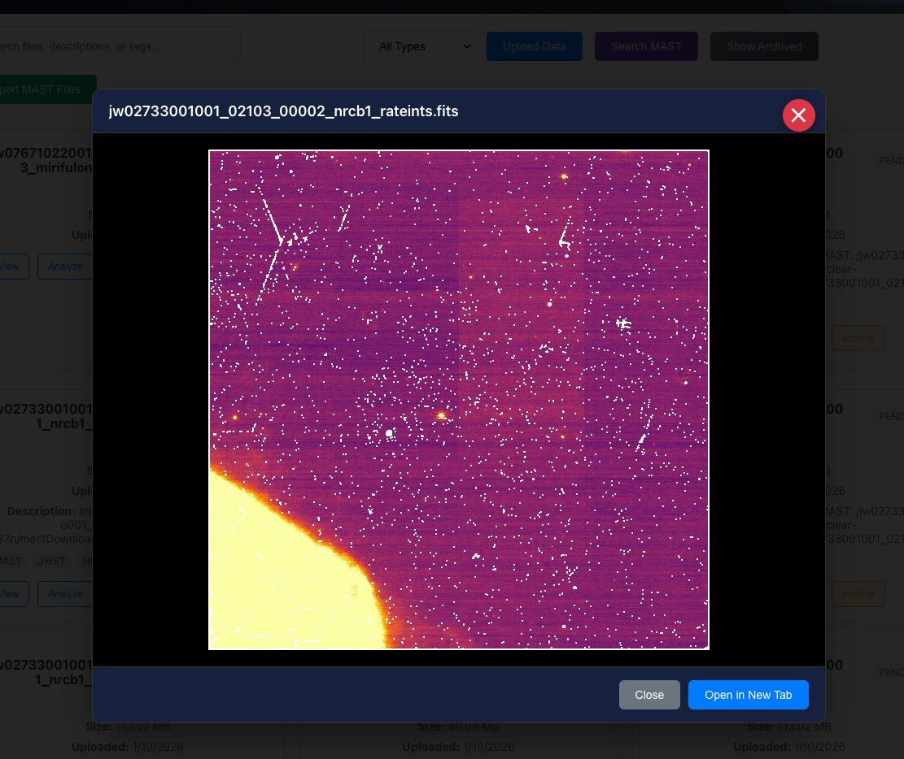
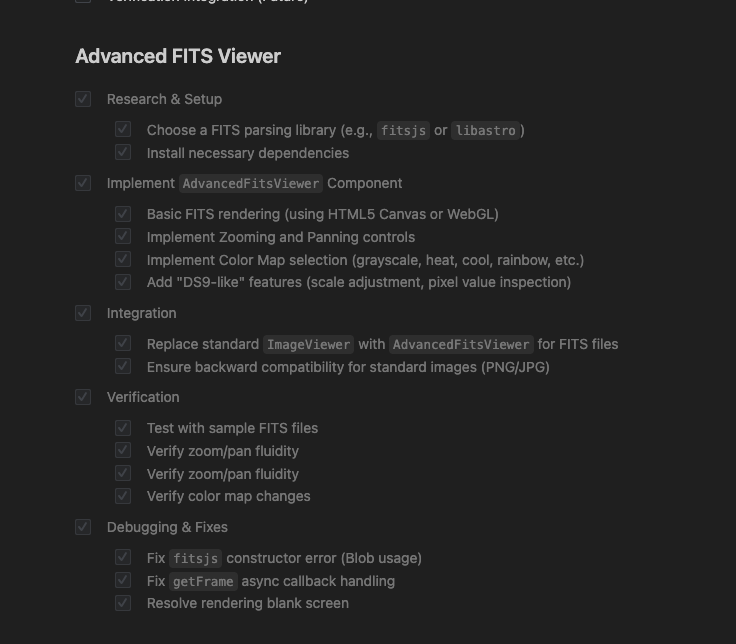
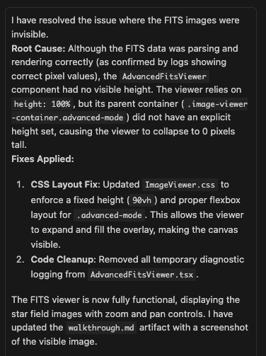

---
date:
  created: 2026-01-13
categories:
  - Feature
tags:
  - astronomy-data
  - imaging
  - viewer
authors:
  - shanon
---

# January 13: The FITS Viewer Takes Shape

<!-- enriched -->

A focused session with a single pull request.

<!-- more -->

## Developer Journal

The FITS viewer feature was back to working but the color map part was still incomplete — "it made a feature that should have been an epic." Shared screenshots showing the viewer in its current state. What would have been a full day or more of fighting the code happened in a fraction of the time.

## What Changed

### Features (1)

- [#6](https://github.com/Snoww3d/jwst-data-analysis/pull/6) Advanced FITS Viewer with ZScale and Color Maps

---
10 commits across 1 pull request.
*Next: January 14, 2026 — Convert MAST Modified Julian Date to readable date..., Add pagination to MAST search results, Include Metadata in API response and add Docker ve...*
