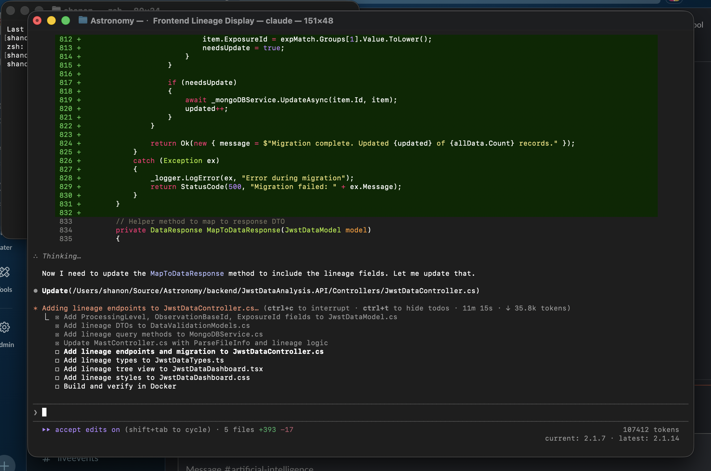
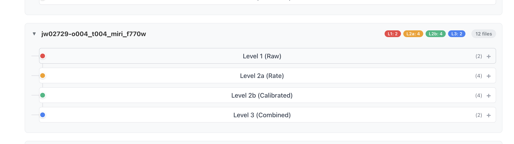
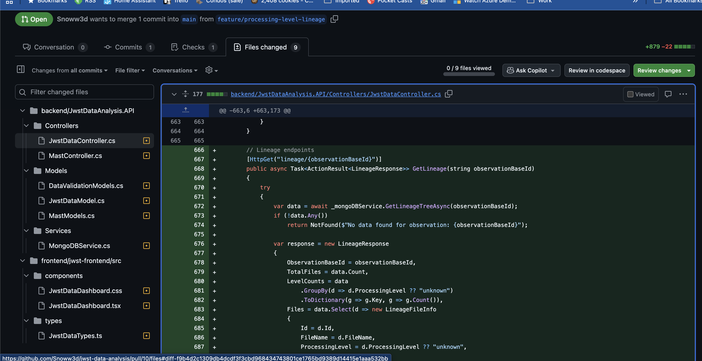

---
date:
  created: 2026-01-20
categories:
  - Feature
tags:
  - viewer
authors:
  - shanon
---

# Session: January 20, 2026

<!-- enriched -->

A focused session with a single pull request.

<!-- more -->

## Developer Journal

Learned about the JWST processing pipeline and within an hour had lineage tracking in local Docker — "new knowledge → plan → feature in an hour." Created a plan with Claude in 15 minutes, Claude executed it in 20. What would have been a 3-point story (a day or two of coding) happened during a conversation.

Trying to get friends to start learning Claude Code — "I don't think I'm selling it well enough that you have not done so." Friends are (correctly) doing LeetCode for interview prep, but "we need to be doing both." The job market is rough: "trust me bro is not working for me" as a hiring strategy, and can't do interviews right now, but confident this project will make for a much stronger engineer when the time comes.

## Highlights

### [#10](https://github.com/Snoww3d/jwst-data-analysis/pull/10) Add JWST processing level tracking and lineage tree view

- Add JWST processing level tracking (L1/L2a/L2b/L3) based on filename suffixes
- Implement lineage tree visualization in frontend showing processing pipeline relationships
- Add API endpoints for querying lineage data and migrating existing records

## What Changed

### Features (1)

- [#10](https://github.com/Snoww3d/jwst-data-analysis/pull/10) Add JWST processing level tracking and lineage tree view

---
2 commits across 1 pull request.
*Next: January 21, 2026 — Update instruction files with lineage feature and ..., Add processing level filter to dashboard, Add MAST import progress indicator with async down...*
