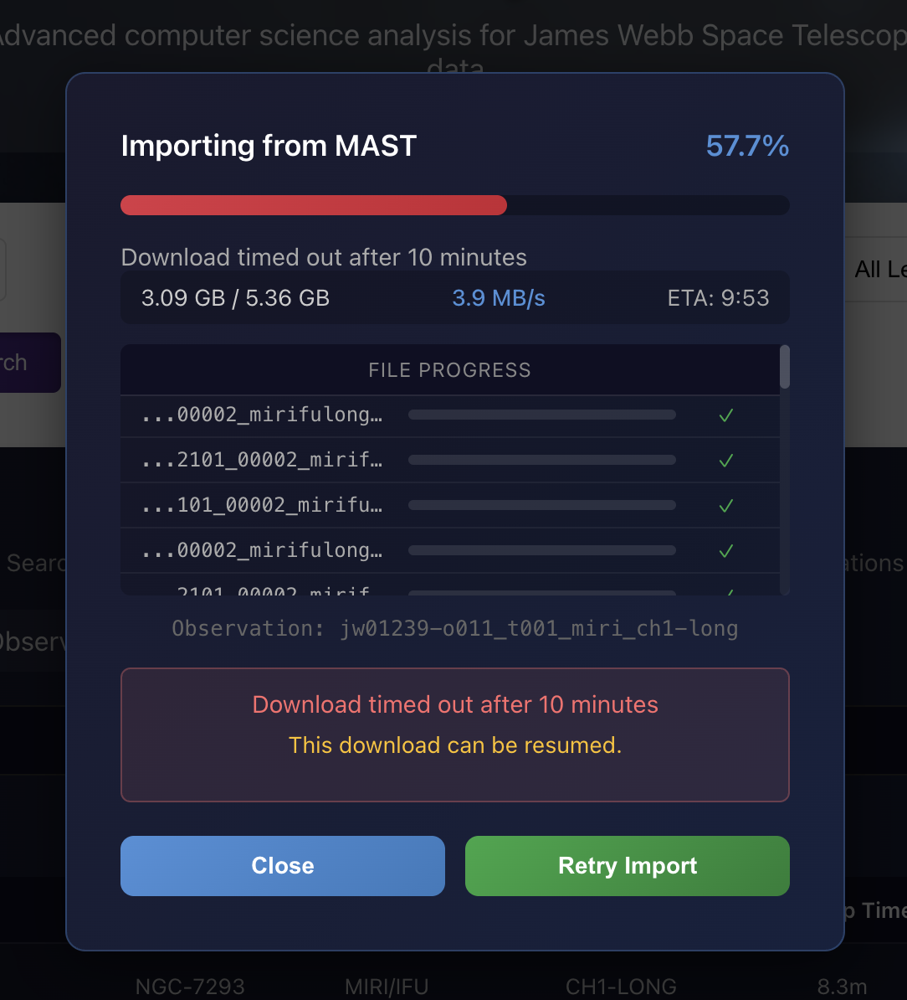
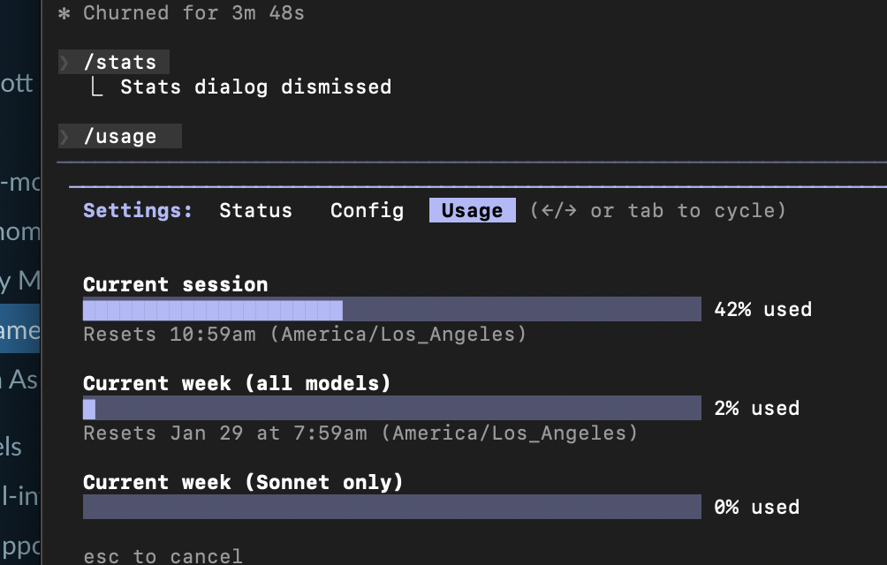
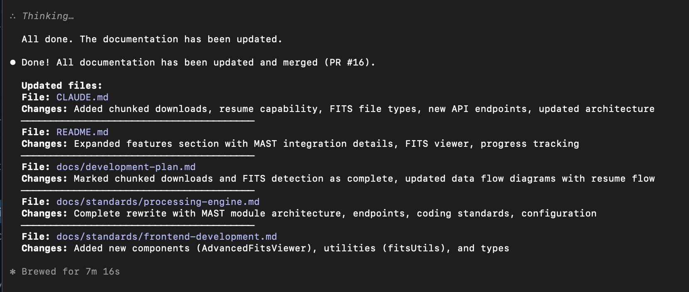
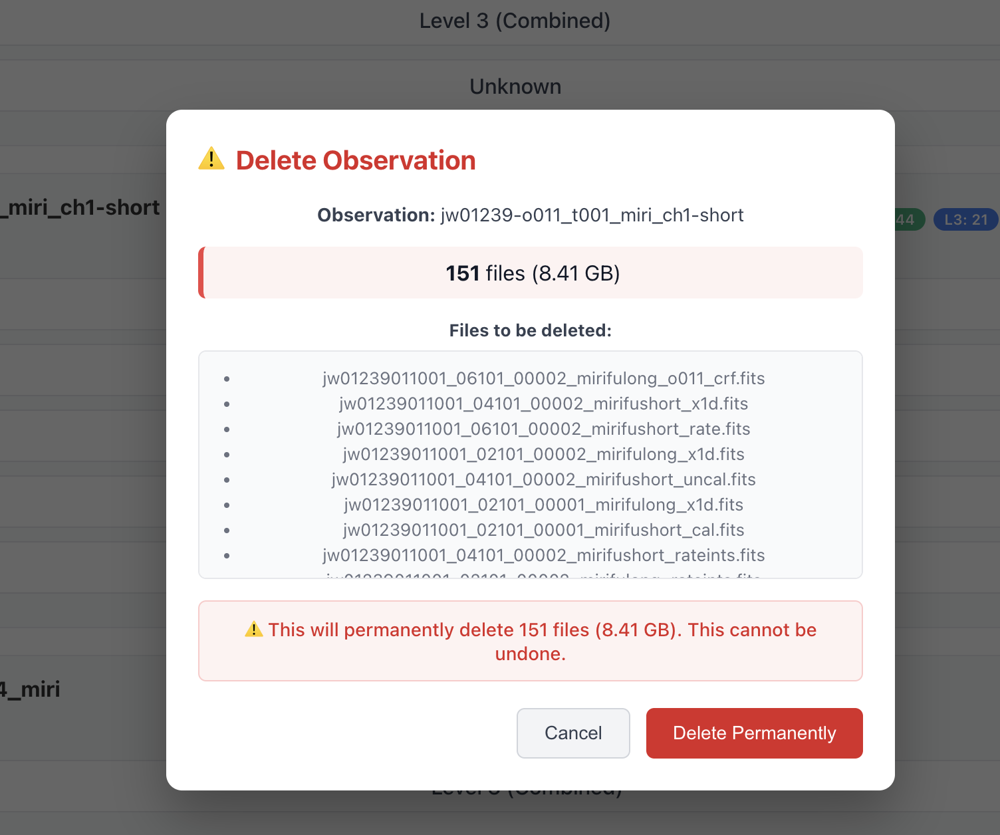
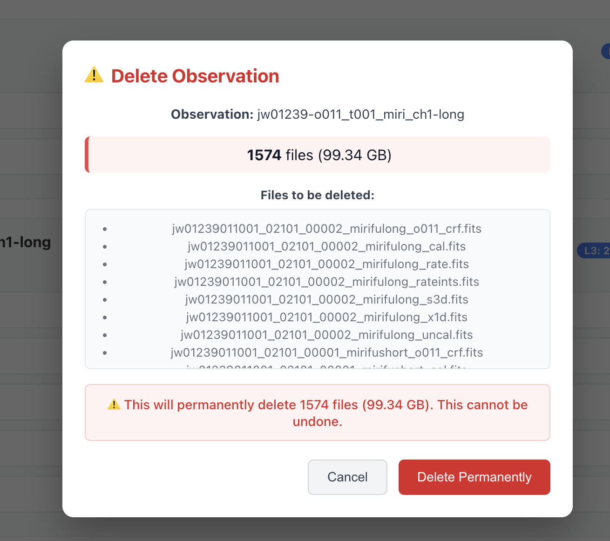
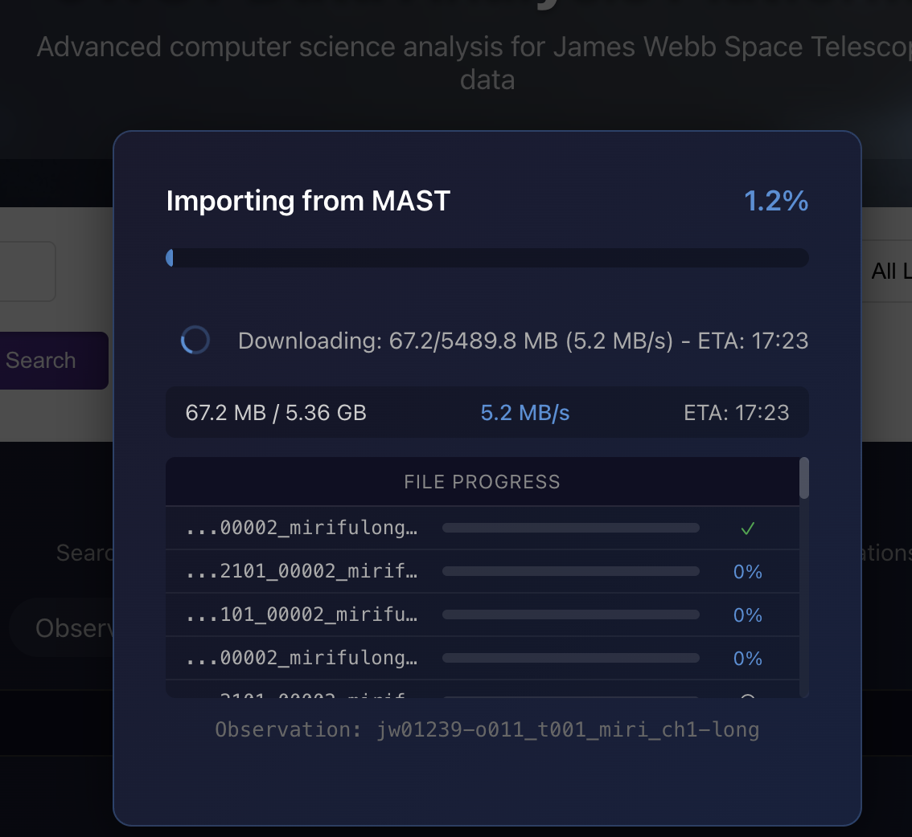

---
date:
  created: 2026-01-22
categories:
  - Documentation
  - Feature
tags:
  - astronomy-data
  - ci
  - docs
  - viewer
authors:
  - shanon
---

# Session: January 22, 2026

<!-- enriched -->

Productive session with 4 pull requests: 2 features, 2 docs.

<!-- more -->

## Developer Journal

Asked the channel if anyone would mind it being used for agentic coding updates — then dove right in. The $100/month Claude Max subscription is a lot for an unemployed developer, but switching to the 5x plan "really helped" and the output easily exceeds $100 of coding value. MAST portal downloads keep timing out because the data volumes are enormous — single FITS files can be 45GB, so storage is becoming an urgent problem. Added delete functionality alongside the existing archive feature.

Starting to see a distinction forming: "vibe coding is the one-shot prompts" while what's happening here is closer to agentic software development. The difference matters. Having Claude update all documentation with recent changes is "F'ing nice" — shared screenshots of the result.

## Highlights

### [#17](https://github.com/Snoww3d/jwst-data-analysis/pull/17) Display target name and instrument in lineage view

- Add target name and instrument display to lineage view headers
- Extract target_name from MAST observation metadata during import
- Extend backend and frontend models with astronomical fields
- Style metadata with colored badges (purple for target, green for instrument)

### [#14](https://github.com/Snoww3d/jwst-data-analysis/pull/14) Add chunked downloads with resume capability and FITS file type indicators

- **Chunked Downloads**: Implement HTTP Range header support for downloading large FITS files in 5MB chunks with parallel downloads (3 concurrent files)
- **Resume Capability**: Add state persistence and resume functionality for interrupted downloads
- **FITS File Type Indicators**: Show visual badg...

## What Changed

### Features (2)

- [#14](https://github.com/Snoww3d/jwst-data-analysis/pull/14) Add chunked downloads with resume capability and FITS file type indicators
- [#17](https://github.com/Snoww3d/jwst-data-analysis/pull/17) Display target name and instrument in lineage view

### Documentation (2)

- [#15](https://github.com/Snoww3d/jwst-data-analysis/pull/15) Add CI check requirement to git workflow
- [#16](https://github.com/Snoww3d/jwst-data-analysis/pull/16) Update documentation for chunked downloads and FITS viewer features

---
10 commits across 4 pull requests.
*Next: January 27, 2026 — Add image processing module foundation with photut..., Add import job cancellation and configurable downl...*
