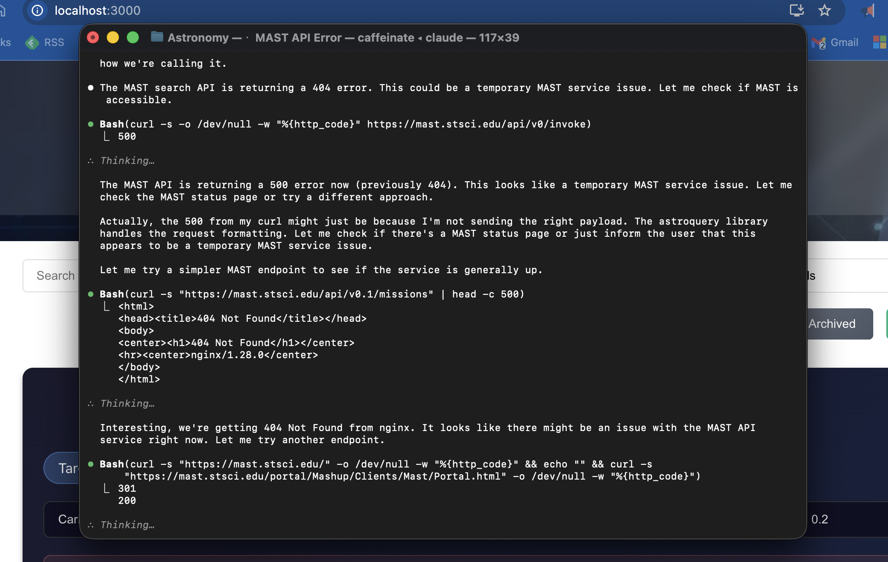

---
date:
  created: 2026-01-27
categories:
  - Feature
tags:
  - job-queue
  - mast-data
authors:
  - shanon
---

# January 27: Image Processing Foundations

<!-- generated -->

A focused session — 2 features.

<!-- more -->

## Developer Journal

## Highlights

### [#19](https://github.com/Snoww3d/jwst-data-analysis/pull/19) Add import job cancellation and configurable download settings

- Add cancel endpoint (`POST /mast/import/cancel/{jobId}`) to abort active MAST imports
- Implement graceful cancellation using CancellationTokens in ImportJobTracker
- Remove hardcoded 10-minute timeout - downloads now run until complete or cancelled
- Make download settings configurable (poll inte...

### [#18](https://github.com/Snoww3d/jwst-data-analysis/pull/18) Add image processing module foundation with photutils

- Implements Phase 1 of the image processing roadmap (Task #12)
- Adds `photutils` and `scikit-image` dependencies for astronomical image analysis
- Creates modular processing architecture with 6 specialized modules
- Includes comprehensive research document covering algorithms and design decisions

## What Changed

### Features (2)

- [#18](https://github.com/Snoww3d/jwst-data-analysis/pull/18) Add image processing module foundation with photutils
- [#19](https://github.com/Snoww3d/jwst-data-analysis/pull/19) Add import job cancellation and configurable download settings

---
8 commits across 2 pull requests.
*Next: January 28, 2026 — Add observation date display and sort by download ...*
