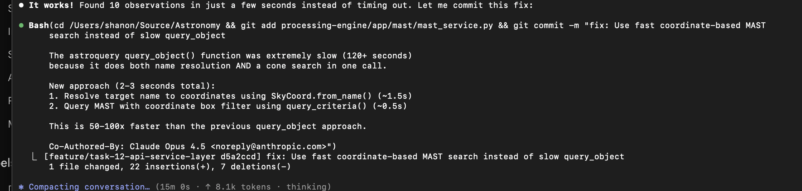
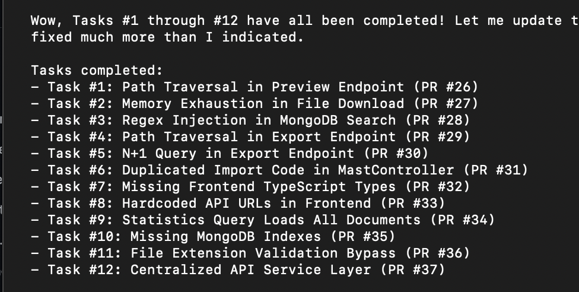
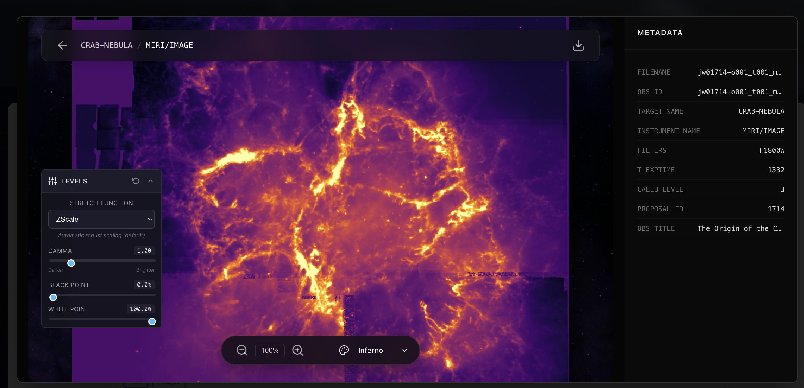
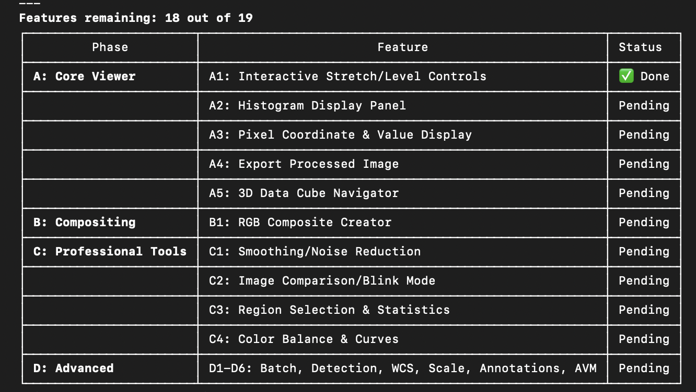
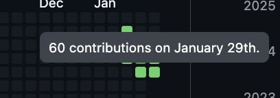

---
date:
  created: 2026-01-29
categories:
  - Documentation
  - Feature
  - Bug Fix
  - Refactoring
tags:
  - astronomy-data
  - ci
  - docs
  - export
  - mast-data
  - performance
  - security
  - viewer
authors:
  - shanon
---

# January 29: Twenty-One PRs and Security Hardening

<!-- enriched -->

A marathon session: 21 pull requests merged (4 features, 12 fixes, 4 docs, 1 refactor). Security hardening across the stack.

<!-- more -->

## Developer Journal

Reviewing the 11th PR of the morning. New scaling and levels features are working — "starting to be something" but "FAR FAR from something." The MAST portal remains the major pain point: extremely slow queries, and without very tight search parameters the timeouts are a recurring problem that can't seem to stay solved. Burned some tokens but the new approach is working faster.

## Highlights

### [#41](https://github.com/Snoww3d/jwst-data-analysis/pull/41) Add interactive stretch and level controls to FITS viewer

- Adds 7 stretch algorithms (zscale, asinh, log, sqrt, power, histogram equalization, linear) to the FITS preview
- Adds gamma correction, black point, and white point controls for fine-tuning image display
- Creates a collapsible StretchControls panel in the image viewer UI
- Implements 500ms debou...

### [#39](https://github.com/Snoww3d/jwst-data-analysis/pull/39) Server-side FITS preview with enhanced viewer UI

Replace slow client-side FITS parsing with fast server-side PNG generation.

## What Changed

### Features (4)

- [#21](https://github.com/Snoww3d/jwst-data-analysis/pull/21) Preserve all MAST metadata on import and add refresh functionality
- [#37](https://github.com/Snoww3d/jwst-data-analysis/pull/37) Add centralized API service layer (Task #12)
- [#39](https://github.com/Snoww3d/jwst-data-analysis/pull/39) Server-side FITS preview with enhanced viewer UI
- [#41](https://github.com/Snoww3d/jwst-data-analysis/pull/41) Add interactive stretch and level controls to FITS viewer

### Bug Fixes (12)

- [#26](https://github.com/Snoww3d/jwst-data-analysis/pull/26) Path traversal protection in preview endpoint (Task #1)
- [#27](https://github.com/Snoww3d/jwst-data-analysis/pull/27) Stream file downloads to prevent memory exhaustion (Task #2)
- [#28](https://github.com/Snoww3d/jwst-data-analysis/pull/28) Escape regex patterns in MongoDB search to prevent ReDoS (Task #3)
- [#29](https://github.com/Snoww3d/jwst-data-analysis/pull/29) Prevent path traversal in export download endpoint (Task #4)
- [#30](https://github.com/Snoww3d/jwst-data-analysis/pull/30) Replace N+1 query with batch fetch in export endpoint (Task #5)
- [#32](https://github.com/Snoww3d/jwst-data-analysis/pull/32) Add TypeScript interfaces for API responses (Task #7)
- [#33](https://github.com/Snoww3d/jwst-data-analysis/pull/33) Centralize hardcoded API URLs in frontend (Task #8)
- [#34](https://github.com/Snoww3d/jwst-data-analysis/pull/34) Use MongoDB aggregation for statistics to avoid memory exhaustion (Task #9)
- [#35](https://github.com/Snoww3d/jwst-data-analysis/pull/35) Add MongoDB indexes for commonly queried fields (Task #10)
- [#36](https://github.com/Snoww3d/jwst-data-analysis/pull/36) Add file content validation using magic bytes/signatures (Task #11)
- [#38](https://github.com/Snoww3d/jwst-data-analysis/pull/38) Add mast_obs_id fallback for observation lookup/delete
- [#40](https://github.com/Snoww3d/jwst-data-analysis/pull/40) Forward colormap and size parameters to processing engine

### Refactoring (1)

- [#31](https://github.com/Snoww3d/jwst-data-analysis/pull/31) Extract duplicated import logic into shared helper (Task #6)

### Documentation (4)

- [#22](https://github.com/Snoww3d/jwst-data-analysis/pull/22) Update documentation for MAST metadata preservation feature
- [#23](https://github.com/Snoww3d/jwst-data-analysis/pull/23) Add documentation update step to PR workflow
- [#24](https://github.com/Snoww3d/jwst-data-analysis/pull/24) Include documentation updates in same PR
- [#25](https://github.com/Snoww3d/jwst-data-analysis/pull/25) Add user review pause to Git Workflow

---
42 commits across 21 pull requests.
*Next: January 30, 2026 — Add delete/archive by processing level functionali..., Redesign FITS viewer header with observation title, Add observation title to dashboard Lineage and Gro...*
