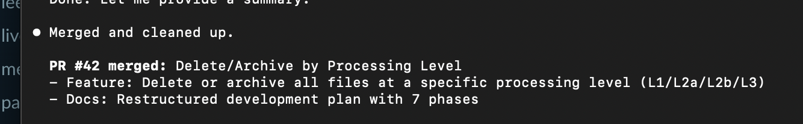
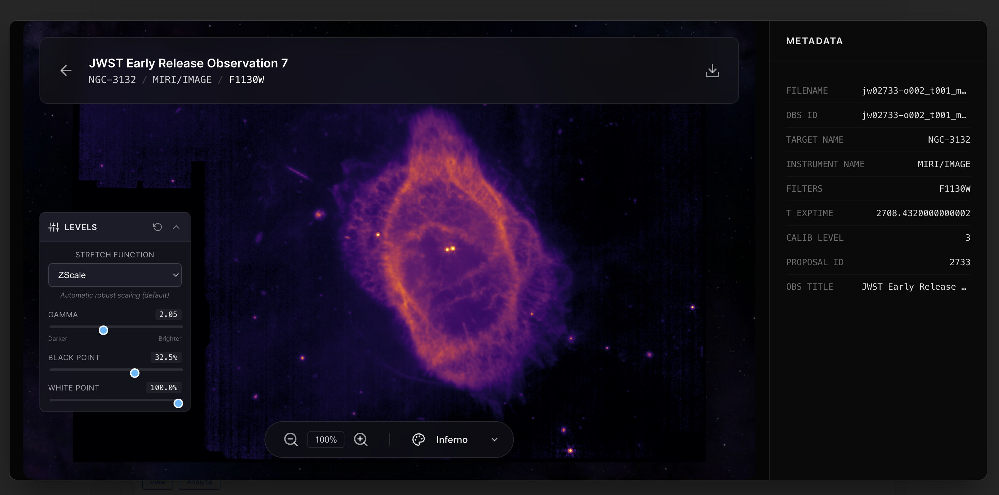
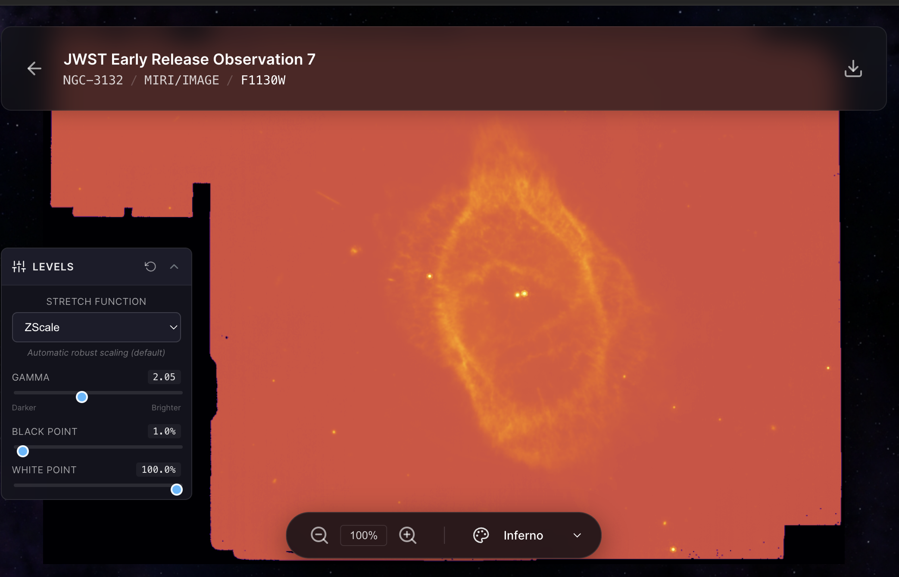
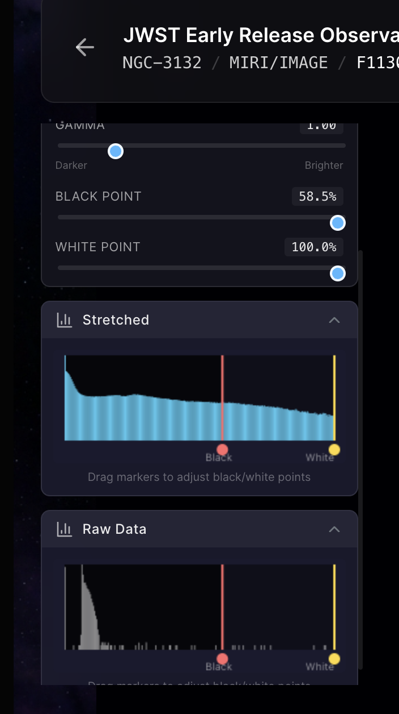

---
date:
  created: 2026-01-30
categories:
  - Feature
  - Bug Fix
  - Refactoring
tags:
  - astronomy-data
  - job-queue
  - mast-data
  - ui
  - viewer
authors:
  - shanon
---

# Session: January 30, 2026

<!-- enriched -->

Productive session with 8 pull requests: 6 features, 1 fix, 1 refactor.

<!-- more -->

## Developer Journal

Caught Claude not running its own test plan before presenting a PR — it only verified the TypeScript and C# builds compiled but never actually started Docker and tested end-to-end. "Oh this is where I yell at the junior developer." Claude admitted the gap, and mandatory Docker verification got added to every workflow. The feature itself had broken the dashboard on load, which should have been caught by the existing smoke test.

Watched Claude debug an issue for 14 minutes — had the correct theory within the first two minutes but let it churn to see if it would get there on its own. It did, but it took much longer than it should. "This is where I would tell the junior dev to go get help from someone."

UI bugs are a particular pain — the screenshot-and-click review cycle is slow. Spent 2 hours trying to fix the stretch sliders, an extremely hard problem that became a new tech debt item with a plan to improve. The app is at a phase that could be called MVP — "extremely minimally, but still." A friend wished for a YouTube vlog to follow along; the response: "that sounds hard and also requires speaking."

## Highlights

### [#50](https://github.com/Snoww3d/jwst-data-analysis/pull/50) Histogram shows stretched values instead of raw data

- Histogram panel now displays the distribution of **stretched** pixel values instead of raw FITS data
- When users change stretch function (ZScale → Asinh → Linear, etc.) or adjust gamma/black point/white point, the histogram updates to reflect the actual displayed distribution
- Histogram updates ...

### [#48](https://github.com/Snoww3d/jwst-data-analysis/pull/48) Sync MAST Files now fetches metadata and processing levels

- Combined "Import MAST Files" and "Refresh Metadata" buttons into single "Sync MAST Files" button
- Updated `ScanAndImportFiles` endpoint to fetch MAST metadata for each observation group
- Now properly populates both `Metadata` dictionary and `ImageInfo` fields during disk scan import
- Automatica...

## What Changed

### Features (6)

- [#42](https://github.com/Snoww3d/jwst-data-analysis/pull/42) Add delete/archive by processing level functionality
- [#44](https://github.com/Snoww3d/jwst-data-analysis/pull/44) Add observation title to dashboard Lineage and Grouped views
- [#45](https://github.com/Snoww3d/jwst-data-analysis/pull/45) Add magma, inferno, and plasma colormaps for FITS viewer
- [#46](https://github.com/Snoww3d/jwst-data-analysis/pull/46) Add download job cleanup timer and cancel endpoint
- [#47](https://github.com/Snoww3d/jwst-data-analysis/pull/47) A2 Histogram display panel with adjustable black/white points
- [#50](https://github.com/Snoww3d/jwst-data-analysis/pull/50) Histogram shows stretched values instead of raw data

### Bug Fixes (1)

- [#48](https://github.com/Snoww3d/jwst-data-analysis/pull/48) Sync MAST Files now fetches metadata and processing levels

### Refactoring (1)

- [#43](https://github.com/Snoww3d/jwst-data-analysis/pull/43) Redesign FITS viewer header with observation title

---
31 commits across 8 pull requests.
*Next: January 31, 2026 — Add "What's New" panel to browse recent JWST relea..., Complete git history security audit (Task #35), Externalize credentials to environment variables (...*
