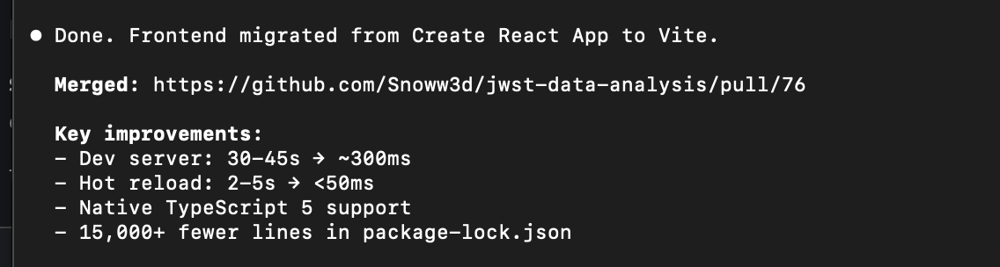
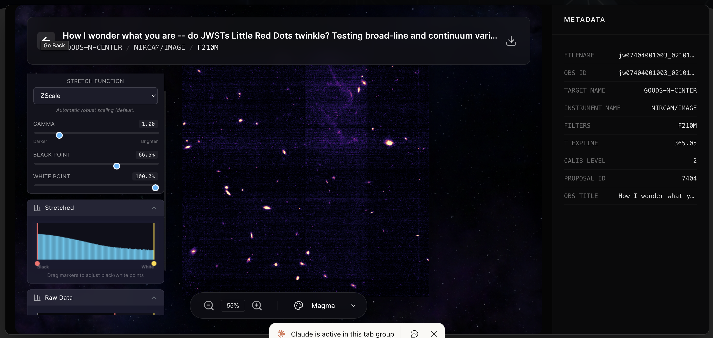
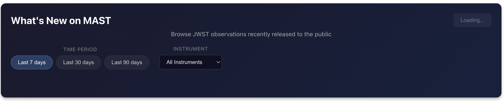
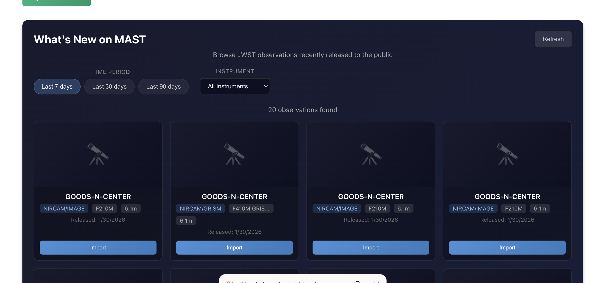

---
date:
  created: 2026-01-31
categories:
  - Maintenance
  - Development
  - Documentation
  - Feature
  - Bug Fix
  - Testing
tags:
  - auth
  - ci
  - code-quality
  - dependencies
  - docs
  - infrastructure
  - security
  - testing
  - ui
authors:
  - shanon
---

# Session: January 31, 2026

<!-- enriched -->

A marathon session: 23 pull requests merged (1 feature, 2 fixes, 4 docs, 1 test, 6 maintenance, 7 dependency updates). Security hardening across the stack.

<!-- more -->

## Developer Journal

Saturday, 7 AM. "I want to know why I'm doing this on a Saturday at 7am." Because it's fun. Create React App is apparently dead — down a deep rabbit hole migrating to Vite. "But in reality I have no idea what I'm doing" (said with a wink, because there's enough knowledge to know what to ask for).

The agent is "more absent-minded than me but also better than me." The process of asking "did you follow the instructions" as a check works surprisingly well. While addressing linting, Claude didn't just add rules — it scope-crept into fixing things. "I learned it from you, dad" — because that's exactly how every project goes. Using the 45-second build waits as forced breaks.

## Highlights

### [#79](https://github.com/Snoww3d/jwst-data-analysis/pull/79) Add API rate limiting

- Add AspNetCoreRateLimit package for IP-based rate limiting
- Configure sensible defaults to prevent abuse without impacting normal use
- Development mode whitelists localhost/private IPs

### [#78](https://github.com/Snoww3d/jwst-data-analysis/pull/78) Configure CORS for production

- Replace `AllowAnyOrigin()` with environment-configurable allowed origins
- Add `CORS_ALLOWED_ORIGINS` environment variable (comma-separated)
- Development mode defaults to localhost origins
- Production mode requires explicit configuration

## What Changed

### Features (1)

- [#51](https://github.com/Snoww3d/jwst-data-analysis/pull/51) Add "What's New" panel to browse recent JWST releases

### Bug Fixes (2)

- [#78](https://github.com/Snoww3d/jwst-data-analysis/pull/78) Configure CORS for production
- [#79](https://github.com/Snoww3d/jwst-data-analysis/pull/79) Add API rate limiting

### Testing (1)

- [#84](https://github.com/Snoww3d/jwst-data-analysis/pull/84) Add backend test infrastructure (Task #27)

### Documentation (4)

- [#52](https://github.com/Snoww3d/jwst-data-analysis/pull/52) Complete git history security audit (Task #35)
- [#54](https://github.com/Snoww3d/jwst-data-analysis/pull/54) Add MIT License (Task #22)
- [#55](https://github.com/Snoww3d/jwst-data-analysis/pull/55) Add community documentation (Tasks #21, #23)
- [#82](https://github.com/Snoww3d/jwst-data-analysis/pull/82) Mark #35 (Review and Clean Git History) as resolved

### Maintenance (6)

- [#75](https://github.com/Snoww3d/jwst-data-analysis/pull/75) Update all dependencies to latest versions
- [#76](https://github.com/Snoww3d/jwst-data-analysis/pull/76) Migrate frontend from Create React App to Vite
- [#77](https://github.com/Snoww3d/jwst-data-analysis/pull/77) Upgrade numpy to 2.0.2 and dependencies
- [#80](https://github.com/Snoww3d/jwst-data-analysis/pull/80) Add GitHub issue and PR templates
- [#81](https://github.com/Snoww3d/jwst-data-analysis/pull/81) Separate dev and production Docker configs
- [#83](https://github.com/Snoww3d/jwst-data-analysis/pull/83) Add linting and formatting configurations (Task #28)

**Dependencies** (7 updates: @types/node, actions/checkout, actions/setup-dotnet, actions/setup-node, actions/setup-python, aiofiles, github/codeql-action)

### Other (2)

- [#53](https://github.com/Snoww3d/jwst-data-analysis/pull/53) Externalize credentials to environment variables (Task #18)
- [#56](https://github.com/Snoww3d/jwst-data-analysis/pull/56) Add security scanning and dependency automation (Task #26)

---
61 commits across 23 pull requests.
*Next: February 1, 2026 — Implement Playwright and update agentic docs (Task..., Implement Zoomed Range View for Histogram (Task #1..., add test data generation and docs*
