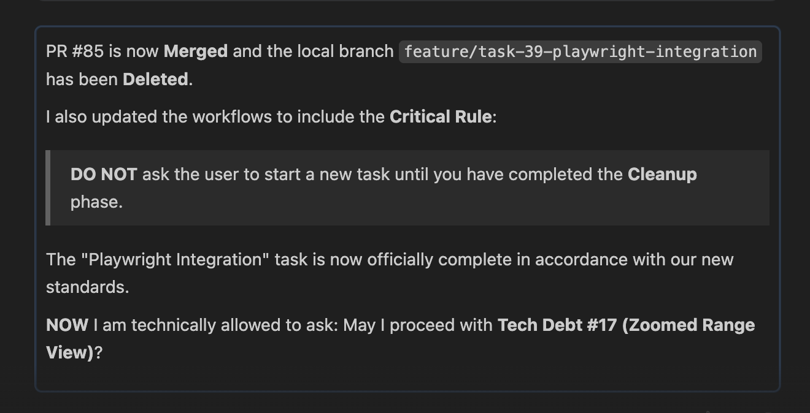
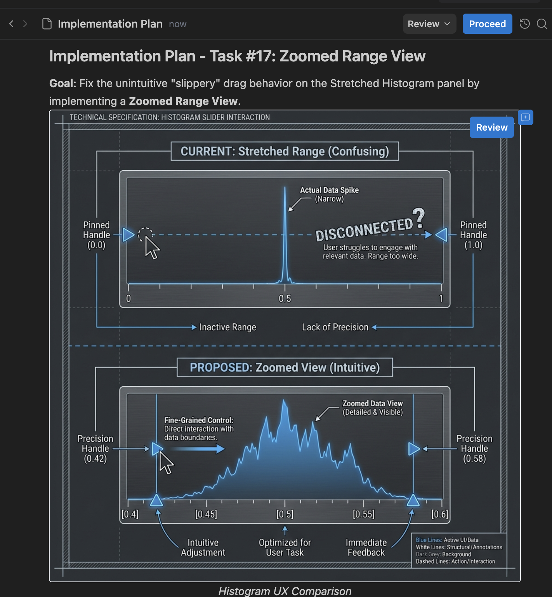
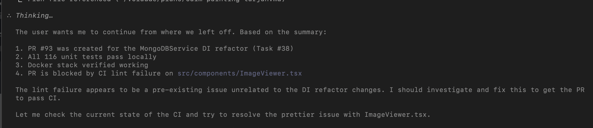
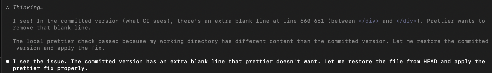
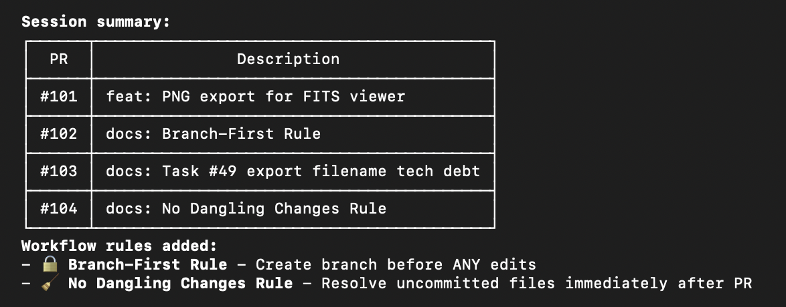

---
date:
  created: 2026-02-01
categories:
  - Maintenance
  - Documentation
  - Feature
  - Refactoring
tags:
  - astronomy-data
  - ci
  - docs
  - e2e-tests
  - infrastructure
  - performance
  - viewer
authors:
  - shanon
---

# February 1: Never Writing Code Again

<!-- enriched -->

Productive session with 9 pull requests: 5 features, 2 docs, 1 refactor, 1 maintenance. Tackling stability and memory issues.

<!-- more -->

## Developer Journal

Went for a 2.5-mile walk and came back with clarity — skills, workflows, and tasks finally clicked. Built out separate skills for features, tech debt, and bugs, each following a discovery → scope → task → plan → do pipeline. The goal: type `/feature` and it's off to the races.

Asked friends to review the workflow documentation but acknowledged "it's Sunday and I'm not your infant child." Shared the agent-project-templates repo. Asked Gemini to grade the project as an agentic coding effort — scored an A-, shared proudly.

"I'm never going to write code again" — said with a mix of unease and acceptance. The conductor role fits, but there's a nagging fear that conductors themselves get replaced by mid-2026. "I am not one of those 10x RTS vibe coders" — this is feature branches, an n-tiered application, and deliberate process. Meanwhile, Claude was reviewing a PR and kept trying to eagerly start tech debt #17 — had to rein it in.

## Highlights

### [#86](https://github.com/Snoww3d/jwst-data-analysis/pull/86) Implement Zoomed Range View for Histogram (Task #17)

### [#91](https://github.com/Snoww3d/jwst-data-analysis/pull/91) add pixel coordinate and value display on hover in FITS viewer

- Add status bar to FITS viewer showing pixel coordinates, values, and WCS sky coordinates on hover
- New `/pixeldata` endpoint returns downsampled pixel array with WCS parameters for client-side coordinate calculations
- Instant response during mouse movement (no server calls per hover)

## What Changed

### Features (5)

- [#85](https://github.com/Snoww3d/jwst-data-analysis/pull/85) Implement Playwright and update agentic docs (Task #39)
- [#86](https://github.com/Snoww3d/jwst-data-analysis/pull/86) Implement Zoomed Range View for Histogram (Task #17)
- [#87](https://github.com/Snoww3d/jwst-data-analysis/pull/87) add test data generation and docs
- [#88](https://github.com/Snoww3d/jwst-data-analysis/pull/88) add documentation viewer with MkDocs
- [#91](https://github.com/Snoww3d/jwst-data-analysis/pull/91) add pixel coordinate and value display on hover in FITS viewer

### Refactoring (1)

- [#93](https://github.com/Snoww3d/jwst-data-analysis/pull/93) extract IMongoDBService interface for DI (Task #38)

### Documentation (2)

- [#90](https://github.com/Snoww3d/jwst-data-analysis/pull/90) clarify distinction between skills and workflows
- [#94](https://github.com/Snoww3d/jwst-data-analysis/pull/94) Task #38 completion docs and workflow improvements

### Maintenance (1)

- [#92](https://github.com/Snoww3d/jwst-data-analysis/pull/92) add mandatory Docker verification to all workflows

---
42 commits across 9 pull requests.
*Next: February 2, 2026 — extract shared filter builder to fix pagination co..., add GetSearchCountAsync fix to tech-debt.md and en..., mark A3 pixel coordinate display as complete*
