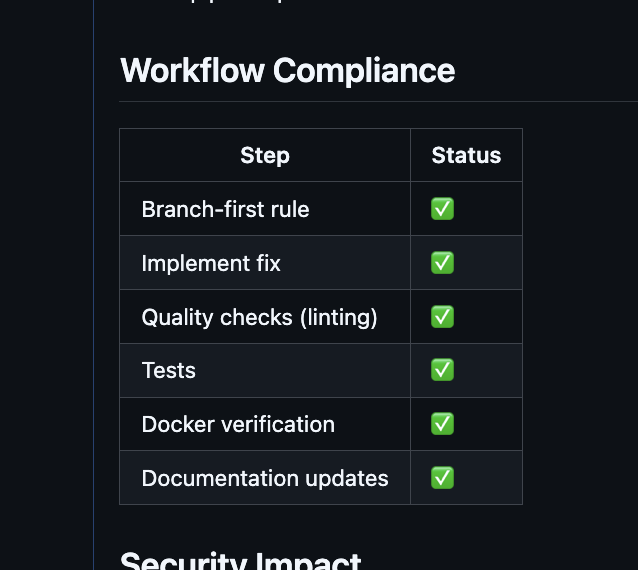
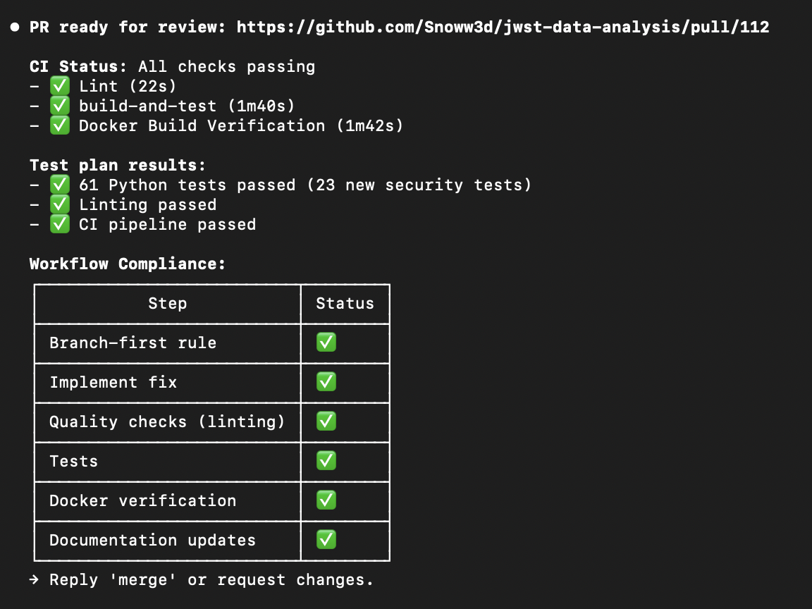

---
date:
  created: 2026-02-02
categories:
  - Maintenance
  - Documentation
  - Feature
  - Bug Fix
  - Development
tags:
  - astronomy-data
  - ci
  - docs
  - export
  - mast-data
  - security
  - viewer
authors:
  - shanon
---

# February 2: JWT Authentication Overhaul

<!-- enriched -->

A marathon session: 19 pull requests merged (1 feature, 1 fix, 9 docs, 2 maintenance). Security hardening across the stack.

<!-- more -->

## Developer Journal

Big JWT authentication feature (Task #55) — massive implementation spanning endpoints, user models, auth service, Swagger config, and all 164 unit tests passing. Saved detailed resume instructions for the next morning session: branch name, remaining verification steps, even the curl commands for testing auth endpoints. The process of pausing mid-feature and resuming cleanly is becoming a discipline.

Claude tried to simplify tests by removing interfaces rather than adding them — would have dropped the test count from 164 to 151. Caught it, rejected the PR, and added a hard rule: never delete or weaken tests to make them pass. "This asshole tried to go from 164 to 151 tests." The process documentation approach is working: "do these steps every time, then at the end ask yourself did you do every step." Claude is almost as bad at remembering the process as the human, so everything gets written down.

Spotted Codex for the first time — the cloud environments could solve the feature branching problem on a single machine. Looks like a much cleaner version of the Claude Code TUI with slightly less workflow automation but seemingly easy to add.

## Highlights

### [#101](https://github.com/Snoww3d/jwst-data-analysis/pull/101) add PNG export to FITS viewer

- Add PNG export button to FITS viewer that downloads current visualization with all settings applied
- Generate meaningful filenames from MAST metadata (e.g., `jw02733-o001_nircam_f090w_2024-01-15_143022.png`)
- Show loading spinner during export, disable button while image is loading
- Update docu...

### [#95](https://github.com/Snoww3d/jwst-data-analysis/pull/95) extract shared filter builder to fix pagination count mismatch (Task #2)

- Fixed `GetSearchCountAsync` to apply all 9 filters that `AdvancedSearchAsync` uses, ensuring pagination counts match filtered results
- Extracted `BuildSearchFilter()` private method to eliminate code duplication and guarantee consistent filtering behavior
- Added 5 unit tests to verify correct co...

## What Changed

### Features (1)

- [#101](https://github.com/Snoww3d/jwst-data-analysis/pull/101) add PNG export to FITS viewer

### Bug Fixes (1)

- [#95](https://github.com/Snoww3d/jwst-data-analysis/pull/95) extract shared filter builder to fix pagination count mismatch (Task #2)

### Documentation (9)

- [#96](https://github.com/Snoww3d/jwst-data-analysis/pull/96) add GetSearchCountAsync fix to tech-debt.md and enhance workflows
- [#97](https://github.com/Snoww3d/jwst-data-analysis/pull/97) mark A3 pixel coordinate display as complete
- [#100](https://github.com/Snoww3d/jwst-data-analysis/pull/100) add Task #48 for GitHub branch protection
- [#102](https://github.com/Snoww3d/jwst-data-analysis/pull/102) add Branch-First Rule to harden git workflow
- [#103](https://github.com/Snoww3d/jwst-data-analysis/pull/103) add Task #49 for export filename pattern improvements
- [#104](https://github.com/Snoww3d/jwst-data-analysis/pull/104) add No Dangling Changes Rule to git workflow
- [#106](https://github.com/Snoww3d/jwst-data-analysis/pull/106) Enforce mandatory workflow usage for all changes
- [#109](https://github.com/Snoww3d/jwst-data-analysis/pull/109) mark Task #50 (MongoDB password exposure) as verified false positive
- [#111](https://github.com/Snoww3d/jwst-data-analysis/pull/111) add self-compliance check to all workflows

### Maintenance (2)

- [#98](https://github.com/Snoww3d/jwst-data-analysis/pull/98) add git workflow protection to prevent direct pushes to main
- [#99](https://github.com/Snoww3d/jwst-data-analysis/pull/99) enhance PR template with documentation checklist

### Other (6)

- [#105](https://github.com/Snoww3d/jwst-data-analysis/pull/105) Add MCP server security policy
- [#107](https://github.com/Snoww3d/jwst-data-analysis/pull/107) add comprehensive security audit findings to tech debt
- [#108](https://github.com/Snoww3d/jwst-data-analysis/pull/108) fix path traversal vulnerability via obsId parameter (Task #51)
- [#110](https://github.com/Snoww3d/jwst-data-analysis/pull/110) fix SSRF risk in MAST URL construction (Task #52)
- [#112](https://github.com/Snoww3d/jwst-data-analysis/pull/112) fix path traversal in chunked downloader filename (Task #53)
- [#113](https://github.com/Snoww3d/jwst-data-analysis/pull/113) add production-ready HTTPS/TLS support (Task #54, #63)

---
22 commits across 19 pull requests.
*Next: February 3, 2026 — add desktop requirements specification document, add tech debt #70 for docs-only PR workflow optimi..., add tech debt #71 for context window optimization*
