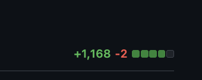
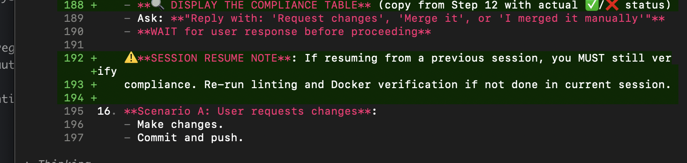
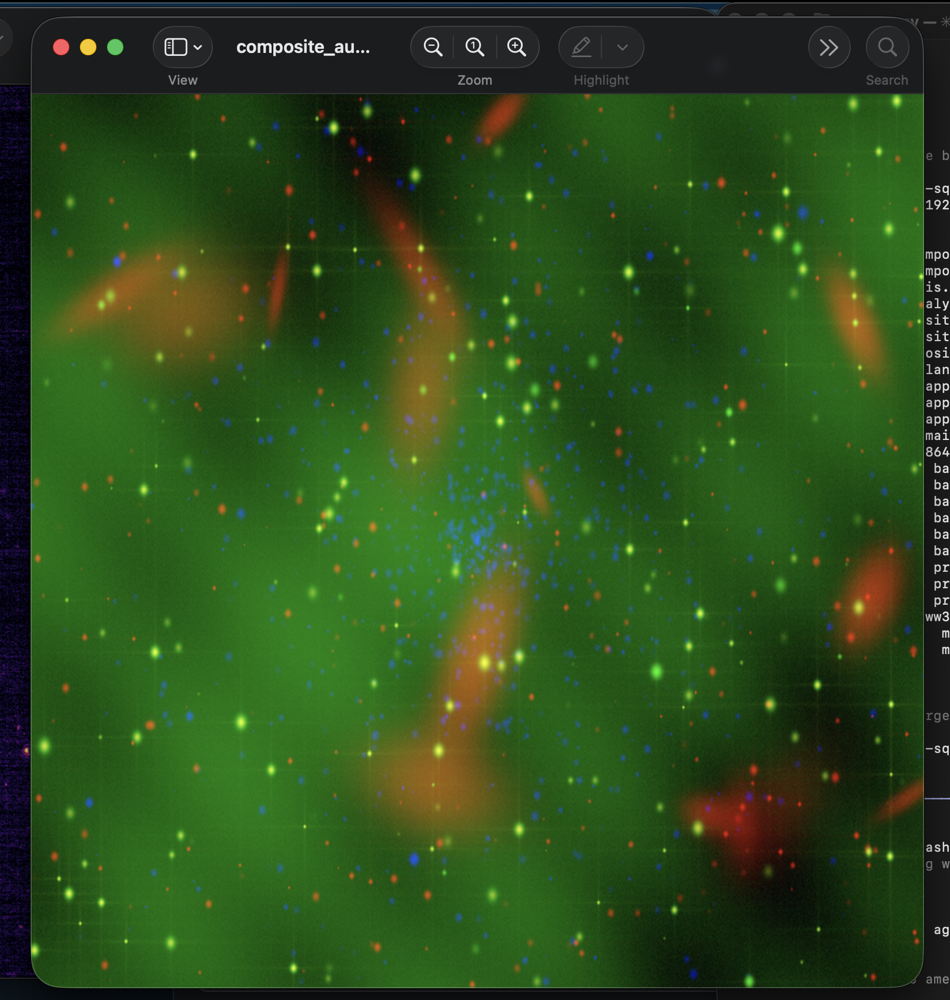
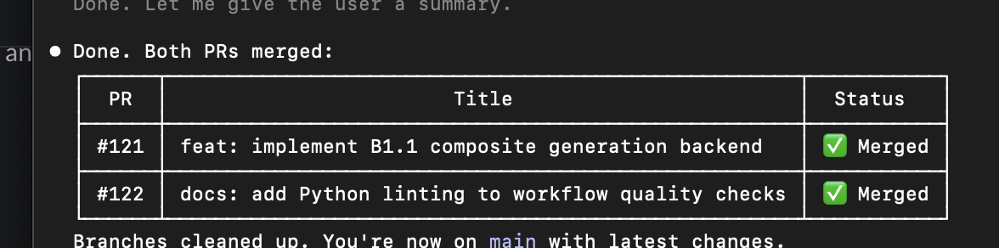
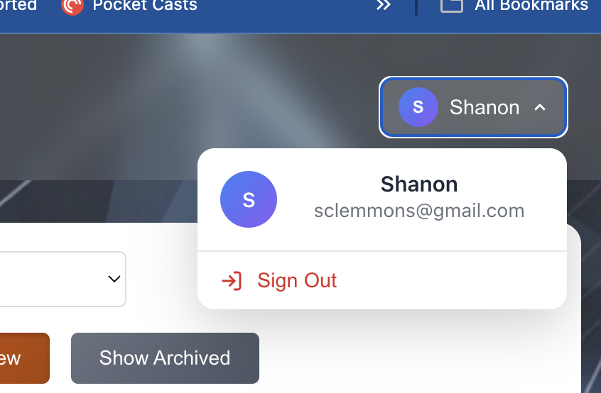
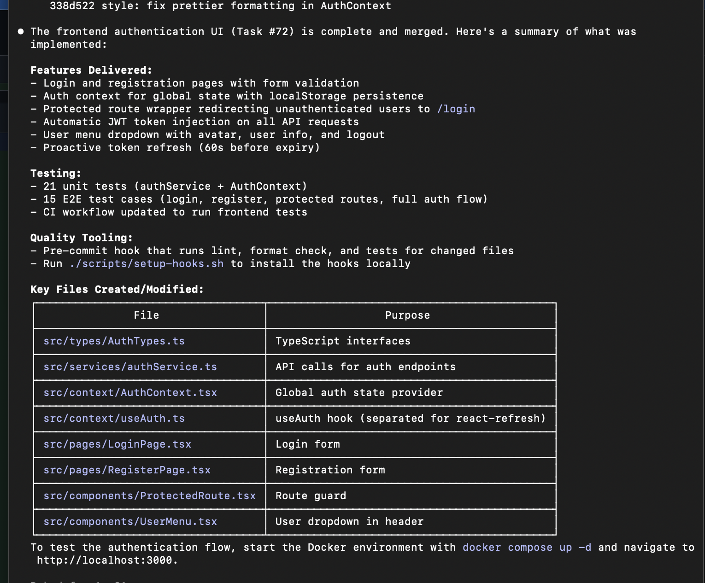
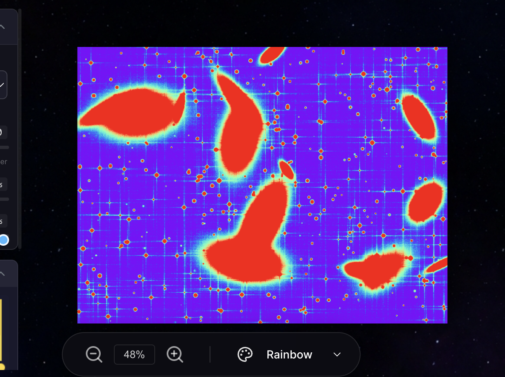
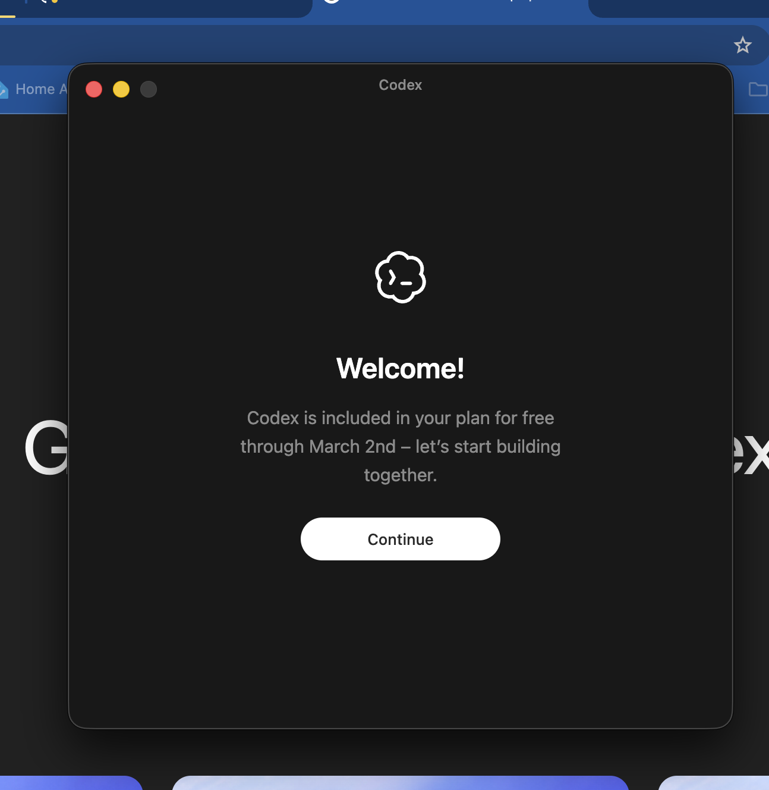

---
date:
  created: 2026-02-03
categories:
  - Maintenance
  - Documentation
  - Feature
  - Bug Fix
tags:
  - astronomy-data
  - auth
  - ci
  - code-quality
  - docs
  - export
  - imaging
  - mast-data
  - performance
authors:
  - shanon
---

# February 3: The Compositing Pipeline Takes Shape

<!-- enriched -->

A marathon session: 17 pull requests merged (4 features, 4 fixes, 8 docs, 1 maintenance). Security hardening across the stack.

<!-- more -->

## Developer Journal

The compositing pipeline is starting to take shape — shared screenshots of three FITS files at different wavelengths combined into a single image (B1.1 through B1.7). Meanwhile, Claude tried to resolve merge conflicts by writing new code rather than just taking one side — and it actually worked. "If someone thinks you can 'claude --dangerously-skip-permissions' an app today you are WRONG!"

Claude churned for 17.5 minutes and produced a PR with 5 endpoints, several UI components, full integration and E2E testing, and a well-documented workflow. "This is not that special or unique, it's a very solved problem, but less than a year ago I was on a web app where a team of 5 devs took a sprint to do this — and Claude is about to do it while I watch YouTube." The human is the bottleneck now, slow at reviewing huge PRs.

An unfinished feature from the previous day broke the dashboard on load — the smoke test existed but didn't catch it. "This is the DEFINITION of a smoke test." The guardrails are mostly working though: rm -rf of build directories deleted a .sln file but git recovered it. "I'm gonna have to ~science~ DevOps the shit out of this." Also had Claude write a full desktop application requirements doc — it was an excellent novel-length spec that was exactly right, the only problem being it had to be read. Encouraged friends to try Codex while it's free through March 2nd.

## Highlights

### [#121](https://github.com/Snoww3d/jwst-data-analysis/pull/121) implement RGB composite generation backend (B1.1)

- Add new `/api/composite/generate` endpoint to create RGB composites from 3 FITS files
- Implement composite module in processing engine with per-channel stretch controls
- Support automatic dimension resampling when FITS files have different sizes
- Include path traversal protection and comprehens...

### [#130](https://github.com/Snoww3d/jwst-data-analysis/pull/130) allow anonymous access to MAST search endpoints

- Add `[AllowAnonymous]` attribute to read-only MAST search endpoints to fix 401 Unauthorized errors for unauthenticated users
- Aligns with project API documentation: "Read operations (GET) allow anonymous access"

## What Changed

### Features (4)

- [#117](https://github.com/Snoww3d/jwst-data-analysis/pull/117) implement JWT authentication for all API endpoints (Task #55)
- [#121](https://github.com/Snoww3d/jwst-data-analysis/pull/121) implement RGB composite generation backend (B1.1)
- [#125](https://github.com/Snoww3d/jwst-data-analysis/pull/125) add PNG/JPEG export with format, quality, and resolution options (A4)
- [#128](https://github.com/Snoww3d/jwst-data-analysis/pull/128) add 3D data cube navigator for MIRI IFU spectral cubes

### Bug Fixes (4)

- [#123](https://github.com/Snoww3d/jwst-data-analysis/pull/123) resolve all code analysis warnings and enforce zero warnings
- [#124](https://github.com/Snoww3d/jwst-data-analysis/pull/124) Add memory limits to FITS processing endpoints (Tech Debt #56)
- [#126](https://github.com/Snoww3d/jwst-data-analysis/pull/126) correct MkDocs nav paths and add missing pages
- [#130](https://github.com/Snoww3d/jwst-data-analysis/pull/130) allow anonymous access to MAST search endpoints

### Documentation (8)

- [#114](https://github.com/Snoww3d/jwst-data-analysis/pull/114) add desktop requirements specification document
- [#115](https://github.com/Snoww3d/jwst-data-analysis/pull/115) add tech debt #70 for docs-only PR workflow optimization
- [#116](https://github.com/Snoww3d/jwst-data-analysis/pull/116) add tech debt #71 for context window optimization
- [#118](https://github.com/Snoww3d/jwst-data-analysis/pull/118) mark Task #55 as resolved (PR #117)
- [#119](https://github.com/Snoww3d/jwst-data-analysis/pull/119) add compliance check reminder to workflow files
- [#120](https://github.com/Snoww3d/jwst-data-analysis/pull/120) add auth review items to tech debt
- [#122](https://github.com/Snoww3d/jwst-data-analysis/pull/122) add Python linting to workflow quality checks
- [#129](https://github.com/Snoww3d/jwst-data-analysis/pull/129) add /compliance-check skill

### Maintenance (1)

- [#127](https://github.com/Snoww3d/jwst-data-analysis/pull/127) upgrade Node.js from 18 to 22 LTS

---
51 commits across 17 pull requests.
*Next: February 4, 2026 — add frontend authentication UI with login/register..., allow login with email address in addition to user..., add WCS Mosaic Generator (B2) to roadmap*
