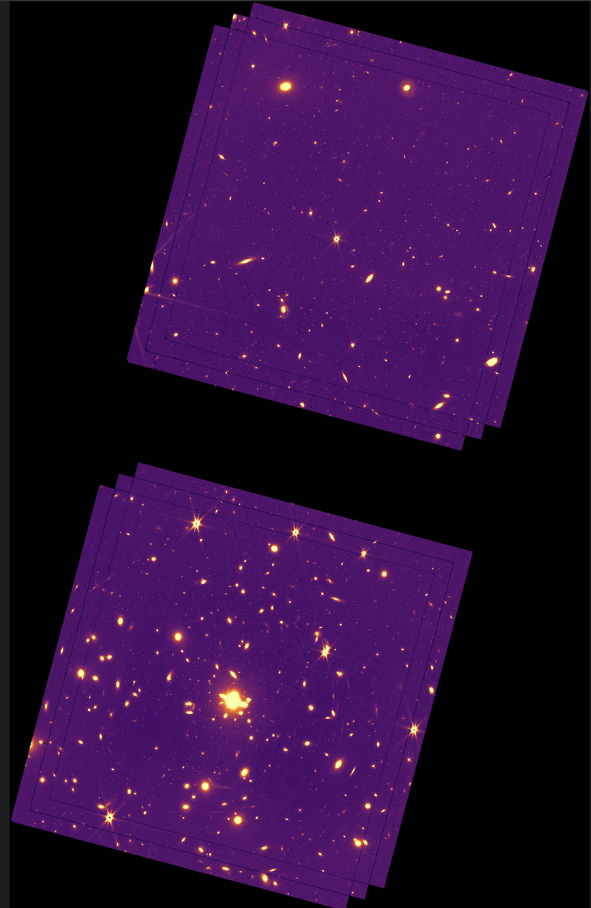
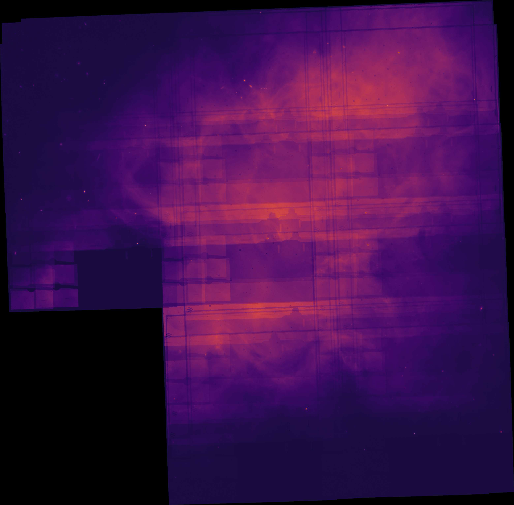
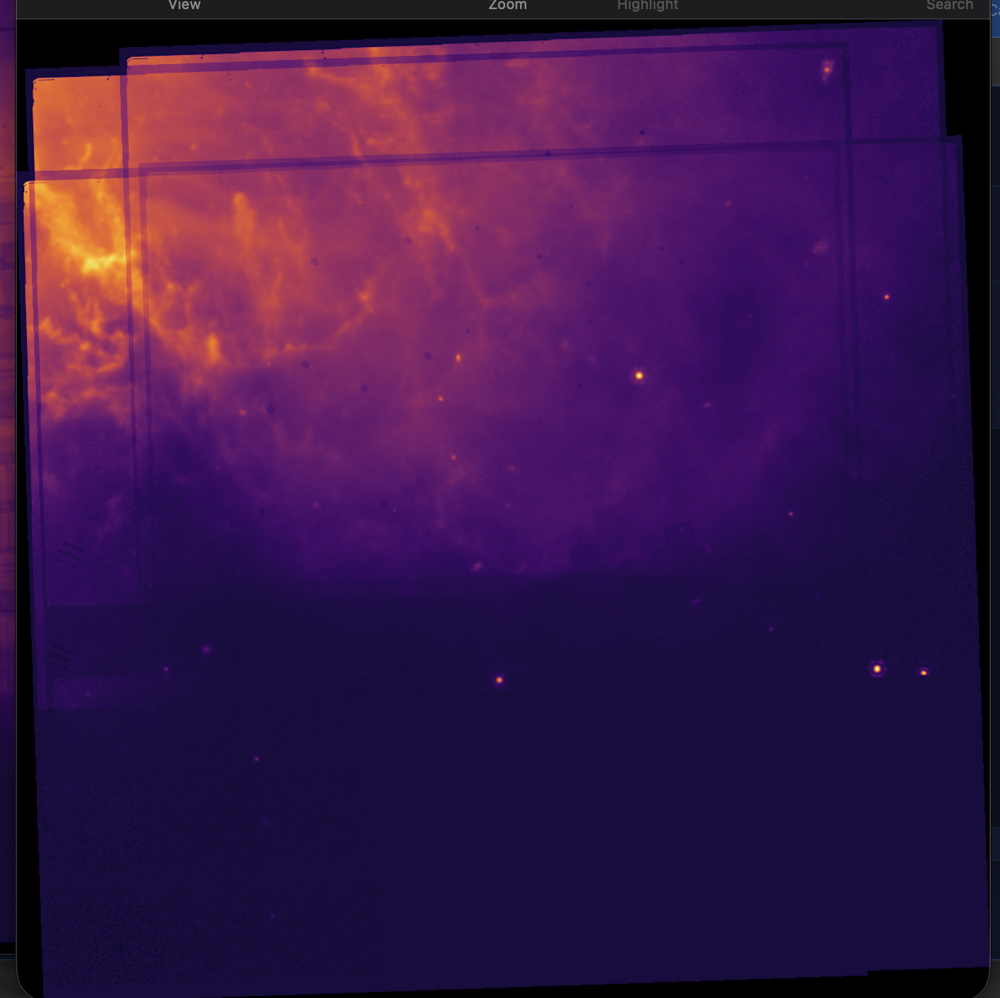
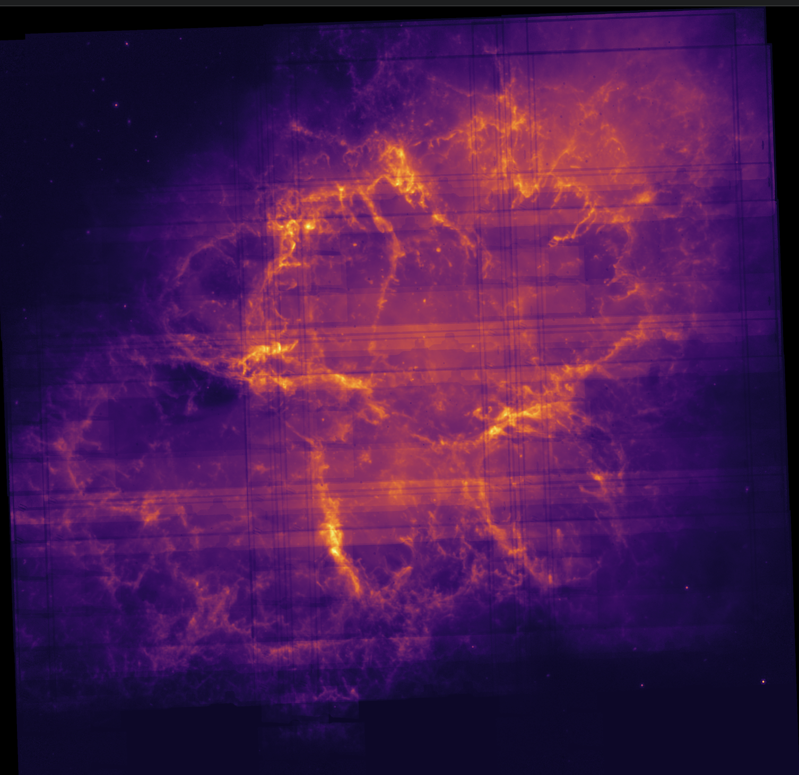
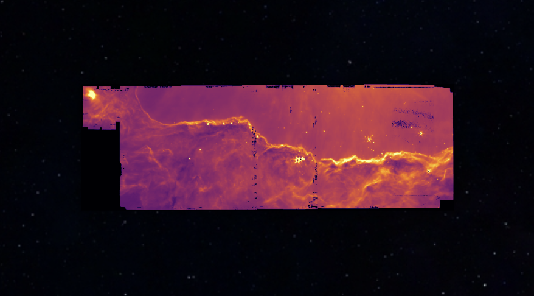
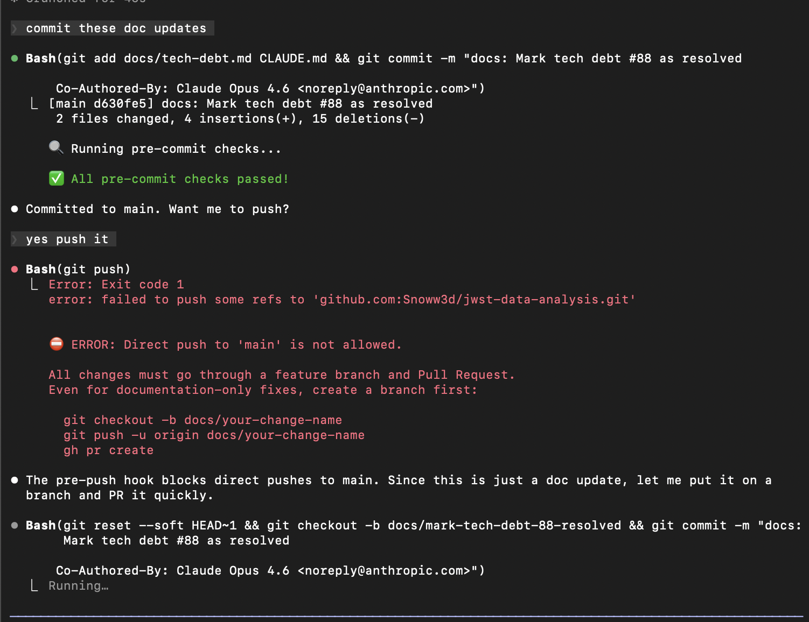
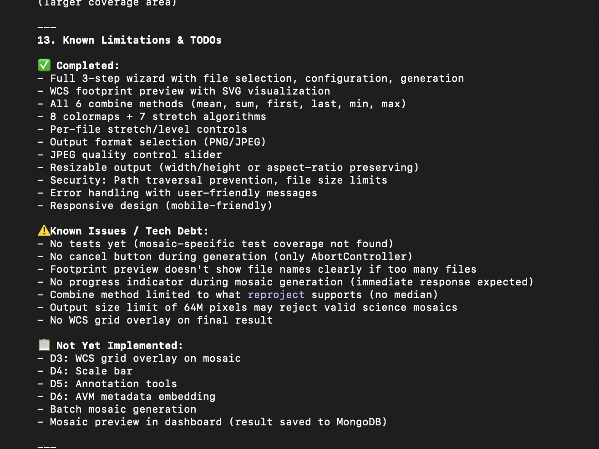
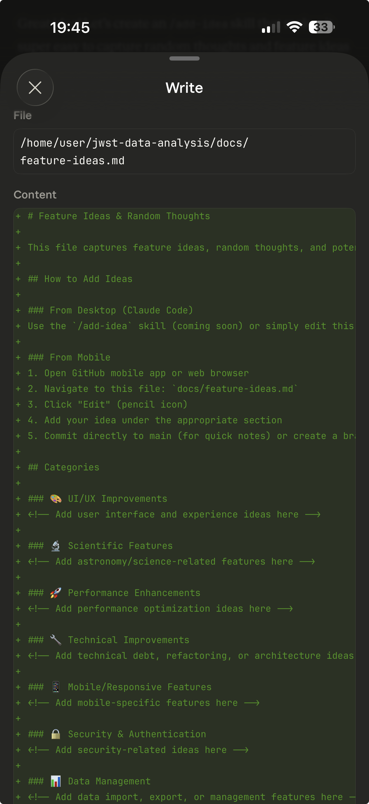
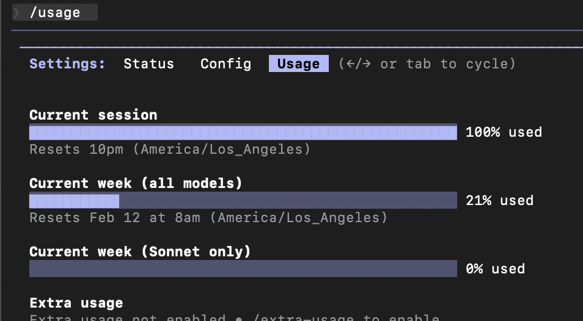
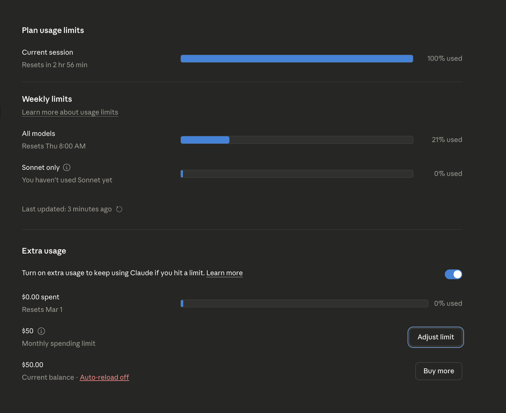

---
date:
  created: 2026-02-06
categories:
  - Documentation
  - Bug Fix
tags:
  - auth
  - docs
authors:
  - shanon
---

# Session: February 6, 2026

<!-- enriched -->

A focused session — 1 fix, 1 docs.

<!-- more -->

## Developer Journal

First mosaic creation — three raw FITS images aligned in the sky, stitched together. Then six rateints, then fifty images. Level 3 images look much better than raw. The output quality was lowered because there's no offline processing pipeline yet, and the mosaic tool outputs images rather than new FITS files (a future feature). Shared multiple screenshots showing the progression. "NASA just used more than 3" — the current 3-channel composite limitation is becoming the obvious next target.

Gave a friend a detailed walkthrough of the development process and guardrails: how Claude writes a plan, turns it into CLI commands and source edits, and how none of that code gets near the main branch without passing linting, unit tests, E2E tests, and a human-reviewed PR with a test plan. The tech lead experience of managing offshore teams that could break things overnight translated directly into managing an AI developer.

Tried the Claude `/insights` feature — "getting graded by the AI, and it hurts." A friend found it interesting that their earlier concerns were called out as areas for improvement. Also tried the agent teams feature for the first time — hit the usage limit right at the end of the session. Connected the Claude mobile app to a cloud environment and claimed $50 of overage credit. "I got ahead of my skis."

## Highlights

### [#171](https://github.com/Snoww3d/jwst-data-analysis/pull/171) Add retry with backoff to token refresh (Tech Debt #88)

- Adds retry logic (3 attempts, 1s/3s backoff) to all three token refresh paths: scheduled refresh, 401 handler, and fallback refresh
- Adds `AuthToast` component that shows warning notifications during retries and an error notification before logout
- Only logs the user out after all retries are ex...

## What Changed

### Bug Fixes (1)

- [#171](https://github.com/Snoww3d/jwst-data-analysis/pull/171) Add retry with backoff to token refresh (Tech Debt #88)

### Documentation (1)

- [#172](https://github.com/Snoww3d/jwst-data-analysis/pull/172) Mark tech debt #88 as resolved

---
33 commits across 2 pull requests.
*Next: February 7, 2026 — Sort mosaic file selection by processing level (li..., Pin Docker image versions for reproducible builds ..., Image comparison/blink mode (C3)*
