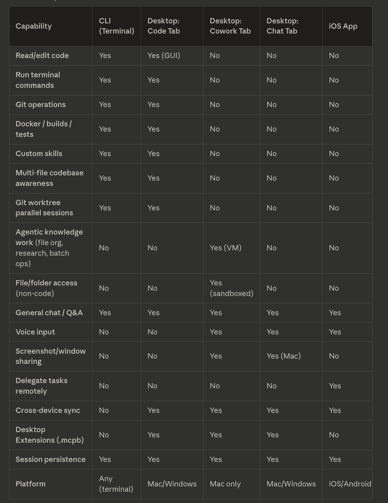
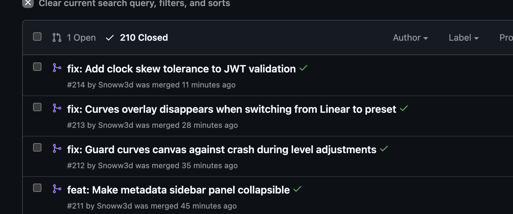
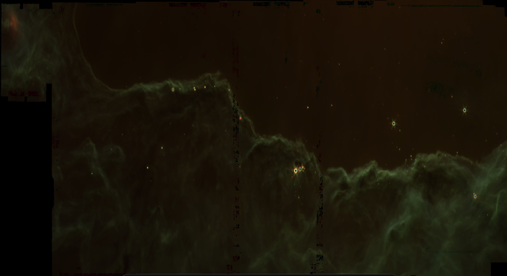
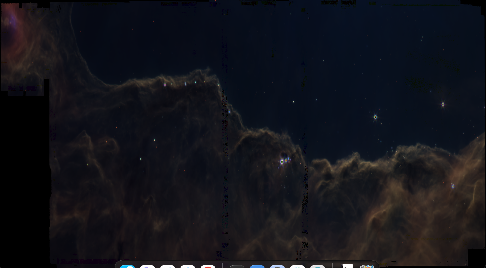

---
date:
  created: 2026-02-07
categories:
  - Documentation
  - Feature
  - Bug Fix
tags:
  - astronomy-data
  - ci
  - code-quality
  - docs
  - export
  - imaging
  - infrastructure
  - job-queue
  - ui
  - viewer
authors:
  - shanon
---

# February 7: Phase Four Complete

<!-- enriched -->

A marathon session: 20 pull requests merged (7 features, 6 fixes, 7 docs). Major work on the composite imaging pipeline.

<!-- more -->

## Developer Journal

Saturday session — Phase 4 finished the day before, now making small changes and finding bugs. 210 PRs closed to date. The Claude CLI updated at least twice during the session (2.1.34 → 2.1.36 → 2.1.37), with version 35 presumably landing overnight. Hard to keep track of features across the CLI, desktop app, and phone app when all three are getting daily updates.

Connected the GitHub project to the Claude mobile app's cloud environment — the idea being to capture feature ideas and quick thoughts from the phone using Sonnet. Found a good 3-image set to composite that produced an ok result; swapping the channel order improved it. Mosaic and composite both work individually, but the composite is still limited to 3 channels (R/G/B) — not enough for the multi-filter NASA-quality images.

## Highlights

### [#176](https://github.com/Snoww3d/jwst-data-analysis/pull/176) Disable seed users in production, refresh downloads panel, fix mosaic export button (#90, #91, #92)

Three independent quick fixes bundled into a single PR:

### [#173](https://github.com/Snoww3d/jwst-data-analysis/pull/173) Sort mosaic file selection by processing level (lineage order)

- Sort the Mosaic Wizard file selection grid by JWST processing level (lineage order): L1 (raw/uncal) → L2a (rate/rateints) → L2b (calibrated) → L3 (combined) → unknown
- Add color-coded processing level badges next to each filename for visual grouping
- Secondary sort by filename within each level ...

## What Changed

### Features (7)

- [#173](https://github.com/Snoww3d/jwst-data-analysis/pull/173) Sort mosaic file selection by processing level (lineage order)
- [#175](https://github.com/Snoww3d/jwst-data-analysis/pull/175) Image comparison/blink mode (C3)
- [#178](https://github.com/Snoww3d/jwst-data-analysis/pull/178) Add interactive curves/levels adjustment to FITS viewer (C4)
- [#180](https://github.com/Snoww3d/jwst-data-analysis/pull/180) Add WCS coordinate grid overlay to FITS viewer (D3)
- [#181](https://github.com/Snoww3d/jwst-data-analysis/pull/181) Add annotation tools to FITS viewer (D5)
- [#183](https://github.com/Snoww3d/jwst-data-analysis/pull/183) Add angular scale bar to FITS viewer (D4)
- [#208](https://github.com/Snoww3d/jwst-data-analysis/pull/208) Add AVM metadata embedding on export (D6)

### Bug Fixes (6)

- [#174](https://github.com/Snoww3d/jwst-data-analysis/pull/174) Pin Docker image versions for reproducible builds (Task #62)
- [#176](https://github.com/Snoww3d/jwst-data-analysis/pull/176) Disable seed users in production, refresh downloads panel, fix mosaic export button (#90, #91, #92)
- [#177](https://github.com/Snoww3d/jwst-data-analysis/pull/177) Prevent concurrent resume of same download job (#66)
- [#182](https://github.com/Snoww3d/jwst-data-analysis/pull/182) Resolve 14 pre-existing ESLint warnings
- [#207](https://github.com/Snoww3d/jwst-data-analysis/pull/207) Resolve all backend build warnings (SA1516, CA1848)
- [#209](https://github.com/Snoww3d/jwst-data-analysis/pull/209) Reorder backend members per StyleCop SA1202/SA1204 (Tech Debt #77+#78)

### Documentation (7)

- [#179](https://github.com/Snoww3d/jwst-data-analysis/pull/179) Update tracking docs for session 2026-02-07
- [#184](https://github.com/Snoww3d/jwst-data-analysis/pull/184) Update development plan for D3, D4, D5 completion
- [#185](https://github.com/Snoww3d/jwst-data-analysis/pull/185) Update CLAUDE.md with comprehensive current state
- [#204](https://github.com/Snoww3d/jwst-data-analysis/pull/204) Slim CLAUDE.md from 50KB to 26KB, add cloud session instructions
- [#205](https://github.com/Snoww3d/jwst-data-analysis/pull/205) Reorganize tech-debt.md into ordered sections
- [#206](https://github.com/Snoww3d/jwst-data-analysis/pull/206) Rewrite setup guide to match current project state
- [#210](https://github.com/Snoww3d/jwst-data-analysis/pull/210) Update tracking docs for session 2026-02-07

---
63 commits across 20 pull requests.
*Next: February 8, 2026 — Make metadata sidebar panel collapsible, Guard curves canvas against crash during level adj..., Curves overlay disappears when switching from Line...*
