---
date:
  created: 2026-02-09
categories:
  - Maintenance
  - Documentation
  - Bug Fix
tags:
  - auth
  - ci
  - docs
  - e2e-tests
  - infrastructure
authors:
  - shanon
---

# February 9: Going Public and E2E Test Battles

<!-- enriched -->

A marathon session: 10 pull requests merged (2 fixes, 2 docs, 6 maintenance). Test reliability improvements.

<!-- more -->

## Developer Journal

The repo needs to go public — hit a GitHub limit that forces the conversion. The fear: documentation or git history might contain passwords or secrets. A friend immediately suggested rotating everything and checking for API keys, which became the day's action item. Checked many times, 98% confident it's clean, but the alarm bells still go off.

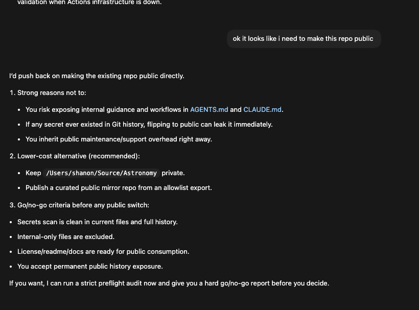

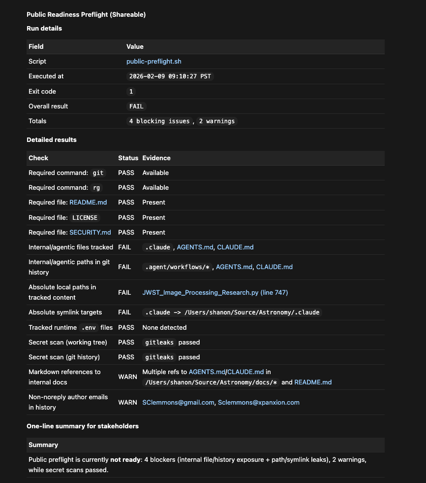

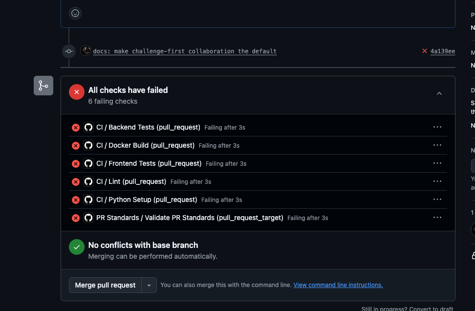

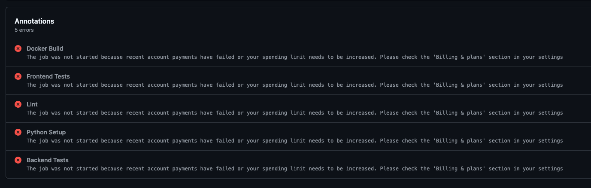

Spent most of the day wrestling with Playwright E2E tests. The MCP-based browser automation eats tokens and runs painfully slow. 20 of 29 tests pass and they're part of the pipeline, but can't enforce them as required yet — some tests were written before the login page existed and need updating. Shared screenshots of test results and the review process. "Reviewing every line of code before the PR is such a normal software experience" — said with the weariness of someone who didn't write the code but owns every line of it.

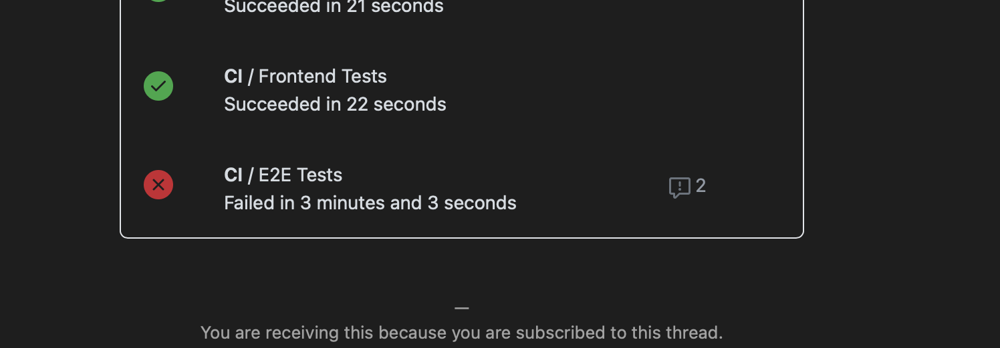

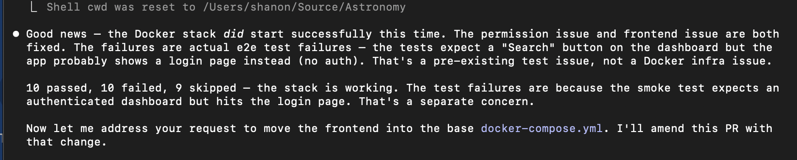

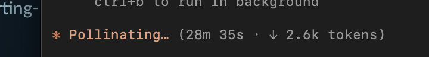

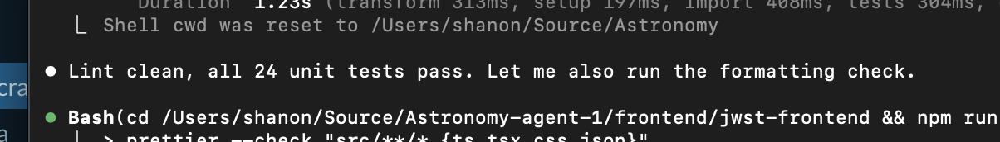

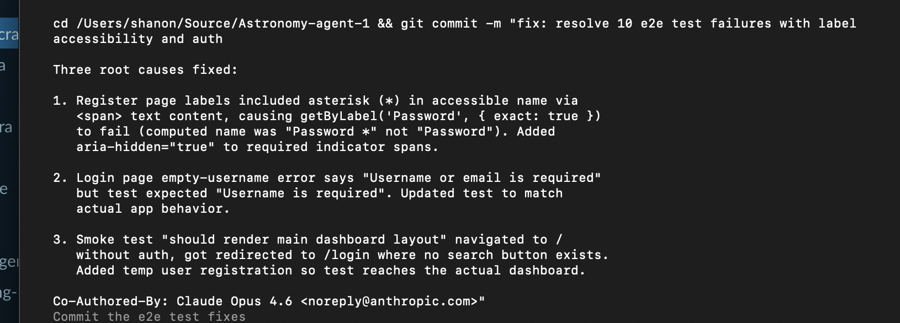

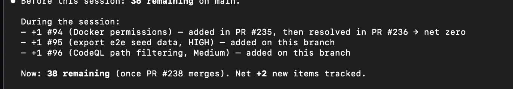

A friend had mixed feelings about Playwright after watching a demo video — felt strongly that tests need to be hardcoded and deterministic. Fair point, but the immediate problem isn't philosophy, it's getting the Docker MCP to stop failing randomly.

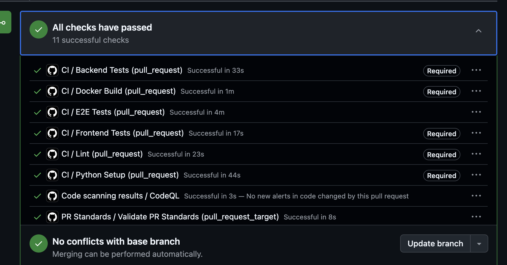

## Highlights

### [#238](https://github.com/Snoww3d/jwst-data-analysis/pull/238) resolve 10 e2e test failures with label accessibility and auth

- Fix all 10 failing e2e tests by addressing 3 root causes: register page accessible label mismatch, login error message mismatch, and unauthenticated smoke test
- Add tech debt #95 (HIGH) for the 9 skipped export tests that need CI seed data
- Replace Math.random() with crypto.randomUUID() to satis...

*The e2e test suite had 10 persistent failures caused by mismatches between what the app renders and what tests expect. All failures are real discrepancies — no tests were weakened or skipped.*

### [#236](https://github.com/Snoww3d/jwst-data-analysis/pull/236) resolve e2e CI Docker stack permission and frontend issues

Fix the e2e-test CI job so the Docker stack starts correctly and Playwright tests can run. Also refactor the Docker Compose setup so the frontend service is defined in the base file.

*The e2e-test job added in PR #235 always fails because: (1) the processing engine container can't create `/app/data/mast` due to bind mount overriding Dockerfile permissions, and (2) the frontend serv...*

## What Changed

### Bug Fixes (2)

- [#236](https://github.com/Snoww3d/jwst-data-analysis/pull/236) resolve e2e CI Docker stack permission and frontend issues
- [#238](https://github.com/Snoww3d/jwst-data-analysis/pull/238) resolve 10 e2e test failures with label accessibility and auth

### Documentation (2)

- [#230](https://github.com/Snoww3d/jwst-data-analysis/pull/230) expand AGENTS.md as model-independent agent guide
- [#233](https://github.com/Snoww3d/jwst-data-analysis/pull/233) add challenge-first collaboration style

### Maintenance (6)

- [#229](https://github.com/Snoww3d/jwst-data-analysis/pull/229) add public repository preflight audit script
- [#231](https://github.com/Snoww3d/jwst-data-analysis/pull/231) public preflight enhancements and repo readiness
- [#232](https://github.com/Snoww3d/jwst-data-analysis/pull/232) enable CodeQL and branch protection
- [#234](https://github.com/Snoww3d/jwst-data-analysis/pull/234) remove stale CLAUDE.md references from public docs
- [#235](https://github.com/Snoww3d/jwst-data-analysis/pull/235) playwright-cli integration for browser automation
- [#237](https://github.com/Snoww3d/jwst-data-analysis/pull/237) use GHA cache for e2e Docker image builds

---
25 commits across 10 pull requests.
*Next: February 10, 2026 — use CSS ::after for required field asterisks in re..., add noValidate to register form for custom email v...*
