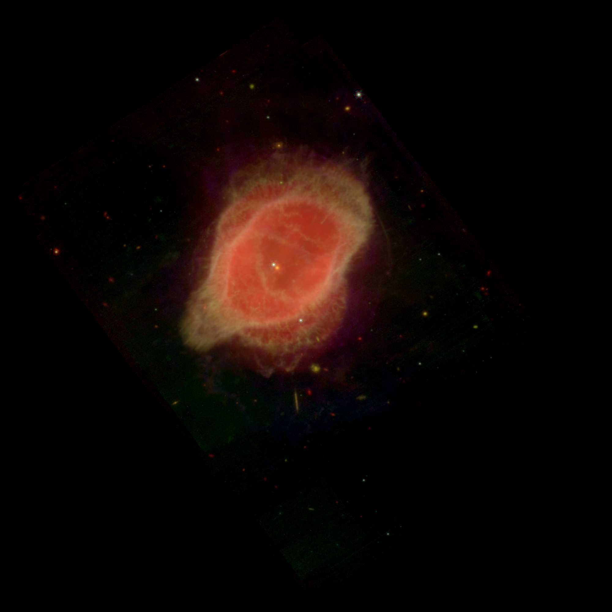
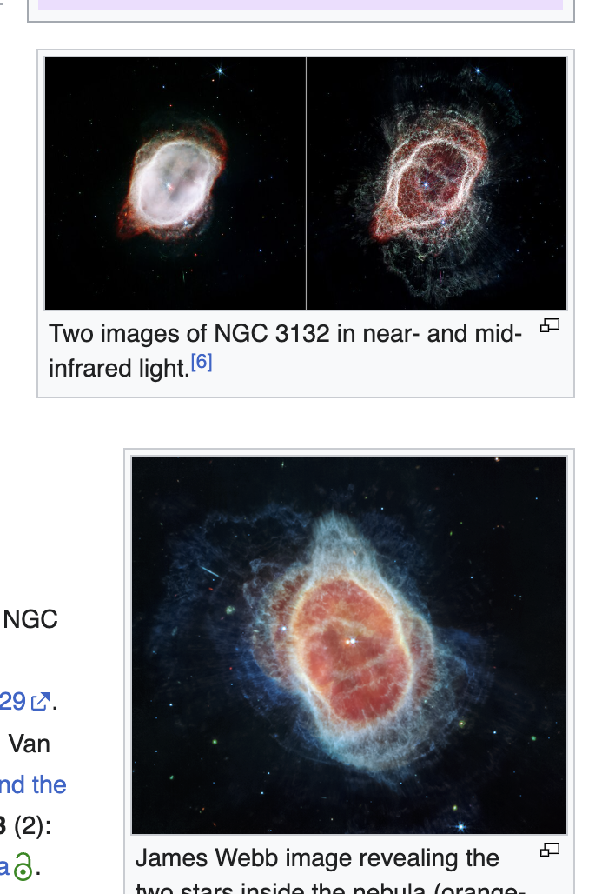
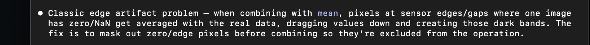
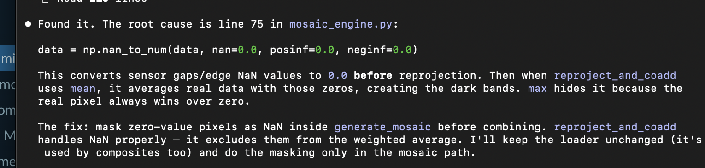
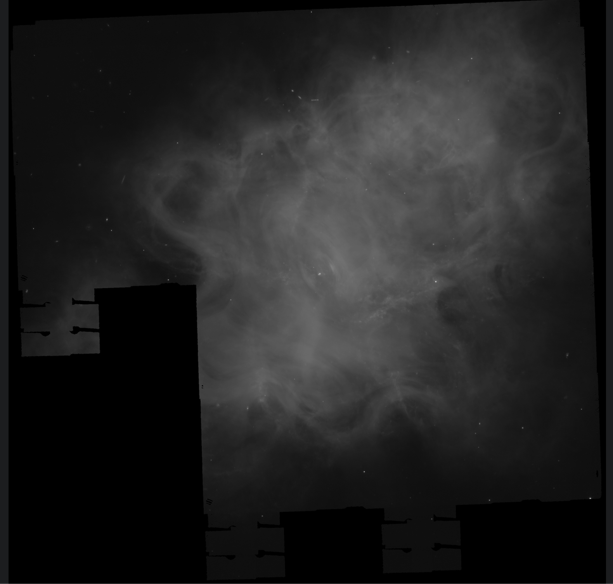
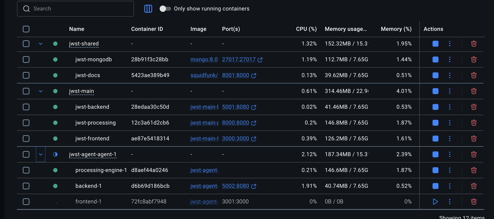

---
date:
  created: 2026-02-14
categories:
  - Development
  - Maintenance
  - Documentation
  - Feature
  - Bug Fix
tags:
  - astronomy-data
  - auth
  - ci
  - code-quality
  - dependencies
  - docs
  - guided-wizard
  - imaging
  - infrastructure
  - mast-data
  - performance
  - ui
  - viewer
authors:
  - shanon
---

# Session: February 14, 2026

<!-- enriched -->

A marathon session: 33 pull requests merged (8 features, 10 fixes, 1 docs, 2 maintenance, 12 dependency updates). Major work on the composite imaging pipeline.

<!-- more -->

## Developer Journal

Late night session — started past midnight and friends had to tell me to sleep. The composite wizard is getting more user friendly, and the results are visibly better, but the gap between what the app produces and what NASA publishes is humbling. Shared side-by-side screenshots with friends: still room for improvement. The color mapping is slightly off and missing an entire channel (luminance in LRGB).

A friend with signal processing background jumped in with suggestions — harmonic mean instead of standard mean for compositing, edge detection convolutions for weighted pixel functions, frequency weight matrices. The kind of domain knowledge that language models can't replicate because they'd be penalized for the speculative ideation needed. Another friend shared a PDF of an image processing textbook — immediately fed it to Claude to learn from.

Discovered that STScI already serves JWST public data from S3 (`s3://stpubdata/`). This changes the deployment calculus — bucket-to-bucket transfers instead of slow HTTP chunking through the MAST portal API. A friend suggested self-hosting to get started, but AWS is the more realistic path.

Had Claude do deep research on how to get from the current composite output to NASA's published version. There's an epic across 5 features to close that gap.

## Highlights

### [#361](https://github.com/Snoww3d/jwst-data-analysis/pull/361) add N-channel composite API endpoint with color mapping

Adds `POST /composite/generate-nchannel` endpoint (B3.2) that accepts N channels with hue or explicit RGB color assignments, enabling multi-filter JWST composites with 4-6+ filters.

*The existing `/composite/generate` endpoint is hardcoded to 3 channels (R/G/B). NASA JWST composites typically use 4-6 filters. This endpoint uses the B3.1 color mapping engine to support arbitrary fi...*

### [#360](https://github.com/Snoww3d/jwst-data-analysis/pull/360) add N-channel color mapping engine for multi-filter composites

Adds the core B3.1 N-channel color mapping engine — pure Python functions and Pydantic models that map N JWST filters to RGB via hue-based color assignment. This is the foundation that B3.2 (API) and B3.3 (UI) will build on.

*The current composite pipeline is hardcoded to 3 channels (R/G/B). NASA JWST composites typically use 4-6 filters mapped to distinct colors. This engine enables that by providing hue→RGB conversion, w...*

## What Changed

### Features (8)

- [#324](https://github.com/Snoww3d/jwst-data-analysis/pull/324) add server-side reprojection cache for composite previews
- [#325](https://github.com/Snoww3d/jwst-data-analysis/pull/325) drag-and-drop channel assignment with thumbnails for composite wizard
- [#328](https://github.com/Snoww3d/jwst-data-analysis/pull/328) mosaic wizard UI refresh with 2-step flow and thumbnail cards
- [#329](https://github.com/Snoww3d/jwst-data-analysis/pull/329) normalize MAST target search variants
- [#330](https://github.com/Snoww3d/jwst-data-analysis/pull/330) multi-agent Docker stack infrastructure
- [#356](https://github.com/Snoww3d/jwst-data-analysis/pull/356) add background neutralization for RGB composite wizard
- [#360](https://github.com/Snoww3d/jwst-data-analysis/pull/360) add N-channel color mapping engine for multi-filter composites
- [#361](https://github.com/Snoww3d/jwst-data-analysis/pull/361) add N-channel composite API endpoint with color mapping

### Bug Fixes (10)

- [#318](https://github.com/Snoww3d/jwst-data-analysis/pull/318) use memory-efficient loading for thumbnail generation
- [#322](https://github.com/Snoww3d/jwst-data-analysis/pull/322) show metadata for mosaic-generated FITS files in ImageViewer
- [#346](https://github.com/Snoww3d/jwst-data-analysis/pull/346) agent-stack.sh bugs and review.sh improvements
- [#349](https://github.com/Snoww3d/jwst-data-analysis/pull/349) add 127.0.0.1 to CORS allowed origins
- [#350](https://github.com/Snoww3d/jwst-data-analysis/pull/350) improve mosaic wizard footer UX — primary action is now Generate Mosaic
- [#351](https://github.com/Snoww3d/jwst-data-analysis/pull/351) collapsible footprint preview and mask sensor edge zeros in mosaic
- [#352](https://github.com/Snoww3d/jwst-data-analysis/pull/352) replace instrument filter with wavelength filter, fix mosaic viewer and thumbnails
- [#353](https://github.com/Snoww3d/jwst-data-analysis/pull/353) trim leading/trailing spaces from search input
- [#354](https://github.com/Snoww3d/jwst-data-analysis/pull/354) include target name in dashboard search filtering
- [#358](https://github.com/Snoww3d/jwst-data-analysis/pull/358) resolve SA1204 static member ordering warning

### Documentation (1)

- [#359](https://github.com/Snoww3d/jwst-data-analysis/pull/359) add B3 multi-channel composite epic to development plan

### Maintenance (2)

- [#320](https://github.com/Snoww3d/jwst-data-analysis/pull/320) fix markdown table alignment across project docs
- [#321](https://github.com/Snoww3d/jwst-data-analysis/pull/321) add language specifiers to fenced code blocks

**Dependencies** (12 updates: @typescript-eslint/eslint-plugin, @vitejs/plugin-react, Microsoft.AspNetCore.Authentication.JwtBearer, Microsoft.AspNetCore.OpenApi, Microsoft.CodeAnalysis.NetAnalyzers, Swashbuckle.AspNetCore, actions/upload-artifact, aiohttp and 4 more)

## Issues

**Opened:**

- [#319](https://github.com/Snoww3d/jwst-data-analysis/issues/319) — fix: MAST Sync bulk import duplicate key error (500)
- [#326](https://github.com/Snoww3d/jwst-data-analysis/issues/326) — [Feature] Improve target search for name variants (Crab Nebula / NGC 3132 / NGC-3132)
- [#347](https://github.com/Snoww3d/jwst-data-analysis/issues/347) — chore: migrate eslint 9 → 10
- [#348](https://github.com/Snoww3d/jwst-data-analysis/issues/348) — chore: migrate pytest-asyncio 0.23 → 1.x
- [#357](https://github.com/Snoww3d/jwst-data-analysis/issues/357) — Refine RGB composite default stretch and background neutralization

**Closed:**

- [#288](https://github.com/Snoww3d/jwst-data-analysis/issues/288) — Composite Preview Performance — Architecture Rework
- [#301](https://github.com/Snoww3d/jwst-data-analysis/issues/301) — fix: ImageViewer shows no metadata for mosaic-generated FITS files
- [#317](https://github.com/Snoww3d/jwst-data-analysis/issues/317) — Thumbnail generation fails for large FITS files (413 Request Entity Too Large)
- [#319](https://github.com/Snoww3d/jwst-data-analysis/issues/319) — fix: MAST Sync bulk import duplicate key error (500)
- [#326](https://github.com/Snoww3d/jwst-data-analysis/issues/326) — [Feature] Improve target search for name variants (Crab Nebula / NGC 3132 / NGC-3132)

---
30 commits across 33 pull requests.
*Next: February 15, 2026 — add F1 S3 direct access epic to development plan, increase default FITS file size limit from 2GB to ..., increase default FITS array element limit from 100...*
