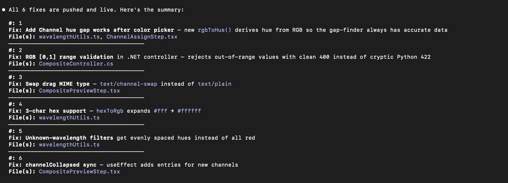

---
date:
  created: 2026-02-15
categories:
  - Documentation
  - Feature
  - Bug Fix
  - Refactoring
  - Testing
tags:
  - astronomy-data
  - docs
  - e2e-tests
  - guided-wizard
  - imaging
  - performance
  - testing
authors:
  - shanon
---

# Session: February 15, 2026

<!-- enriched -->

A marathon session: 11 pull requests merged (2 features, 5 fixes, 2 docs, 1 refactor, 1 test). Major work on the composite imaging pipeline.

<!-- more -->

## Developer Journal

Had Claude review a 366-page image processing textbook (a friend's recommendation) end-to-end and map lessons to the Phase 5 roadmap. It produced 11 concrete roadmap proposals (IO-01 through IO-11), from an operator registry and reproducible processing recipes through adaptive noise characterization and multi-feature decision fusion. The sequencing recommendation: build the foundation and evaluation discipline first, then the highest-utility scientific algorithms, then advanced capabilities.

In the middle of a big feature PR, had Claude self-review the code — "pretend you did not write this PR and review it." Found 6 improvements, all minor but worth catching. The habit of having it check its own work is paying off.

## Highlights

### [#367](https://github.com/Snoww3d/jwst-data-analysis/pull/367) add N-channel composite wizard UI with dynamic channels and color pickers

Extends the Composite Creator wizard from fixed 3 RGB channels to support arbitrary N channels with user-assignable colors, completing B3.3. Users can now add/remove channels, pick colors via a native color picker, and auto-assign filters by wavelength to get scientifically-meaningful hues.

*JWST programs routinely observe in 4-8 filters per target. The previous fixed R/G/B wizard forced users to either drop filters or awkwardly combine them into a single channel. N-channel support lets u...*

### [#373](https://github.com/Snoww3d/jwst-data-analysis/pull/373) update stale pytest match patterns for ChannelColor validation

Fixes 2 failing Python tests in `test_color_mapping.py` where `pytest.raises` match patterns were stale after the ChannelColor model's error messages were updated to include luminance support.

*The ChannelColor validator messages changed from `"not both"` / `"either hue or rgb"` to `"Provide only one of: hue, rgb, or luminance=true"` / `"Provide one of: hue, rgb, or luminance=true"` when lum...*

## What Changed

### Features (2)

- [#367](https://github.com/Snoww3d/jwst-data-analysis/pull/367) add N-channel composite wizard UI with dynamic channels and color pickers
- [#369](https://github.com/Snoww3d/jwst-data-analysis/pull/369) add luminance channel support for LRGB compositing (B3.4)

### Bug Fixes (5)

- [#363](https://github.com/Snoww3d/jwst-data-analysis/pull/363) increase default FITS file size limit from 2GB to 4GB
- [#364](https://github.com/Snoww3d/jwst-data-analysis/pull/364) increase default FITS array element limit from 100M to 200M
- [#365](https://github.com/Snoww3d/jwst-data-analysis/pull/365) optimize memory usage for large FITS file viewing
- [#370](https://github.com/Snoww3d/jwst-data-analysis/pull/370) session persistence across backend restarts
- [#373](https://github.com/Snoww3d/jwst-data-analysis/pull/373) update stale pytest match patterns for ChannelColor validation

### Refactoring (1)

- [#368](https://github.com/Snoww3d/jwst-data-analysis/pull/368) remove deprecated 3-channel RGB composite endpoint (B3.6)

### Testing (1)

- [#371](https://github.com/Snoww3d/jwst-data-analysis/pull/371) add comprehensive E2E test suite with 53 new tests

### Documentation (2)

- [#362](https://github.com/Snoww3d/jwst-data-analysis/pull/362) add F1 S3 direct access epic to development plan
- [#366](https://github.com/Snoww3d/jwst-data-analysis/pull/366) mark B3.1 and B3.2 as complete in development plan

## Issues

**Opened:**

- [#372](https://github.com/Snoww3d/jwst-data-analysis/issues/372) — test: add WCS-enabled FITS fixture for E2E WCS grid toggle test

---
6 commits across 11 pull requests.
*Next: February 16, 2026 — add JWST filter presets dropdown for composite wiz..., add S3 direct access for JWST FITS downloads (F1), add storage abstraction layer for backend and proc...*
