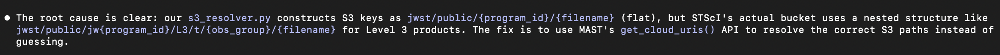

---
date:
  created: 2026-02-17
categories:
  - Maintenance
  - Documentation
  - Feature
  - Bug Fix
  - Refactoring
tags:
  - astronomy-data
  - auth
  - code-quality
  - deployment
  - docs
  - guided-wizard
  - imaging
  - infrastructure
  - mast-data
  - ui
  - viewer
authors:
  - shanon
---

# Session: February 17, 2026

<!-- enriched -->

A marathon session: 19 pull requests merged (6 features, 9 fixes, 2 docs, 1 refactor, 1 maintenance). Major work on the composite imaging pipeline.

<!-- more -->

## Developer Journal

Major milestone — this wraps up Phase 4 of 6. Shared the full project roadmap with friends, covering everything from the completed foundation phases through the upcoming scientific processing work.

The S3 direct downloads are flying — 5 MB/sec versus the 2 MB/sec HTTP average. In AWS it should be even faster bucket-to-bucket, and the ability to work with metadata and thumbnails without needing the full FITS file changes the workflow significantly.

Phase 5 is where a friend's book recommendation on image processing will play a huge factor. Still planning to review phases 5, 6, and 7 before starting on them.

## Highlights

### [#388](https://github.com/Snoww3d/jwst-data-analysis/pull/388) dynamic file size warnings on mosaic selection cards

- New `/api/mosaic/limits` endpoint returns per-wizard file size limits (mosaic=2GB, composite=4GB)
- Red warning icon on mosaic selection thumbnails for files exceeding the generation limit
- Summary banner when oversized files are selected explaining footprint works but generation will fail
- Fixe...

*JWST FITS files commonly exceed 2GB+. Users were hitting a cryptic "File too large for processing" error only after reaching the Generate step. Surfacing the limit on the selection cards lets users kn...*

### [#387](https://github.com/Snoww3d/jwst-data-analysis/pull/387) mosaic wizard smart pre-selection with target priority & warnings

- All three filter dropdowns (Target, Stage, Filter) auto-populate from pre-selected files when values match
- Same-target files appear first with visual highlighting and "Other Targets" divider
- Contextual warnings for mixed selections: different targets, mixed stages, different filters
- Fix misl...

*When pre-selecting files on the dashboard and opening the Mosaic wizard, the user shouldn't have to re-navigate dropdowns to find their files. Auto-populating dropdowns saves clicks, and surfacing war...*

## What Changed

### Features (6)

- [#387](https://github.com/Snoww3d/jwst-data-analysis/pull/387) mosaic wizard smart pre-selection with target priority & warnings
- [#388](https://github.com/Snoww3d/jwst-data-analysis/pull/388) dynamic file size warnings on mosaic selection cards
- [#390](https://github.com/Snoww3d/jwst-data-analysis/pull/390) S3 storage providers, SeaweedFS infrastructure & config wiring
- [#392](https://github.com/Snoww3d/jwst-data-analysis/pull/392) wire MAST downloads and user uploads through storage provider
- [#393](https://github.com/Snoww3d/jwst-data-analysis/pull/393) presigned URL redirects, S3 bug fixes & lifecycle policy
- [#405](https://github.com/Snoww3d/jwst-data-analysis/pull/405) extend access token to 60 minutes and add visibility-based refresh

### Bug Fixes (9)

- [#389](https://github.com/Snoww3d/jwst-data-analysis/pull/389) startup scan dedup compared absolute paths against relative storage keys
- [#394](https://github.com/Snoww3d/jwst-data-analysis/pull/394) remove overly restrictive file size limit from viewer endpoints
- [#395](https://github.com/Snoww3d/jwst-data-analysis/pull/395) propagate actual MAST errors instead of generic 503
- [#396](https://github.com/Snoww3d/jwst-data-analysis/pull/396) use MAST cloud API for S3 key resolution
- [#399](https://github.com/Snoww3d/jwst-data-analysis/pull/399) use fence_mermaid_format for Mermaid diagram rendering in MkDocs
- [#400](https://github.com/Snoww3d/jwst-data-analysis/pull/400) close mermaid code fences in architecture.md and revert mkdocs.yml
- [#401](https://github.com/Snoww3d/jwst-data-analysis/pull/401) use dark-theme-friendly colors for Data Lineage diagram
- [#404](https://github.com/Snoww3d/jwst-data-analysis/pull/404) prevent auth token expiry during long-running operations
- [#406](https://github.com/Snoww3d/jwst-data-analysis/pull/406) background refresh after data mutations + per-file archive in lineage view

### Refactoring (1)

- [#391](https://github.com/Snoww3d/jwst-data-analysis/pull/391) route processing engine FITS access through storage layer

### Documentation (2)

- [#397](https://github.com/Snoww3d/jwst-data-analysis/pull/397) update development roadmap to reflect current project state
- [#398](https://github.com/Snoww3d/jwst-data-analysis/pull/398) fix stale documentation across 13 files

### Maintenance (1)

- [#402](https://github.com/Snoww3d/jwst-data-analysis/pull/402) update AWSSDK.S3 to 4.0.18.6

## Issues

**Opened:**

- [#403](https://github.com/Snoww3d/jwst-data-analysis/issues/403) — Auth token expires during long-running operations, logging user out

**Closed:**

- [#403](https://github.com/Snoww3d/jwst-data-analysis/issues/403) — Auth token expires during long-running operations, logging user out

---
19 commits across 19 pull requests.
*Next: February 18, 2026 — add archiving animation feedback to file cards, resolve CA1805 — remove redundant default value in..., enable SA1001 — commas should be spaced correctly*
