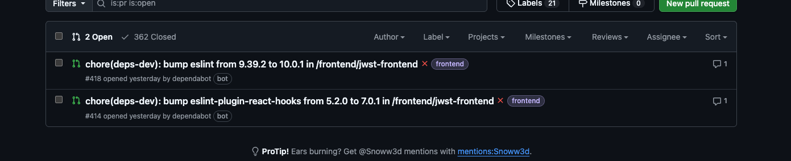
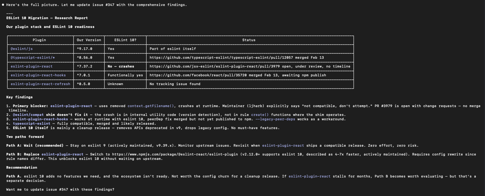
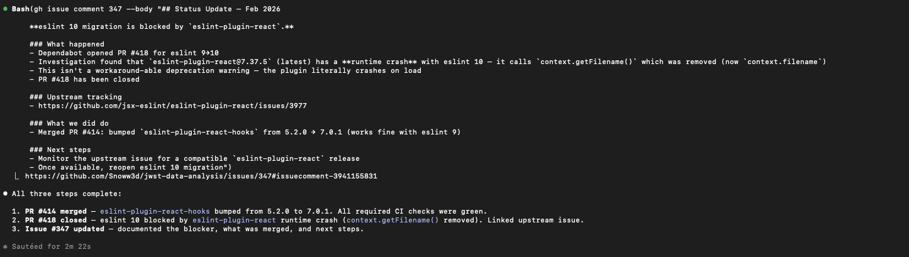
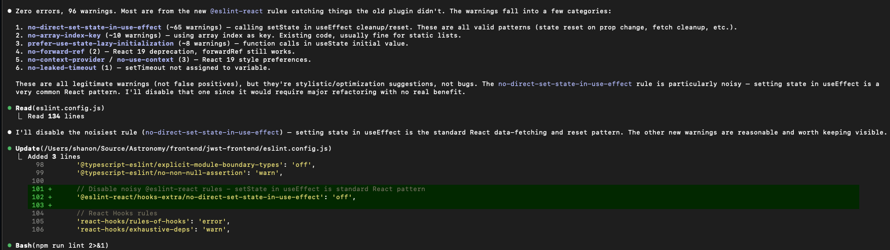
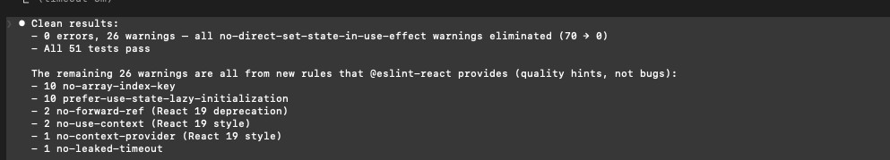
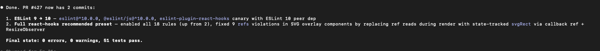

---
date:
  created: 2026-02-22
categories:
  - Maintenance
  - Feature
  - Refactoring
tags:
  - astronomy-data
  - auth
  - ci
  - code-quality
  - dependencies
  - mast-data
authors:
  - shanon
---

# Session: February 22, 2026

<!-- enriched -->

A marathon session: 12 pull requests merged (1 feature, 2 refactors, 8 maintenance, 1 dependency update).

<!-- more -->

## Developer Journal

The ESLint upgrade turned into a rabbit hole. Someone changed a 9 to a 10 in a version number and suddenly there's a cascade of new linter rules, breaking changes, and refactoring — which means regression testing. Hard to explain to leadership why you need half a day just to get back to where you already were. But deprecation warnings are intolerable, and this is the kind of maintenance work that compounds if you ignore it.

Had to stop Claude from plowing ahead and redirect it to fix the linter issues first. Explored `@eslint-react/eslint-plugin` as a plan B. Shared screenshots of the linter output — not magic, but progress. A friend's reaction: "Fixing issues, making new issues?" Pretty much.

The stance: this is my project and I set the process. Using a tool means following its standards, not cherry-picking the convenient parts.

## Highlights

### [#429](https://github.com/Snoww3d/jwst-data-analysis/pull/429) hash refresh tokens with SHA-256 before storage

SHA-256 hash refresh tokens before storing in MongoDB to prevent token replay if the database is compromised. Raw tokens are only held in memory and returned to the client — the DB never sees them. Also cleans up stale issue references in the development roadmap.

*- Refresh tokens were stored as plaintext Base64 in MongoDB - If the database is compromised, an attacker could replay tokens to maintain persistent access - OWASP recommends SHA-256 (not BCrypt) for ...*

## What Changed

### Features (1)

- [#429](https://github.com/Snoww3d/jwst-data-analysis/pull/429) hash refresh tokens with SHA-256 before storage

### Refactoring (2)

- [#426](https://github.com/Snoww3d/jwst-data-analysis/pull/426) replace eslint-plugin-react with @eslint-react
- [#430](https://github.com/Snoww3d/jwst-data-analysis/pull/430) reduce redundant MAST model types (25 → 21)

### Maintenance (8)

- [#412](https://github.com/Snoww3d/jwst-data-analysis/pull/412) bump httpx from 0.27.0 to 0.28.1
- [#413](https://github.com/Snoww3d/jwst-data-analysis/pull/413) bump pytest from 7.4.3 to 9.0.2
- [#414](https://github.com/Snoww3d/jwst-data-analysis/pull/414) bump eslint-plugin-react-hooks from 5.2.0 to 7.0.1
- [#415](https://github.com/Snoww3d/jwst-data-analysis/pull/415) bump uvicorn from 0.24.0 to 0.41.0
- [#416](https://github.com/Snoww3d/jwst-data-analysis/pull/416) bump fastapi from 0.128.4 to 0.129.0
- [#421](https://github.com/Snoww3d/jwst-data-analysis/pull/421) bump BCrypt.Net-Next from 4.0.3 to 4.1.0
- [#428](https://github.com/Snoww3d/jwst-data-analysis/pull/428) upgrade ESLint from 9 to 10
- [#431](https://github.com/Snoww3d/jwst-data-analysis/pull/431) remove dead DTO types from backend and frontend

**Dependencies** (1 updates: upgrade pytest-asyncio)

## Issues

**Opened:**

- [#433](https://github.com/Snoww3d/jwst-data-analysis/issues/433) — Add CI coverage thresholds — starting with Python

**Closed:**

- [#3](https://github.com/Snoww3d/jwst-data-analysis/issues/3) — Processing job queue system
- [#252](https://github.com/Snoww3d/jwst-data-analysis/issues/252) — Add API Documentation (OpenAPI/Swagger)
- [#257](https://github.com/Snoww3d/jwst-data-analysis/issues/257) — Set up MCP Servers
- [#262](https://github.com/Snoww3d/jwst-data-analysis/issues/262) — Refresh Tokens Stored in Plaintext
- [#273](https://github.com/Snoww3d/jwst-data-analysis/issues/273) — Require PR Approving Reviews on Branch Protection
- [#274](https://github.com/Snoww3d/jwst-data-analysis/issues/274) — Add Test Coverage — Frontend & Processing Engine
- [#281](https://github.com/Snoww3d/jwst-data-analysis/issues/281) — No Network Isolation Between Services
- [#282](https://github.com/Snoww3d/jwst-data-analysis/issues/282) — Missing CSRF Protection
- [#347](https://github.com/Snoww3d/jwst-data-analysis/issues/347) — chore: migrate eslint 9 → 10

---
13 commits across 12 pull requests.
*Next: February 23, 2026 — add Python CI coverage threshold at 50%, add Python tests for statistics, utils, and filter..., add enhancement and detection tests, bump coverage...*
