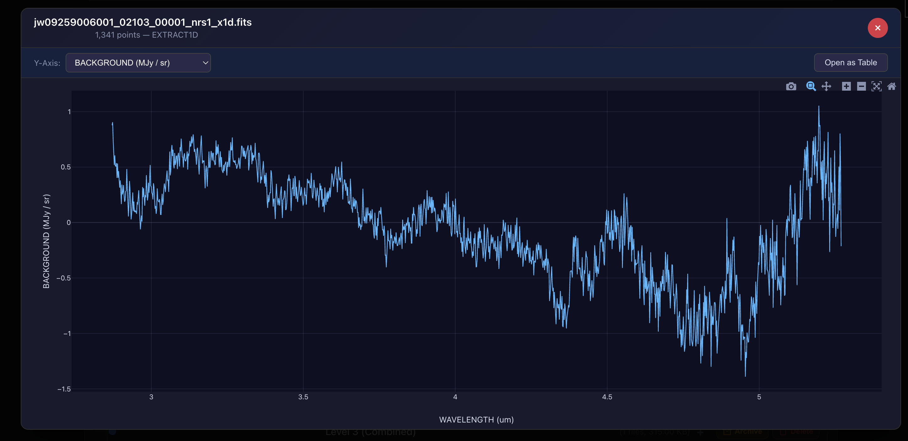
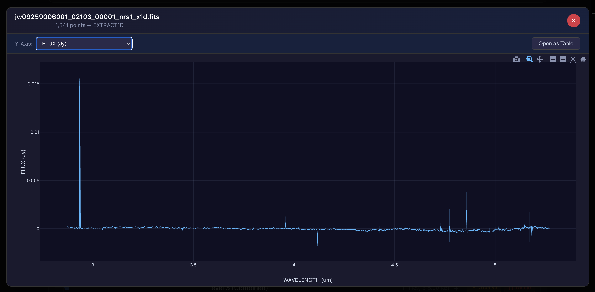
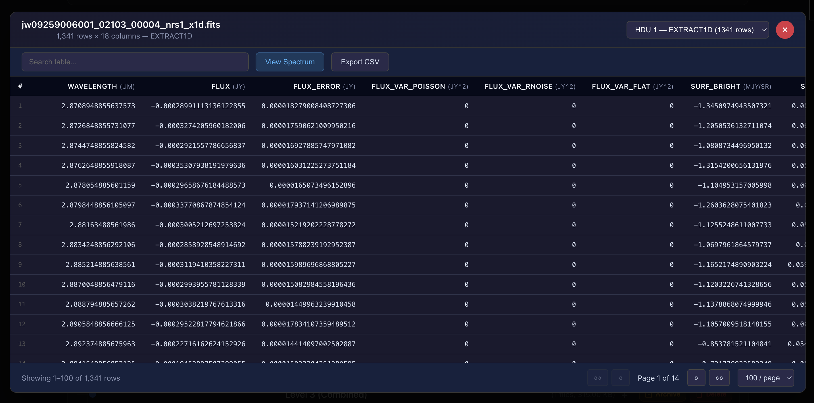

---
date:
  created: 2026-02-24
categories:
  - Feature
  - Bug Fix
  - Testing
tags:
  - astronomy-data
  - auth
  - ci
  - code-quality
  - dependencies
  - e2e-tests
  - imaging
  - testing
  - viewer
authors:
  - shanon
---

# Session: February 24, 2026

<!-- enriched -->

A marathon session: 10 pull requests merged (2 features, 4 fixes, 4 tests). Major work on the composite imaging pipeline.

<!-- more -->

## Developer Journal

Job processing is a big feature, so planning it carefully — unlike the auth workflow, which is in a good place now but didn't start there. The approach: have Claude design a plan, give that plan to Codex for review, then take Codex's feedback back to Claude. Cross-pollinating AI tools to challenge each other's assumptions.

Hit a frustrating plan mode issue — Claude doesn't know how to not start the plan. It can't just generate the plan as a PDF for review; exiting plan mode triggers execution. Had to work around it.

SignalR feels like the correct approach for real-time job progress, but it's new territory. Shared screenshots of non-image FITS data — calibration files, spectral tables — showing the viewer can handle more than just pretty pictures. The data that turns a raw image into a calibrated one is just as important.

## Highlights

### [#474](https://github.com/Snoww3d/jwst-data-analysis/pull/474) resolve all 41 backend test lint warnings (SA/CA rules)

Resolves all 41 StyleCop/CA analyzer warnings across 7 backend test files so the build passes clean with `--warnaserror`.

*Backend lint (`dotnet build --warnaserror`) was failing with 41 SA/CA warnings. These were masked by build caching in prior compliance checks.*

### [#472](https://github.com/Snoww3d/jwst-data-analysis/pull/472) resolve all Python deprecation warnings and achieve 0-warning test suite

Eliminates all 75+ Python test warnings (was 8 visible + ~67 suppressed) by fixing deprecated APIs at the source and removing global warning suppression from pyproject.toml.

*The test suite was hiding deprecation warnings behind `filterwarnings = ["ignore::DeprecationWarning"]` in pyproject.toml. With that removed, 75 warnings surfaced — all from deprecated `datetime.utcno...*

## What Changed

### Features (2)

- [#465](https://github.com/Snoww3d/jwst-data-analysis/pull/465) add FITS table viewer for non-image FITS products
- [#466](https://github.com/Snoww3d/jwst-data-analysis/pull/466) add spectral data visualization with interactive Plotly.js chart

### Bug Fixes (4)

- [#467](https://github.com/Snoww3d/jwst-data-analysis/pull/467) stabilize flaky E2E auth test with explicit navigation waits
- [#471](https://github.com/Snoww3d/jwst-data-analysis/pull/471) resolve all 72 frontend lint warnings with proper types
- [#472](https://github.com/Snoww3d/jwst-data-analysis/pull/472) resolve all Python deprecation warnings and achieve 0-warning test suite
- [#474](https://github.com/Snoww3d/jwst-data-analysis/pull/474) resolve all 41 backend test lint warnings (SA/CA rules)

### Testing (4)

- [#468](https://github.com/Snoww3d/jwst-data-analysis/pull/468) increase Python test coverage from 24% to 66%
- [#469](https://github.com/Snoww3d/jwst-data-analysis/pull/469) increase backend test coverage from 25% to 42%
- [#470](https://github.com/Snoww3d/jwst-data-analysis/pull/470) increase frontend test coverage from 4% to 49%
- [#473](https://github.com/Snoww3d/jwst-data-analysis/pull/473) add CompositeService unit tests to bump backend coverage above 40%

---
9 commits across 10 pull requests.
*Next: February 25, 2026 — add SignalR infrastructure for real-time job progr..., add unified job tracker with MongoDB persistence a..., migrate MAST import progress from HTTP polling to ...*
