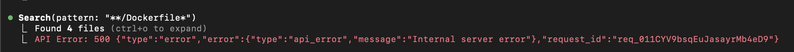
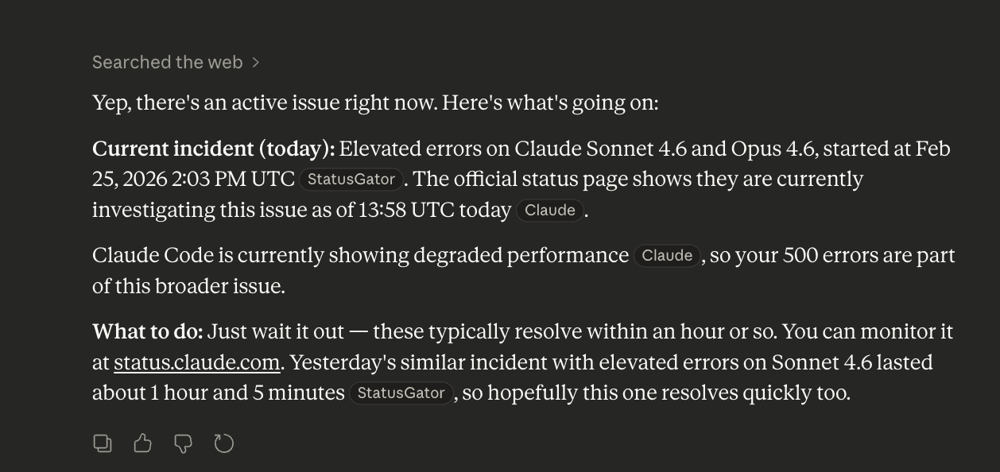
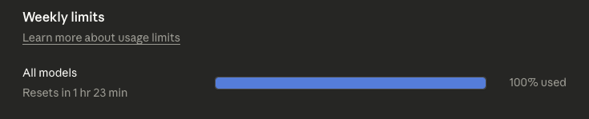
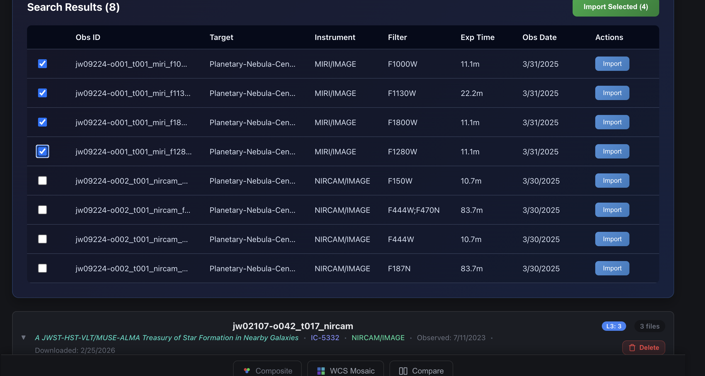
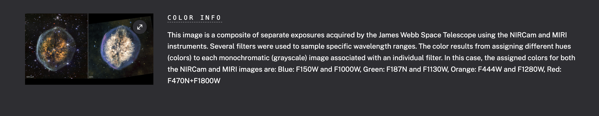
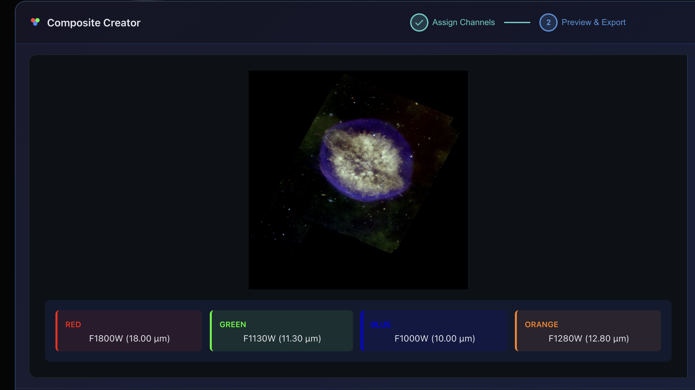
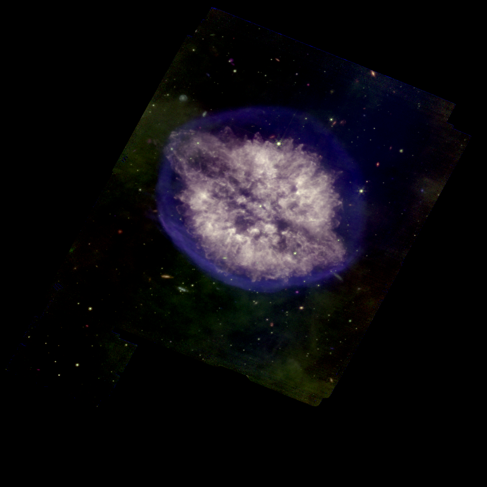
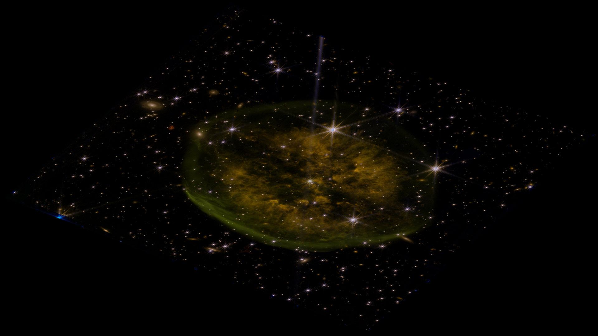

---
date:
  created: 2026-02-25
categories:
  - Documentation
  - Feature
  - Bug Fix
tags:
  - astronomy-data
  - docs
  - export
  - imaging
  - infrastructure
  - job-queue
  - mast-data
authors:
  - shanon
---

# Session: February 25, 2026

<!-- enriched -->

Productive session with 8 pull requests: 4 features, 3 fixes, 1 docs. Major work on the composite imaging pipeline.

<!-- more -->

## Developer Journal

Started the morning fighting Docker — another update broke itself, happens about once a month. Got it back up but Claude Code was struggling too, so took a break.

Explored the new Claude Code remote control feature, hoping to start tasks from the phone and walk away. Getting it working via QR code was finicky — just launching the app didn't work, but remote controlling the session from the sidebar did. The iOS app hadn't been updated yet so couldn't use the mobile flow.

Big day for the SignalR migration — phases 1 through 4 landed. Replaced 500ms HTTP polling with WebSocket push for import progress, unified the job tracker with MongoDB persistence, and started async composite exports. Shared the PR summary with friends.

A friend sent a link to new Cranium Nebula JWST images. Spent the evening trying to reproduce NASA's composite from the same data — shared screenshots comparing versions. Even knowing the exact colors-to-wavelengths mapping and the NASA palette, the result was still far off. A friend joked that the images looked the same on their greyscale phone screen. The gap between NASA's post-processing and what the app can produce automatically is humbling, but having the reference data to compare against is valuable.

## Highlights

### [#482](https://github.com/Snoww3d/jwst-data-analysis/pull/482) add async composite export with job queue and SignalR progress (Phase 4)

- Adds non-blocking composite image export via a bounded `Channel<T>` queue and `BackgroundService`, completing Phase 4 of the SignalR migration
- Preview generation stays synchronous; only exports route through the async pipeline
- New `POST /api/composite/export-nchannel` endpoint requires authent...

*Large composite exports (4K, multi-channel) can take 30+ seconds. Synchronous exports block the HTTP request thread and risk timeouts. Routing through a job queue enables real-time progress feedback v...*

### [#481](https://github.com/Snoww3d/jwst-data-analysis/pull/481) use mast_obs_id for imported status matching in MAST search

- Fix MAST search "Imported" badge never appearing after importing an observation

*The `importedObsIds` set was built from `observationBaseId` (compact filename-derived format like `jw02733002002`) but compared against MAST search `obs_id` (MAST format like `jw02733-o002_t001_miri_f...*

## What Changed

### Features (4)

- [#475](https://github.com/Snoww3d/jwst-data-analysis/pull/475) add SignalR infrastructure for real-time job progress (Phase 1)
- [#477](https://github.com/Snoww3d/jwst-data-analysis/pull/477) add unified job tracker with MongoDB persistence and REST API (Phase 2)
- [#478](https://github.com/Snoww3d/jwst-data-analysis/pull/478) migrate MAST import progress from HTTP polling to SignalR WebSocket (Phase 3)
- [#482](https://github.com/Snoww3d/jwst-data-analysis/pull/482) add async composite export with job queue and SignalR progress (Phase 4)

### Bug Fixes (3)

- [#479](https://github.com/Snoww3d/jwst-data-analysis/pull/479) make MJD epoch timezone-aware to match datetime.now(UTC)
- [#480](https://github.com/Snoww3d/jwst-data-analysis/pull/480) convert MAST thumbnail URIs to HTTPS URLs
- [#481](https://github.com/Snoww3d/jwst-data-analysis/pull/481) use mast_obs_id for imported status matching in MAST search

### Documentation (1)

- [#483](https://github.com/Snoww3d/jwst-data-analysis/pull/483) correct job queue task status in development plan

---
10 commits across 8 pull requests.
*Next: February 26, 2026 — fix 9 roadmap discrepancies found during plan-vs-c..., add v1 plans — guided discovery, color mapping, jo..., add architecture assessment and risk analysis to d...*
