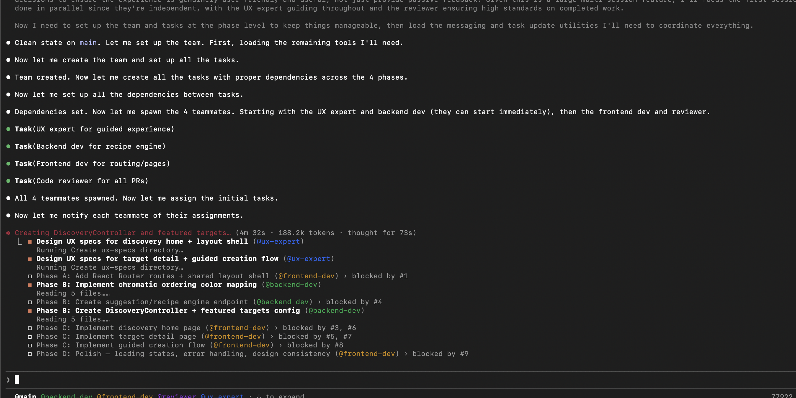
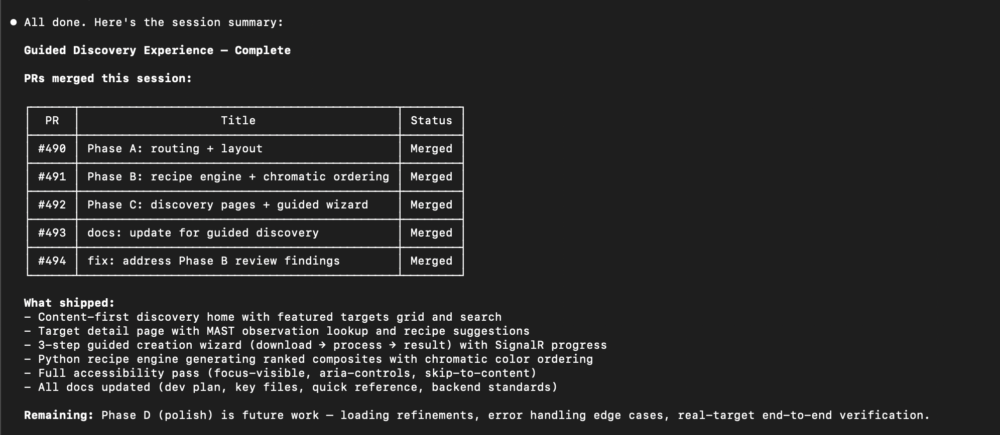
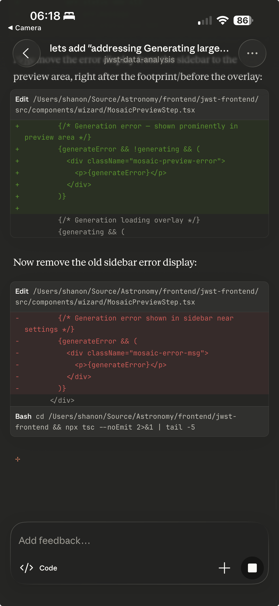

---
date:
  created: 2026-02-26
categories:
  - Documentation
  - Feature
  - Bug Fix
tags:
  - ci
  - docs
  - export
  - guided-wizard
  - imaging
  - job-queue
  - ui
authors:
  - shanon
---

# February 26: Twenty-Seven Dollars in Twenty-Five Minutes

<!-- enriched -->

A marathon session: 13 pull requests merged (5 features, 4 fixes, 4 docs). Major work on the composite imaging pipeline.

<!-- more -->

## Developer Journal

Burned through the entire session in 25 minutes — "GO TEAM GO! Burn those tokens!!!" Used $27 of extra credits. A major feature that would normally take a day or two was done in an hour, but then had to wait until 2 PM for credits to refill before testing and iterating. "But yeah I guess paying 5 humans is not cheap either."

Shared a screenshot of the remote control feature in its current form. A friend joined the channel to share their own Claude Code project — building a lightweight Neo4j replacement in Rust, fighting the same kinds of issues (Claude kept deciding it was fine to add duplicate nodes). Discussion turned to learning Rust: "next application will be learning new things like Rust" — deliberately choosing to build something in a language that could be done without Claude, to actually learn rather than just delegate.

## Highlights

### [#495](https://github.com/Snoww3d/jwst-data-analysis/pull/495) add missing filterCount/compositePotential to featured targets

Fix blank/black screen on Discovery home page caused by frontend-backend data mismatch in featured targets.

*The frontend `TargetCard` component expected `filterCount`, `compositePotential`, and `thumbnail` fields that were never added to the backend `FeaturedTarget` model. When the API returned targets with...*

### [#488](https://github.com/Snoww3d/jwst-data-analysis/pull/488) cap mosaic preview resolution with structured timing logs

- Cap synchronous mosaic preview resolution to 2048px (longest edge) to prevent timeout for large file counts
- Add structured timing logs (file count, resolution, cap status, output size, duration) for evidence-based monitoring
- Configurable via `Mosaic:MaxPreviewDimension` — async export/save pat...

*The synchronous `/api/mosaic/generate` endpoint times out for 49+ files because WCS reprojection reads all input pixels regardless of output size. Capping preview resolution reduces output generation ...*

## What Changed

### Features (5)

- [#487](https://github.com/Snoww3d/jwst-data-analysis/pull/487) add async mosaic export and save with job queue and SignalR progress (Phase 5)
- [#488](https://github.com/Snoww3d/jwst-data-analysis/pull/488) cap mosaic preview resolution with structured timing logs
- [#490](https://github.com/Snoww3d/jwst-data-analysis/pull/490) add React Router routes and shared layout shell (Guided Discovery Phase A)
- [#491](https://github.com/Snoww3d/jwst-data-analysis/pull/491) add chromatic ordering, recipe engine, and DiscoveryController (Phase B)
- [#492](https://github.com/Snoww3d/jwst-data-analysis/pull/492) implement discovery pages and guided creation flow (Phase C)

### Bug Fixes (4)

- [#489](https://github.com/Snoww3d/jwst-data-analysis/pull/489) replace Task.Delay with TaskCompletionSource in flaky dual-write tests
- [#494](https://github.com/Snoww3d/jwst-data-analysis/pull/494) address Phase B review findings
- [#495](https://github.com/Snoww3d/jwst-data-analysis/pull/495) add missing filterCount/compositePotential to featured targets
- [#496](https://github.com/Snoww3d/jwst-data-analysis/pull/496) align discovery frontend types with backend camelCase serialization

### Documentation (4)

- [#484](https://github.com/Snoww3d/jwst-data-analysis/pull/484) fix 9 roadmap discrepancies found during plan-vs-code audit
- [#485](https://github.com/Snoww3d/jwst-data-analysis/pull/485) add v1 plans — guided discovery, color mapping, job queue
- [#486](https://github.com/Snoww3d/jwst-data-analysis/pull/486) add architecture assessment and risk analysis to discovery plan
- [#493](https://github.com/Snoww3d/jwst-data-analysis/pull/493) update documentation for guided discovery Phases A–C

---
13 commits across 13 pull requests.
*Next: February 27, 2026 — improve guided create flow — download feedback, pa..., resolve target aliases, download progress, auth er..., make discovery pages public, gate auth at download...*
